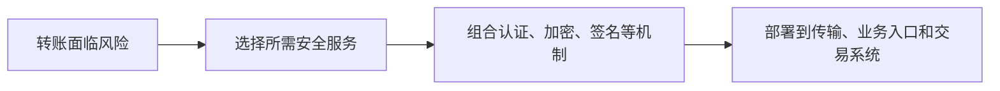

# OSI（开放系统互连）安全体系结构：安全服务、机制和网络层次怎样对应

> [!summary]- 快速复习卡片（学完再看）
> **作用/定位**：把“需要什么安全能力”与“用什么机制、放在哪一层”分开描述。
> **核心结论**：五类服务是鉴别、访问控制、数据机密性、数据完整性、抗抵赖性。
> **经典题型怎么做**：题目问“五类服务”时逐项核对，出现“安全防御/审计”通常是干扰项；问机制时再找加密、签名、访问控制、公证等。
> **易错点**：服务是目标，机制是实现手段；同一种机制可以支撑不止一种服务。

## 一笔网上转账为什么不能只靠加密

小林在手机银行向商户转账 1000 元。银行不仅要防止旁观者看到账号和金额，还要确认登录者是谁、他是否有权操作这个账户、金额在途中有没有被改，并在发生争议时拿出可验证的证据。

所以，**加密只能解决其中一部分问题**。OSI（开放系统互连）安全体系结构把一次安全设计拆成三个连续问题：业务**需要什么安全服务**，使用**什么安全机制**实现，再把机制**部署到合适的协议层次或系统位置**。

## 五类安全服务怎样一起保护这笔转账

| 转账进行到这里时 | 需要的安全服务 | 它回答的问题 |
| --- | --- | --- |
| 小林登录手机银行 | **鉴别** | 发起请求的人或数据来源是谁 |
| 小林选择转出账户 | **访问控制** | 这个主体是否允许使用该资源、执行该操作 |
| 请求经过网络 | **数据机密性** | 未授权者能否看到账号、金额等内容 |
| 银行收到转账请求 | **数据完整性** | 金额、收款方等数据是否被未授权改变 |
| 交易完成后发生争议 | **抗抵赖性** | 能否证明谁发起或接收了这项操作 |

这五项说的是“要获得什么保护结果”，因此叫**安全服务**。它们不是五个具体产品，也不是必须各自只靠一种技术实现。

## 服务怎样落成机制，再放到合适位置

仍看这笔转账：鉴别可以使用口令、证书或质询应答；访问控制要由授权策略判决并由资源入口执行；机密性可以通过传输加密实现；完整性可以使用 MAC（消息认证码）、HMAC（基于散列的消息认证码）或数字签名检查；抗抵赖性则需要签名、公证或可验证的证据记录。

选出机制后，还要决定放在哪里。例如，传输协议可以保护手机与银行之间的通信，银行业务入口可以执行身份与权限检查，交易系统和证据系统可以保存可验证记录。**部署位置不同，保护的对象和范围也不同**；不能看到“用了加密”，就推断身份、权限和争议举证都已解决。

这就是考试中“服务—机制—层次”的判断顺序：先认保护目标，再找实现手段，最后判断它保护哪一段、哪一层或哪个系统位置。

## 纵深防御与它是什么关系

主教材把多点、分层防御作为网络安全体系架构的一部分：网络与基础设施、边界、计算环境分别布置互补控制，再由 PKI、检测和响应基础设施支撑。详细见 [[纵深防御]]。

## 考试怎么认

2014 年综合知识资料和 2025 年上半年回忆题都从“五类安全服务”设问。做这种题不要扩写八类机制，先背准五项：

> **鉴别、访问控制、数据机密性、数据完整性、抗抵赖性。**

## 自测

1. “审计”为什么不能直接替换五类服务中的“抗抵赖性”？

> [!answer]- 第 1 题答案与解析
> **答案**：审计记录可以帮助追查，但抗抵赖性要求在发生争议时能够证明某主体确实参与了某项操作，通常需要签名、公证或可验证证据等机制共同支撑。
> **解析**：审计是重要的记录和调查手段；它不自动提供不可否认的主体行为证据，所以不能直接替换“抗抵赖性”。

2. 数字签名可能同时支撑哪些服务？

> [!answer]- 第 2 题答案与解析
> **答案**：可支撑数据完整性、数据来源鉴别，并在适当证据与密钥管理条件下支撑抗抵赖性。
> **解析**：数字签名不提供机密性；保密仍需加密等其他机制。
## 下一站

- 前置：[[安全模型]]、[[信息安全基本目标]]
- 下一站：[[安全架构设计]]
- 后续原则：[[纵深防御]]
