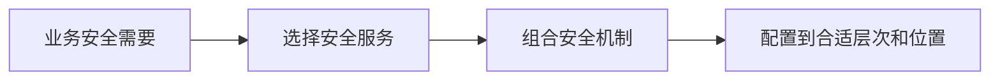

# OSI 安全体系结构：安全服务、机制和网络层次怎样对应

> [!summary] 快速复习卡片
> **作用/定位**：把“需要什么安全能力”与“用什么机制、放在哪一层”分开描述。
> **核心结论**：五类服务是鉴别、访问控制、数据机密性、数据完整性、抗抵赖性。
> **经典题型怎么做**：题目问“五类服务”时逐项核对，出现“安全防御/审计”通常是干扰项；问机制时再找加密、签名、访问控制、公证等。
> **易错点**：服务是目标，机制是实现手段；同一种机制可以支撑不止一种服务。

## 为什么不能把“加密”直接当成全部安全

通信双方可能需要隐藏内容、确认身份、阻止越权、发现篡改和保留交易证据。加密只是实现其中部分能力的机制。OSI 安全体系结构因此把问题拆成三层：**要什么服务、靠什么机制、配置在哪个协议层次**。

## 五类安全服务

| 安全服务 | 回答的问题 | 常见机制举例 |
| --- | --- | --- |
| 鉴别 | 对方或数据来源是谁 | 口令、证书、签名、质询应答 |
| 访问控制 | 是否允许使用资源 | 策略判决与执行 |
| 数据机密性 | 未授权者能否看到数据 | 加密、访问限制、路由控制 |
| 数据完整性 | 数据是否被未授权改变 | MAC/HMAC、数字签名、序列号 |
| 抗抵赖性 | 发生争议时能否给出证据 | 签名、公证、证据记录与验证 |

这条链也解释了为什么“HTTPS 使用加密”不是完整答案：它还要结合证书鉴别、完整性保护和协议部署位置。

## 纵深防御与它是什么关系

主教材把多点、分层防御作为网络安全体系架构的一部分：网络与基础设施、边界、计算环境分别布置互补控制，再由 PKI、检测和响应基础设施支撑。详细见 [[纵深防御]]。

## 考试怎么认

2014 年综合知识资料和 2025 年上半年回忆题都从“五类安全服务”设问。做这种题不要扩写八类机制，先背准五项：

> **鉴别、访问控制、数据机密性、数据完整性、抗抵赖性。**

## 自测

1. “审计”为什么不能直接替换五类服务中的“抗抵赖性”？

> [!answer]- 第 1 题答案与解析
> **答案**：审计记录可以帮助追查，但抗抵赖性要求在发生争议时能够证明某主体确实参与了某项操作，通常需要签名、公证或可验证证据等机制共同支撑。
> **解析**：审计是重要的记录和调查手段；它不自动提供不可否认的主体行为证据，所以不能直接替换“抗抵赖性”。

2. 数字签名可能同时支撑哪些服务？

> [!answer]- 第 2 题答案与解析
> **答案**：可支撑数据完整性、数据来源鉴别，并在适当证据与密钥管理条件下支撑抗抵赖性。
> **解析**：数字签名不提供机密性；保密仍需加密等其他机制。

## 下一站

- 前置：[[安全模型]]、[[信息安全基本目标]]
- 下一站：[[安全架构设计]]
- 后续原则：[[纵深防御]]
