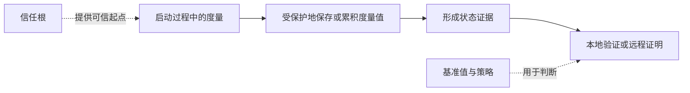

# 可信计算：系统启动以后，怎样说明自己处在预期状态

> [!summary]- 快速复习卡片（学完再看）
> **作用/定位**：从受保护的信任基础出发，度量启动组件并保存结果，为本地判断或远程证明提供依据。
> **核心结论**：度量是“计算并记录状态证据”；验证/策略才决定是否信任或是否允许继续。
> **题干怎么认**：信任根、TPM（可信平台模块）、度量、PCR（平台配置寄存器）、可信/测量启动、远程证明。
> **易错点**：度量不等于自动阻止启动；TPM 也不能单独保证整个系统永远可信。

## 为什么操作系统里的安全软件还需要更早的基础

如果启动加载器或固件已经被篡改，后来启动的安全软件可能看到的是攻击者伪造的环境。可信计算把信任判断向启动早期延伸：从受保护的可信起点开始，对启动过程中的组件做度量并保存证据。

TPM（Trusted Platform Module，可信平台模块）可以保护密钥并保存相关度量状态；PCR（Platform Configuration Register，平台配置寄存器）用于累积记录度量值。**度量只产生证据，是否接受当前状态还要由基准值和策略判断。**

## 测量启动与安全启动不要混成一件事

- **测量/可信启动**重在记录加载组件的度量证据，便于之后判断；
- **安全启动**重在加载前验证签名，不符合策略时可以拒绝加载。

具体产品可能组合两者，因此不要写成“逐级度量后，任何一级不同就必然停止启动”。

## 与零信任怎样衔接

可信计算可以向访问决策提供设备状态证据；零信任还要综合用户身份、资源、请求上下文和风险。设备度量正常不代表这次访问一定被授权。

## 自测

1. 为什么“记录度量值”和“阻止组件启动”不是同一个动作？

> [!answer]- 第 1 题答案与解析
> **答案**：度量启动负责计算并保存组件状态证据；安全启动或策略验证才决定组件是否符合要求、是否允许继续加载。
> **解析**：两种机制可以组合，但“发现并记录状态”不等于“立即阻止不符合项”。

2. TPM 保存了可信启动证据，为什么仍不能替代用户授权？

> [!answer]- 第 2 题答案与解析
> **答案**：TPM 提供的是设备与启动状态证据；授权还要判断用户身份、资源、操作权限和当前上下文。
> **解析**：设备可信是访问决策的一个输入，不能单独回答“该用户能否访问该资源”。
## 下一站

- 前置：[[纵深防御]]
- 下一站：[[零信任架构]]——把这里产生的设备状态证据，与身份、资源和请求上下文一起用于访问决策。
