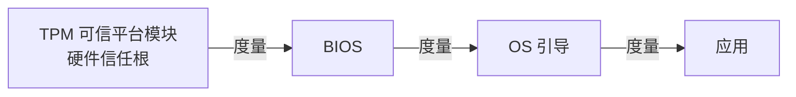

---
tags:
  - 系统架构师
  - 系统架构师/信息安全
  - 系统架构师/信息安全/安全体系
priority: ⭐
status: 学习中
created: 2026-08-03 星期一
---
# 可信计算

> [!important] 软考定位
> ⭐ 低频概念题：**信任根 + 信任链**，看到 TPM 就选它。

---

## 一、一句话定义

**可信计算** = 从**硬件信任根**出发，逐级验证系统启动链的真实性，确保"启动过程没被篡改"。

---

## 二、核心机制（⭐）

- **信任根**：TPM 芯片（硬件级，出厂烧录密钥）
- **信任链**：逐级哈希度量，**环环相扣**，一级不信任则后续不启动
- 度量值存进 TPM 的 PCR 寄存器，防止伪造

> 🧠 **记忆**：像"防伪芯片"，从娘胎里就是真的，一路验证到底。

---

## 三、价值

- 防**启动链攻击**（Bootkit/固件木马）
- 防密钥被软件窃取（密钥锁在硬件里）
- 为远程证明（证明"我这台机器是可信的"）提供基础

---

## 四、国产化背景

- 我国推进**可信计算 3.0**（双体系：可信计算+访问控制）
- 等保2.0 中"可信验证"是三级以上系统要求

---

## 五、考场避坑

1. 关键词 **TPM/信任根/信任链/度量** → 可信计算
2. 信任链是"**逐级验证**"，不是一次验证
3. 和零信任区别：可信计算管"**设备本身可信**"，零信任管"**访问持续验证**"

---

## 六、一句话总结

> **硬件做根、逐级度量、环环验证——让设备从开机那一刻起就"身世清白"。**

