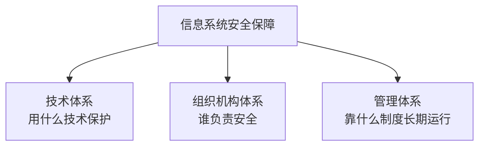

# 安全架构设计：把安全措施放到系统该放的位置

> [!summary]- 快速复习卡片（学完再看）
> **一句话**：安全架构设计就是根据风险，把身份、网络、主机、应用、数据、审计和恢复措施组合成一套完整方案。
> **核心组成**：技术体系 + 组织机构体系 + 管理体系，共同构成整体安全保障。
> **运行覆盖**：安全不能只有“防”，还要覆盖预警、检测、响应、恢复等能力。
> **易错点**：安全架构不是“多买几台安全设备”，也不是把各安全能力理解成固定的串行步骤。

## 为什么一台防火墙不够

网上办事系统即使有防火墙，也可能出现：

- 账号被盗；
- 应用有漏洞；
- 内部人员越权；
- 数据库被误改；
- 备份不能恢复。

所以：

> **安全架构不是只守网络入口，而是根据不同风险，在不同位置分别设防。**

例如网络边界放防火墙，登录入口做身份认证，应用防 SQL 注入，数据库限制权限，日志系统负责审计，备份负责恢复。

## 安全架构主要看三件事

| 方面 | 一句话 |
| --- | --- |
| 技术体系 | 具体用什么安全措施保护网络、主机、应用和数据。 |
| 组织机构体系 | 谁决策、谁管理、谁执行。 |
| 管理体系 | 用什么制度、流程、培训和审计让措施长期有效。 |

这三类不能互相替代：有技术没人管会失效；只有制度没有技术也落不了地。

## 三类体系怎样组成整体

下面是**组成关系图，不是执行流程图**：

这三类体系是**同时存在、共同支撑**的关系，不是“先技术、再组织、最后管理”。

其中技术体系还要覆盖不同位置，例如网络、主机、应用、数据等；同时还要具备检测、响应、恢复等运行能力。

一句话理解：

> **安全架构是在不同位置安排技术控制，同时让责任和制度把这些控制长期运行起来。**

## WPDRRC 是什么

WPDRRC 用来提醒安全不能只有“防”：

- W：预警；
- P：保护；
- D：检测；
- R：响应；
- R：恢复；
- C：反击/依法处置。

考试不用把它理解成六种产品，也不要把它理解成系统必须严格依次执行的六步流程，只要知道：

> **安全要覆盖事前、事中和事后，而不是只做保护。**

现实中的处置必须遵守法律和授权边界。

## 案例题第一动作

题目让你设计“整体安全方案”，可以按下面这个**检查清单**思考：

1. 有什么资产、威胁和风险；
2. 身份和权限怎么管；
3. 网络和通信怎么保护；
4. 主机、应用、数据怎么保护；
5. 怎么审计、检测、响应和恢复；
6. 谁负责、有什么制度和培训。

这是一套答题检查顺序，不代表真实系统按这六步串行运行。这样写出来的是架构，不是设备采购清单。

## 自测

1. 为什么只有边界防火墙不能算完整安全架构？

> [!answer]- 第 1 题答案与解析
> **答案**：因为它只负责一部分网络流量，不能覆盖账号、主机、应用、数据、审计和恢复等其他风险。

2. 技术体系、组织机构体系、管理体系是什么关系？

> [!answer]- 第 2 题答案与解析
> **答案**：三者共同构成信息系统安全保障，没有固定先后顺序。
> **解析**：技术负责具体保护，组织负责责任分工，管理负责制度和持续运行。

## 下一站

安全架构解决“不同风险分别在哪里设防，并由谁、按什么制度持续运行”；接下来继续问：**如果其中一道防线失效怎么办？** → [[纵深防御]]。
