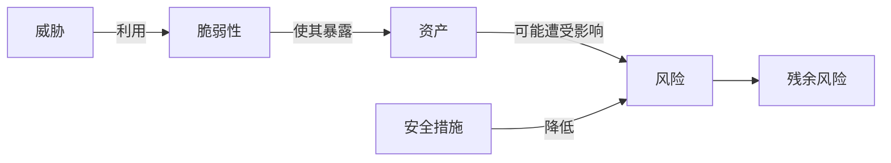

# 安全风险评估：漏洞、威胁和资产怎样连成一个风险

> [!summary]- 快速复习卡片（学完再看）
> **作用/定位**：先判断哪些风险最值得处理，再选择与成本相称的安全措施。
> **核心结论**：威胁利用脆弱性危害资产才形成风险；措施降低风险，但通常仍有残余风险。
> **题干怎么认**：资产价值、威胁、脆弱性、影响、发生可能性、安全措施、残余风险。
> **易错点**：脆弱性只是可被利用的弱点，本身不等于已经发生损失；风险也不必、通常也不能降为零。

## 十台服务器都有漏洞，先修哪一台

假设扫描报告列出十台有漏洞的服务器，而团队今晚只能修一台。**安全风险评估就是把漏洞放回真实业务中比较，找出一旦被利用最可能造成重大损失的那一台，决定先处理什么。**

判断时不能只看漏洞名称或严重等级，还要看服务器承载什么业务、是否暴露给攻击者、现有措施能否拦住，以及出事后的影响。评估给出处理顺序和处置选择；它不能承诺风险从此变为零，后面还要由安全架构把选定的措施放进系统并持续运行。

## 从一个没有修补的服务器开始

服务器装着重要业务数据，这是**资产**；旧组件存在缺陷，这是**脆弱性**；攻击者或恶意程序具有利用它的可能，这是**威胁**。威胁真正利用弱点后，才可能造成泄露、篡改或停机影响。

## 评估时按什么顺序想

1. 明确范围和业务目标；
2. 识别资产及其价值；
3. 识别威胁与脆弱性；
4. 判断发生可能性和影响；
5. 选择规避、降低、转移或接受等处理方式；
6. 持续监视残余风险和环境变化。

安全措施有成本。低价值资产上的极小风险，不一定值得投入最高级控制；高价值核心业务即使概率不高，也可能需要优先处置。

### 填一条可复核的风险记录

下面是**虚构教学示例**。高/中/低是本例为了比较采用的相对等级，不是教材规定的量表，也不能替代组织采用的正式评估方法。

| 记录项 | 示例内容 | 判断依据 / 待核证据 |
| --- | --- | --- |
| 评估范围与资产 | 外网门户的用户资料库 | 教学假设：资料库支持核心业务，含需要保护的用户资料；实际项目须由资产责任人确认数据类别和业务依赖 |
| 威胁 | 外部攻击者尝试利用门户组件漏洞 | 威胁存在不等于事件已经发生；应依据暴露面、攻击活动和监测记录判断可能性 |
| 脆弱性 | 门户组件版本落后，厂商已发布修复 | 需用资产清单、版本核验和厂商公告确认漏洞是否适用于本实例；扫描器告警不能单独证明可被利用 |
| 现有控制 | 门户后有访问控制和网络隔离规则 | 需检查规则实际生效、日志覆盖和绕过路径，不能只依据设计文档判定有效 |
| 事件可能性 | 初评为“中” | 这是教学判断：组件对外可达，存在可利用弱点，但已有隔离控制；真实评级需风险评估小组用证据和规定量表复核 |
| 影响 | 初评为“高” | 教学假设：若资料泄露会影响用户权益、业务连续性和组织声誉；实际影响由业务负责人和合规要求确认 |
| 初始风险与处理 | 相对优先级判为“高”；降低风险：先限制不必要的外部访问，再在验证兼容性后修补组件 | 本例不计算通用数值风险分；修补窗口、业务回退和负责人须纳入真实变更流程 |
| 残余风险与复评触发 | 修补后仍保留配置错误、未知漏洞或控制失效的可能；持续监视告警和访问日志 | 若确认漏洞不适用于该版本、发现利用活动、边界控制变化或修补失败，重新评估并调整处理 |

把记录写完整的关键是让别人能复查每个判断从哪里来：**资产值由业务影响支撑，事件可能性由威胁与脆弱性证据支撑，风险处理写清责任动作，措施后仍留残余风险和复评触发条件。**教材的定性顺序是先评资产价值、威胁可能性和脆弱性严重程度，再判断安全事件发生可能性，最后结合资产重要性确定风险值；具体等级或公式须服从采用的评估方法，不能把本例的“中/高”当通用标准。

## 与漏洞扫描有什么区别

漏洞扫描只是发现技术弱点的一种手段。风险评估还要把弱点放回资产、业务影响、现有控制和发生可能性中判断。扫描结果“高危”不等于业务风险一定最高。

## 自测
1. 一台与外网隔离且不承载业务的测试机存在漏洞，为什么不能只凭漏洞名称判断最终风险？

> [!answer]- 第 1 题答案与解析
> **答案**：风险还取决于资产价值、暴露条件、威胁利用可能性、业务影响和现有控制，漏洞名称本身只说明存在一种弱点。
> **解析**：漏洞扫描是风险评估的输入，不是最终结论。

2. 安全措施实施后为什么还要记录和监视残余风险？

> [!answer]- 第 2 题答案与解析
> **答案**：措施通常只能降低风险而不能消除风险；环境、威胁和资产价值变化后，原来的结论也可能失效。
> **解析**：风险处理是持续过程，不是部署一次控制就结束。

3. 扫描器报告一个外网门户组件有高危漏洞，能否直接判定它是全组织最高风险？

> [!answer]- 第 3 题答案与解析
> **答案**：不能。
> **解析**：还要核实漏洞是否适用于资产、威胁能否利用、现有控制是否有效、资产业务价值和实际影响，再按组织评估方法确定优先级。

4. 风险措施完成后，哪些情况应触发重新评估？

> [!answer]- 第 4 题答案与解析
> **答案**：如漏洞适用性判断变化、出现利用活动、边界控制或业务环境改变、修补失败，均应复核原风险结论。
> **解析**：残余风险可能随威胁、脆弱性、资产价值和控制状态变化，不能一次记录后永久沿用。

## 下一站

- 前置：[[信息安全基本目标]]
- 下一站：[[安全架构设计]]
