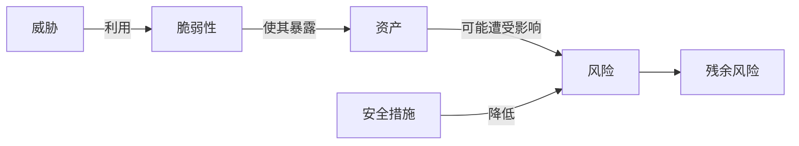

# 安全风险评估：漏洞、威胁和资产怎样连成一个风险

> [!summary]- 快速复习卡片（学完再看）
> **作用/定位**：先判断哪些风险最值得处理，再选择与成本相称的安全措施。
> **核心结论**：威胁利用脆弱性危害资产才形成风险；措施降低风险，但通常仍有残余风险。
> **题干怎么认**：资产价值、威胁、脆弱性、影响、发生可能性、安全措施、残余风险。
> **易错点**：脆弱性只是可被利用的弱点，本身不等于已经发生损失；风险也不必、通常也不能降为零。

## 十台服务器都有漏洞，先修哪一台

假设扫描报告列出十台有漏洞的服务器，而团队今晚只能修一台。**安全风险评估就是把漏洞放回真实业务中比较，找出一旦被利用最可能造成重大损失的那一台，决定先处理什么。**

判断时不能只看漏洞名称或严重等级，还要看服务器承载什么业务、是否暴露给攻击者、现有措施能否拦住，以及出事后的影响。评估给出处理顺序和处置选择；它不能承诺风险从此变为零，后面还要由安全架构把选定的措施放进系统并持续运行。

## 从一个没有修补的服务器开始

服务器装着重要业务数据，这是**资产**；旧组件存在缺陷，这是**脆弱性**；攻击者或恶意程序具有利用它的可能，这是**威胁**。威胁真正利用弱点后，才可能造成泄露、篡改或停机影响。

## 评估时按什么顺序想

1. 明确范围和业务目标；
2. 识别资产及其价值；
3. 识别威胁与脆弱性；
4. 判断发生可能性和影响；
5. 选择规避、降低、转移或接受等处理方式；
6. 持续监视残余风险和环境变化。

安全措施有成本。低价值资产上的极小风险，不一定值得投入最高级控制；高价值核心业务即使概率不高，也可能需要优先处置。

## 与漏洞扫描有什么区别

漏洞扫描只是发现技术弱点的一种手段。风险评估还要把弱点放回资产、业务影响、现有控制和发生可能性中判断。扫描结果“高危”不等于业务风险一定最高。

## 自测
1. 一台与外网隔离且不承载业务的测试机存在漏洞，为什么不能只凭漏洞名称判断最终风险？

> [!answer]- 第 1 题答案与解析
> **答案**：风险还取决于资产价值、暴露条件、威胁利用可能性、业务影响和现有控制，漏洞名称本身只说明存在一种弱点。
> **解析**：漏洞扫描是风险评估的输入，不是最终结论。

2. 安全措施实施后为什么还要记录和监视残余风险？

> [!answer]- 第 2 题答案与解析
> **答案**：措施通常只能降低风险而不能消除风险；环境、威胁和资产价值变化后，原来的结论也可能失效。
> **解析**：风险处理是持续过程，不是部署一次控制就结束。

## 下一站

- 前置：[[信息安全基本目标]]
- 下一站：[[安全架构设计]]
