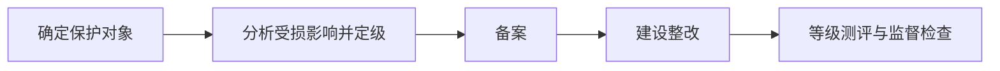

# 等级保护 2.0：为什么要先定保护对象和等级，再谈建设措施

> [!summary] 快速复习卡片
> **作用/定位**：按保护对象受破坏后的影响确定安全保护等级，再开展相应建设、测评和监督。
> **核心结论**：先明确对象和影响，再定级；典型工作链是定级、备案、建设整改、等级测评、监督检查。
> **题干怎么认**：网络安全等级保护、定级对象、五级、备案、测评、监督检查。
> **易错点**：不能只凭行业名称或“核心系统”字样直接定级；也不要把旧版评估准则中的等级名称套成等保 2.0 定级名称。

## 为什么不能先买设备再定级

同样是网站，普通公开信息页和承载重要业务的平台，受破坏后的影响不同，需要的保护强度也不同。等级保护先界定保护对象，再根据受损影响确定等级，后续措施才有依据。

安全措施应与信息化建设同步规划、同步建设、同步使用。这里的重点是安全进入系统全生命周期，而不是上线后临时补设备。

## 五级怎样减负记忆

只先记“由低到高共五级，保护和监管要求逐级增强”。具体系统属于哪一级，要依据定级规则和受损影响判断。

旧教材或旧题可能出现“用户自主保护级、系统审计保护级、安全标记保护级”等术语，它们来自 GB 17859 的计算机信息系统安全保护能力等级口径，不能直接当成等保 2.0 的五个定级名称。

## 与 ISO/IEC 27001 的关系

等级保护属于我国网络安全制度与合规语境；[[ISO27001信息安全管理]]关注组织如何建立 ISMS。实际组织可能同时采用，但考试中要先分清题目问制度流程还是管理体系标准。

## 自测

1. 为什么“政府系统”四个字不足以直接判定保护等级？
2. 旧版“系统审计保护级”等名称为什么不能直接写成等保 2.0 五级名称？

## 下一站

- 前置：[[安全风险评估]]
- 下一站：[[ISO27001信息安全管理]]
