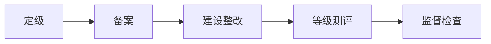

# 等级保护 2.0：先判断系统有多重要，再决定保护到什么程度

> [!summary]- 快速复习卡片（学完再看）
> **一句话**：等级保护就是先判断一个系统一旦出事会造成多大影响，确定保护等级，再按这个等级去建设、测评和接受监督。
> **工作主线**：定级 → 备案 → 建设整改 → 等级测评 → 监督检查。
> **五级记忆**：第一级到第五级，等级越高，要求越严格。
> **易错点**：不能只看“政府系统”“核心系统”等名称直接判断等级。

## 为什么要分等级

普通宣传网站和核心业务系统都需要安全，但两者一旦被破坏，造成的影响可能完全不同。

所以不能所有系统都用同一套保护强度。

> **等保先回答“这个系统需要保护到什么程度”，再决定具体怎么建设。**

## 等级是怎么定出来的

零基础先抓一个判断思路：

> **先确定保护对象，再看它受到破坏后会影响谁、影响有多严重，据此确定等级。**

所以“某行业”“某单位”“某系统名称”本身都不能直接等于某一级。

考试看到“定级”时，第一反应应是：

**保护对象 + 受破坏后的影响。**

## 等保工作怎么走

这是本篇唯一需要记的流程：

分别只记一句：

| 环节 | 一句话 |
| --- | --- |
| 定级 | 判断保护对象应该达到哪一级。 |
| 备案 | 按规定把定级等情况进行备案。 |
| 建设整改 | 按相应等级要求补齐技术和管理措施。 |
| 等级测评 | 检查实际保护能力是否达到对应要求。 |
| 监督检查 | 后续继续接受检查并整改发现的问题。 |

> **这五个是工作环节，不是五种安全技术。**

## 五级怎么记

考试阶段先只记：

**第一级 → 第二级 → 第三级 → 第四级 → 第五级**

等级越高，保护要求越严格。

具体系统到底属于哪一级，要根据定级规则和受破坏后的影响判断，不要凭名称猜。

> [!note]- 旧教材五级名称：遇到旧题再看
> 旧教材可能出现：
> **用户自主保护级、系统审计保护级、安全标记保护级、结构化保护级、访问验证保护级**。
>
> 这组名称来自旧的计算机信息系统安全保护能力等级口径。
>
> **只把它当旧题识别词，不要拿它替换等保 2.0 的“第一级～第五级”。**

## 最容易混的地方

### 等保不是安全设备清单

“三级系统”不是说一定买某几台固定设备，而是要达到对应等级要求，技术和管理措施要结合实际系统落实。

### 等保也不是风险评估的同义词

[[安全风险评估]]回答的是：

> **当前有哪些风险、风险有多大？**

等级保护回答的是：

> **这个保护对象应该达到什么保护等级，并按这个等级建设和测评？**

风险评估可以帮助安全建设，但两者不是同一个概念。

### 和 ISO/IEC 27001 不要混

一句话够用：

- **等级保护**：按我国网络安全等级保护制度确定等级并建设、测评；
- [[ISO27001信息安全管理]]：组织怎样建立和持续改进 ISMS。

## 考试第一动作

题干出现：

**等保、定级、备案、测评、第几级**

先在脑中还原：

> **先定对象和等级 → 再按等级建设 → 再测评和监督。**

不要先去想 TLS、防火墙、数字签名这些单项技术。

## 自测

1. 为什么“政府系统”四个字不能直接说明它一定是第三级？

> [!answer]- 第 1 题答案与解析
> **答案**：因为定级要针对具体保护对象分析其受破坏后的影响，不能只靠行业或系统名称判断。

2. 等保的五个典型工作环节是什么？

> [!answer]- 第 2 题答案与解析
> **答案**：定级、备案、建设整改、等级测评、监督检查。

3. “系统审计保护级”应该怎样处理？

> [!answer]- 第 3 题答案与解析
> **答案**：把它当作旧教材、旧题中的安全保护能力等级术语识别，不要直接当成等保 2.0 的等级名称。

## 下一站

等保解决“**这个系统应该保护到什么等级，并怎样按等级落实**”；下一站再看组织怎样长期管理安全风险：[[ISO27001信息安全管理]]。
