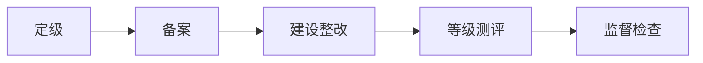

# 等级保护 2.0：先判断系统有多重要，再决定保护到什么程度

> [!summary]- 快速复习卡片（学完再看）
> **一句话**：等级保护就是先判断一个系统一旦出事会造成多大影响，确定保护等级，再按这个等级去建设、测评和接受监督。
> **工作主线**：定级 → 备案 → 建设整改 → 等级测评 → 监督检查。
> **五级记忆**：第一级到第五级，等级越高，要求越严格。
> **易错点**：不能只看“政府系统”“核心系统”等名称直接判断等级。

## 为什么要分等级

普通宣传网站和核心业务系统都需要安全，但两者一旦被破坏，造成的影响可能完全不同。

所以不能所有系统都用同一套保护强度。

> **等保先回答“这个系统需要保护到什么程度”，再决定具体怎么建设。**

## 等级是怎么定出来的

零基础先抓一个判断思路：

> **先确定保护对象，再看它受到破坏后会影响谁、影响有多严重，据此确定等级。**

所以“某行业”“某单位”“某系统名称”本身都不能直接等于某一级。

考试看到“定级”时，第一反应应是：

**保护对象 + 受破坏后的影响。**

### 做一张定级信息收集记录

下面用虚构的“网上办事申请系统”演示**收集和核验问题**，不是实际定级结论，也不替代现行国家标准、主管部门规则或正式评审。仓库现有主教材可支撑“先看对象及其受损影响”的学习动作，但没有足以在此给出合规等级结论的完整现行定级材料。

| 记录项 | 教学记录 | 谁/用什么材料核验 |
| --- | --- | --- |
| 拟评估对象 | 网上办事申请系统（边界待确认：是否包含统一身份平台、共享交换和数据服务） | 系统责任单位依据系统边界图、资产清单和业务流程确认保护对象范围 |
| 主要业务与信息 | 接收申请、保存申请材料、向办事人员提供审核信息 | 业务负责人核对业务连续性要求、信息分类和相关方要求 |
| 假设的受损情境 | 申请材料泄露；申请记录被未授权篡改；系统长时间不可用 | 分别核实保密性、完整性、可用性受到影响的范围和持续时间；目前均为待核假设 |
| 影响对象与后果 | 申请人权益、办事流程、关联部门协同及组织声誉可能受影响 | 业务与数据责任人提供影响分析和证据；不可把“政府系统”标签当影响结论 |
| 影响级别/等级结论 | **待核，不在本教学例中填具体级别** | 由责任单位按现行定级规则形成材料，并依规定完成评审/审核与后续程序；应记录规则版本和结论依据 |
| 后续跟踪 | 定级结论确认后，按适用要求分解建设项；测评发现的问题进入整改台账 | 每条整改记录写差距、责任人、期限、修复证据、复测结果和遗留风险；系统边界、业务或规则变化时重新核对 |

这样写的目的，是把“定级不能凭名称猜”变成可执行的前置工作：先固定对象边界，再收集受损情境、影响证据和责任人，最后才由适用规则导出结论。缺少关键材料时应标记待核并补证，不能为了填满表格而编出等级。

## 等保工作怎么走

这是本篇唯一需要记的流程：

分别只记一句：

| 环节 | 一句话 |
| --- | --- |
| 定级 | 判断保护对象应该达到哪一级。 |
| 备案 | 按规定把定级等情况进行备案。 |
| 建设整改 | 按相应等级要求补齐技术和管理措施。 |
| 等级测评 | 检查实际保护能力是否达到对应要求。 |
| 监督检查 | 后续继续接受检查并整改发现的问题。 |

> **这五个是工作环节，不是五种安全技术。**

教学上可把整改与测评分开跟踪：例如“访问权限最小化”写明目标范围、责任岗位、完成期限和配置/测试证据；测评发现未达项后进入整改，再用复测结果关闭或保留待处理。具体材料名称、报送主体、周期和程序以当前适用制度为准，本页不将旧教材流程解释成完整的现行合规清单。

## 五级怎么记

考试阶段先只记：

**第一级 → 第二级 → 第三级 → 第四级 → 第五级**

等级越高，保护要求越严格。

具体系统到底属于哪一级，要根据定级规则和受破坏后的影响判断，不要凭名称猜。

> [!note]- 旧教材五级名称：遇到旧题再看
> 旧教材可能出现：
> **用户自主保护级、系统审计保护级、安全标记保护级、结构化保护级、访问验证保护级**。
>
> 这组名称来自旧的计算机信息系统安全保护能力等级口径。
>
> **只把它当旧题识别词，不要拿它替换等保 2.0 的“第一级～第五级”。**

## 最容易混的地方

### 等保不是安全设备清单

“三级系统”不是说一定买某几台固定设备，而是要达到对应等级要求，技术和管理措施要结合实际系统落实。

### 等保也不是风险评估的同义词

[[安全风险评估]]回答的是：

> **当前有哪些风险、风险有多大？**

等级保护回答的是：

> **这个保护对象应该达到什么保护等级，并按这个等级建设和测评？**

风险评估可以帮助安全建设，但两者不是同一个概念。

### 和 ISO/IEC 27001 不要混

一句话够用：

- **等级保护**：按我国网络安全等级保护制度确定等级并建设、测评；
- [[ISO27001信息安全管理]]：组织怎样建立和持续改进 ISMS。

## 考试第一动作

题干出现：

**等保、定级、备案、测评、第几级**

先在脑中还原：

> **先定对象和等级 → 再按等级建设 → 再测评和监督。**

不要先去想 TLS、防火墙、数字签名这些单项技术。

## 自测

1. 为什么“政府系统”四个字不能直接说明它一定是第三级？

> [!answer]- 第 1 题答案与解析
> **答案**：因为定级要针对具体保护对象分析其受破坏后的影响，不能只靠行业或系统名称判断。

2. 等保的五个典型工作环节是什么？

> [!answer]- 第 2 题答案与解析
> **答案**：定级、备案、建设整改、等级测评、监督检查。

3. “系统审计保护级”应该怎样处理？

> [!answer]- 第 3 题答案与解析
> **答案**：把它当作旧教材、旧题中的安全保护能力等级术语识别，不要直接当成等保 2.0 的等级名称。

4. 对“网上办事系统”这个名称，能否直接写定为某一级？

> [!answer]- 第 4 题答案与解析
> **答案**：不能。
> **解析**：先确认保护对象边界和受破坏后的影响情境，再由责任单位依据当前适用规则核验；名称本身不构成等级证据。

5. 测评发现“申请数据访问范围过宽”后，怎样记录整改才便于复查？

> [!answer]- 第 5 题答案与解析
> **答案**：记录差距、责任人、期限、调整后的权限证据、复测结果和遗留风险。
> **解析**：测评发现要进入整改与复测闭环；具体程序和正式材料要求依现行适用制度确认。

## 下一站

等保解决“**这个系统应该保护到什么等级，并怎样按等级落实**”；下一站再看组织怎样长期管理安全风险：[[ISO27001信息安全管理]]。
