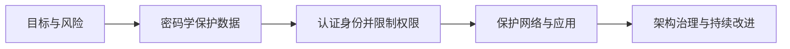

# 信息安全技术 · 考前速记

> [!warning] 用法
> 这是召回清单，不替代原子卡。先闭卷说答案，卡住再点链接。

## 全章主线

## 起点：目标与风险

- [[信息安全基本目标]]：机密性防泄露，完整性防未授权改动，可用性保证需要时可使用。
- [[安全风险评估]]：资产有价值，威胁利用脆弱性造成影响，控制用于降低可能性或影响。

## 密码学与 PKI

- [[对称加密]]：共享密钥、速度快、适合大量数据；难点是密钥分发和管理。
- [[非对称加密]]：公私钥成对；保密通常使用接收方公钥，签名使用签名方私钥。
- [[哈希算法]]：单向摘要，不提供机密性；用于完整性检查、口令派生/存储、签名前摘要。
- [[数字签名]]：支持真实性、完整性和不可抵赖证据，不直接提供机密性。
- [[数字证书与PKI]]：证书把身份与公钥绑定，客户端仍要验证信任链、名称、有效期和用途。
- [[密钥管理]]：生成、分发、存储、轮换、备份/恢复、吊销与销毁贯穿密钥生命周期。

## 身份认证与访问控制

- [[身份认证]]：验证“你是谁”；多因素必须来自不同因素类别。
- [[访问控制基础]]：主体请求访问客体，系统按策略作出允许或拒绝决定，并记录审计信息。
- [[DAC自主访问控制]]：资源属主可在策略允许范围内授予权限。
- [[MAC强制访问控制]]：系统依据安全标签和强制规则裁决，普通属主不能绕过。
- [[RBAC基于角色访问控制]]：用户 → 角色 → 权限，适合按岗位管理授权。
- [[Kerberos认证]]：KDC、TGT、服务票据；时间戳与短期票据帮助抵抗重放。

## 网络、通信与攻击

- [[防火墙]]：按规则控制经过控制点的流量；包过滤、状态检测、应用代理关注深度不同。
- [[IDS与IPS]]：IDS 偏检测告警，IPS 可在线阻断；旁路/串联是经典网络部署题眼。
- [[VPN]]：公网之上的逻辑专用连接；IPsec 重点认 AH/ESP、传输/隧道模式。
- [[TLS与HTTPS]]：验证证书、协商参数与密钥，再用会话密钥保护业务数据。
- [[无线网络安全]]：WEP 已不安全；WPA2/WPA3、802.1X/RADIUS 是识别重点。
- [[常见网络攻击]]：资源耗尽 → DoS/DDoS；旧合法消息再发送 → 重放；插入通信双方 → 中间人。

## Web 应用三分法

| 考点 | 攻击落点 | 首要防线 |
| --- | --- | --- |
| [[SQL注入]] | 输入变成 SQL 结构 | 参数化查询 |
| [[XSS跨站脚本]] | 内容变成浏览器代码 | 按上下文输出编码 / 安全 DOM API |
| [[CSRF跨站请求伪造]] | 借已有身份提交请求 | Token / SameSite / 来源校验 |

## 安全架构与治理

- [[安全模型]]：Bell-LaPadula 重机密性，Biba 重完整性，Clark-Wilson 用受控事务保护商业完整性，Chinese Wall 防利益冲突。
- [[OSI安全体系结构]]：先认安全服务，再找实现机制；五类服务是认证、访问控制、数据机密性、数据完整性、抗抵赖。
- [[安全架构设计]]：从资产、威胁和脆弱性推导控制，覆盖预防、检测、响应和恢复。
- [[纵深防御]]：不同层次、不同类型控制互补，避免单点失败直接暴露核心资产。
- [[数据库安全与完整性设计]]：访问安全回答“谁能做什么”，完整性约束回答“数据能写成什么样”。
- [[软件脆弱性分析]]：脆弱性贯穿需求、设计、编码、测试、部署和运行阶段。
- [[等级保护2.0]]：定级 → 备案 → 建设整改 → 等级测评 → 监督检查。
- [[可信计算]]：信任根、度量与证明用于判断平台状态是否符合预期；不等于发现异常就自动拦截。

拓展只记定位：[[单点登录SSO]] 是跨系统复用认证结果；[[零信任架构]] 不基于网络位置给予隐式信任；[[ISO27001信息安全管理]] 用风险驱动的 ISMS 持续管理信息安全。

## 考前 12 问

- [ ] CIA 三目标分别防什么问题？
- [ ] 威胁、脆弱性、资产和风险怎样关联？
- [ ] 对称加密、非对称加密分别适合什么任务？
- [ ] 哈希、签名、证书各提供什么能力？
- [ ] 认证与访问控制有什么区别？
- [ ] DAC / MAC / RBAC 的题眼是什么？
- [ ] 防火墙、IDS、IPS 的职责有什么差别？
- [ ] IPsec 的 AH / ESP 和两种模式怎样区分？
- [ ] HTTPS 握手后为什么仍使用对称密钥？
- [ ] DDoS / 重放 / 中间人攻击如何识别？
- [ ] SQL 注入 / XSS / CSRF 分别攻击哪里？
- [ ] 如何按“风险 → 控制 → 监测 → 响应恢复”组织案例题答案？

卡住就回 [[信息安全技术索引]]，按主线重新定位。
