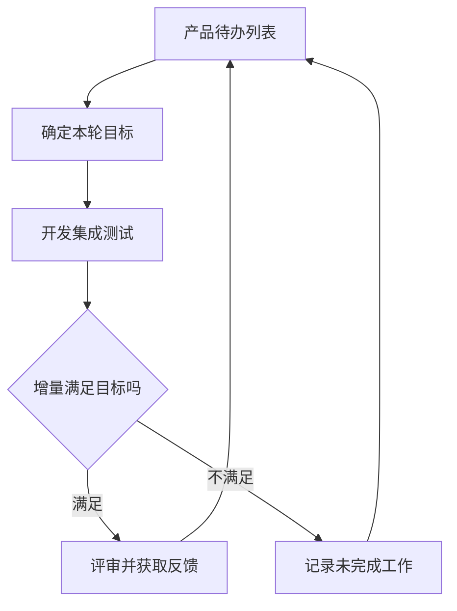

# Scrum迭代管理

> [!summary] 快速复习卡片
> - **核心结论**：产品待办列表管理需求，本轮待办列表限定迭代工作，结束时检查产品增量。
> - **做题入口**：Backlog、Sprint、迭代结束交付增量 → Scrum。

**Scrum**是教材介绍的敏捷过程骨架，侧重开发工作的组织管理。产品待办列表保存待实现需求，并按商业价值等因素排序；Sprint 是一个短迭代周期。

以告警平台为例，待办列表有邮件通知、短信通知、统计报表。团队选择本轮能够完成的目标，例如邮件通知，细化成本轮待办项，完成开发、集成与测试，最后检查是否得到可交付增量。

反馈用于重新安排后续工作。迭代不是只按时开会，更不能把未验证的代码数量当作可交付增量。本卡解释教材的基本过程，不套用未经核验的具体天数和版本规则。

## 自测

> [!question] 自测
> 1. 本轮写完代码但无法集成，是否形成可交付增量？
>
> > [!answer]- 第 1 题答案与解析
> > **答案**：没有，增量需要经过集成和验证，满足约定目标。
