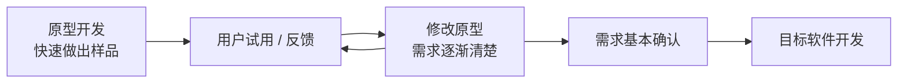

# 原型模型：用户自己都说不清需求时，先做一个样品给他看

> [!summary]- 快速复习卡片（学完再看）
> **作用/定位**：当用户难以准确说清需求时，先快速做出能看、能试的原型，用真实反馈把需求逐渐说清楚。  
> **两阶段**：原型开发 → 根据反馈确认需求 → 目标软件开发。  
> **两种去留**：抛弃型原型用完就丢；演化型原型继续完善，逐步成为正式产品。  
> **题干信号**：需求模糊、用户说不清、先做样品/界面让用户试 → 原型模型。  
> **易错点**：原型能演示 ≠ 已达到生产系统要求；“反复修改”也不能单独证明它是螺旋。

上一站 [[螺旋模型]] 已经知道：

> 面对高风险和高不确定性，应该尽早验证最可能让项目失败的问题。

现在把风险换一种。

假设要做一个新的运维告警平台，用户说：

> “我要一个好用的告警首页。”

开发人员继续问：

- 首页最重要的是主机、服务还是告警级别？
- 需要几张图？
- 默认看最近 1 小时还是 24 小时？
- 点进去先看详情还是趋势？

用户可能只能回答：

> “我也说不清，做出来我看看才知道。”

这时最大的问题不是“技术能不能实现”，而是：

> **用户脑子里还没有一个足够清楚的目标，单靠继续写需求文档也未必能说清。**

原型模型的答案就是：

> **不要一直靠嘴描述，先快速做一个看得见、能操作的样品，让用户通过实际体验告诉你哪里对、哪里不对。**

## 原型到底解决什么问题

原型最适合解决的是：

> **“需求还很模糊，用户难以一次性准确表达。”**

例如团队先做一个简单告警首页：

- 左边放项目列表；
- 中间放当前告警；
- 右边放趋势图；
- 数据可以只用少量模拟数据；
- 某些按钮甚至暂时不真正执行后台操作。

用户一试就可能说：

> “项目列表不重要，我首先要按严重级别看；趋势图也应该放下面，首页先显示当前未恢复告警。”

这些反馈比继续讨论“首页应该友好、清晰、直观”有效得多。

所以原型的核心价值不是“提前写了一版正式系统”，而是：

> **把抽象、含糊的需求变成一个可见对象，让用户通过反馈帮助需求收敛。**

## 原型模型为什么分成两个阶段

主教材把原型模型概括成两个阶段。

### 第一阶段：原型开发

目标不是一开始就把所有生产要求做完整，而是尽快把关键问题展示出来。

原型可以重点体现：

- 关键界面；
- 主要交互；
- 核心业务流程；
- 最需要用户确认的功能或性能表现。

教材还说明，原型可以通过真实开发、界面模拟，甚至参考已有类似系统等方式帮助用户理解目标系统。

### 第二阶段：目标软件开发

原型经过若干轮反馈后，用户和开发者对需求有了更一致的理解。

这时才进入正式目标系统开发。

关键问题就来了：

> **刚才做的原型代码到底留不留？**

于是出现两种典型方式。

## 抛弃型原型：样品的任务是“把需求问明白”

假设团队为了确认首页布局，用模拟数据快速做了一个页面。

用户确认完需求后，这个页面代码：

- 结构很临时；
- 没有权限控制；
- 没考虑大数据量；
- 没处理异常；
- 只是为了尽快获得反馈。

那么最合理的做法可能是：

> **留下已经确认的需求和经验，把原型丢掉，再按正式要求开发目标系统。**

这就是：

> **抛弃型原型：原型的主要产物是“被澄清的需求”，不是原型代码本身。**

教材明确指出，抛弃型原型在需求确认后可以被废弃，再采用完整过程开发正式系统。

## 演化型原型：样品本身继续长成正式产品

另一种情况是，团队从一开始就有意识地让原型具备可继续演进的结构。

用户每次反馈后：

- 补功能；
- 改交互；
- 加权限；
- 完善数据处理；
- 增强性能和可靠性。

原型不被丢弃，而是一轮轮完善，最终成为目标系统。

这就是：

> **演化型原型：原型不是临时草稿，而是正式产品的早期版本。**

所以两者最短区分：

> **抛弃型：原型帮你把需求问清楚，然后扔掉。**  
> **演化型：原型边问边改，最后自己长成产品。**

## “原型能跑”为什么不等于“可以上线”

这是非常容易误解的一点。

一个原型页面能打开、按钮能点，只说明：

> 它足以帮助用户理解和反馈某些需求。

它不自动证明已经具备正式系统要求，例如：

- 权限控制；
- 并发能力；
- 容错与恢复；
- 安全；
- 可维护性；
- 完整异常处理；
- 真实数据规模下的性能。

所以：

> **原型首先是沟通和验证工具；只有演化型原型在持续补齐生产要求后，才可能逐步变成正式产品。**

不能看到“演示成功”就直接等号“目标系统完成”。

## 原型、迭代、螺旋为什么看起来都在反复修改

因为它们都可能出现“做一版 → 看结果 → 再修改”。

但真正区分它们，要问：

> **为什么要反复？**

| 概念 | 反复的核心原因 |
| --- | --- |
| [[迭代与增量模型]] | 改进已有能力，或逐步增加新的可用能力 |
| [[螺旋模型]] | 每轮优先识别和降低关键风险 |
| **原型模型** | 用户需求模糊，需要通过看得见的样品来澄清 |

所以题干写“反复修改”时不能马上选答案。

继续找最强信号：

- **分批交付功能** → 增量；
- **风险分析** → 螺旋；
- **用户需求说不清，先做样品确认** → 原型。

## 原型是不是只用来做界面

**不是。**

界面原型最好理解，所以经常拿来举例。

但教材所说的原型可以展示目标系统全部或部分的：

- 功能；
- 性能；
- 交互；
- 关键问题。

例如一个高并发系统，也可能先做小型原型来验证某项关键技术或性能行为。

考试时不要把“原型”缩成“画 UI”。

真正要抓的是：

> **快速形成一个可观察、可评价的目标系统样品，用来减少不确定性。**

## 考试第一动作

看到过程模型题，先找题干在说什么困难。

- **用户无法准确回答目标系统需要什么 / 需求模糊**  
  → 优先想到 **原型模型**。

- **先快速做出样品，让用户试用、评价、修改需求**  
  → **原型模型**。

- **原型需求确认后被丢弃，重新正式开发**  
  → **抛弃型原型**。

- **原型不断补充完善，最终成为产品**  
  → **演化型原型**。

- **只是“分多轮开发”**  
  → 证据不够，可能只是迭代。

- **每轮明确突出风险分析**  
  → 回到 [[螺旋模型]]。

## 为什么下一站是构件组装模型

到现在为止，前几个模型都默认了一件事：

> 项目主要是在“开发自己的软件”。

但实际开发中可能遇到另一个问题。

假设告警平台需要：

- 用户认证；
- 报表导出；
- 消息队列客户端；
- 日志解析；
- 图表展示。

这些能力市场上或组织内部已经有成熟构件。

那还需要全部从头写一遍吗？

于是下一站开始换一个问题：

> **如果已经有成熟的软件构件，能不能把开发重点从“自己写”转向“寻找、评估、适配和组装”？**

这就是 [[构件组装模型]]。

## 自测

1. 用户说“我也不知道首页具体怎么设计，你先做一个我看看”，优先考虑什么模型？

> [!answer]- 第 1 题答案与解析
> **答案：原型模型。**
> **解析：**核心困难是需求模糊，先用可见样品获取反馈并澄清需求。

2. 为了确认告警首页布局，团队用模拟数据快速做了一个临时页面。需求确认后把页面代码废弃，只保留确认后的需求。这属于什么原型？

> [!answer]- 第 2 题答案与解析
> **答案：抛弃型原型。**
> **解析：**原型的价值是澄清需求，需求确认后原型本身不进入正式产品。

3. 一个原型已经能演示主要功能，是否说明它一定可以直接上线？

> [!answer]- 第 3 题答案与解析
> **答案：不能。**
> **解析：**原型可能没有满足权限、并发、安全、可靠性、可维护性等生产要求。

4. 原型反复修改和螺旋模型都存在循环，怎样最快区分？

> [!answer]- 第 4 题答案与解析
> **答案：看循环的核心驱动力。**
> **解析：**原型重点是通过样品澄清需求；螺旋重点是每轮风险分析和风险驱动。

## 上一站 / 下一站

- **上一站**：[[螺旋模型]] —— 已经学会“风险驱动”；本篇把其中一种常见不确定性单独拿出来：**用户根本说不清需求**，此时用原型把抽象描述变成可见反馈。
- **下一站**：[[构件组装模型]] —— 原型解决“需求说不清”，下一篇换一个完全不同的问题：**如果成熟能力已经有人实现好了，为什么还要全部从头开发？**
