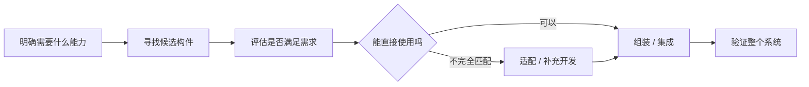

# 构件组装模型：已经有成熟软件构件时，为什么还要全部从头写

> [!summary]- 快速复习卡片（学完再看）
> **作用/定位**：把开发重点从“全部自己实现”转向“寻找已有构件 → 评估 → 必要时适配 → 组装成系统”。  
> **核心思想**：复用已有成熟构件，减少重复开发，把更多精力放到选择、集成和验证。  
> **题干信号**：软件重用、已有构件、构件库、选择/适配/组装 → 优先想到构件模型。  
> **易错点**：构件组装模型是**过程模型视角**；第 06 节 CBSE 会继续讲构件模型、容器、具体组装方式和接口适配，不在本篇重复展开。  
> **下一步**：过程模型已经看过多种“怎么组织开发”的思路，下一站 [[RUP]] 开始看一个更完整的过程框架怎样把阶段、迭代、用例和架构组织起来。

上一站 [[原型的去留与目标系统]] 解决的是：

> 用户自己说不清需求时，先做一个样品让需求逐渐清楚。

现在换一个完全不同的问题。

假设要开发告警平台，需要：

- 登录和身份认证；
- 消息通知；
- 图表展示；
- 报表导出；
- 日志解析。

团队发现这些能力并不是第一次有人做。

公司内部已经有成熟认证构件，外部也有可复用的图表、消息和报表构件。

这时还要全部从零编码吗？

> **构件组装模型的答案是：不一定。能复用的先复用，把开发重点从“重新实现”转向“选择、适配和集成已有构件”。**

主教材在 CBSE 中把这种思想概括为：

> 开发重点从“实现”转向“集成”。

## 先理解“构件”到底是什么

这里不需要提前学习第 06 节全部构件理论。

当前先把构件理解成：

> **一个已经实现、能够通过明确接口被其他系统使用的软件单元。**

例如：

- 一个认证服务；
- 一个报表生成模块；
- 一个支付构件；
- 一个消息发送组件。

它们不是几行随手复制的代码，而是能够被独立选择、使用和组合的软件能力。

所以构件组装模型首先改变了一个开发假设：

> **需要某项能力 ≠ 一定要自己从头实现。**

## 开发过程发生了什么变化

传统思路可能更像：

> 明确需求 → 自己设计 → 自己编码 → 测试。

构件组装思路会先增加一个关键动作：

> **市场、组织内部或构件库里，是否已经有合适的东西？**

这张图当前只需要抓住一个主线：

> **找得到 → 合不合适 → 不合适怎么办 → 怎样组起来 → 整体是否可用。**

后面第 06 节 [[CBSE开发过程]] 会再把完整活动展开。

## 为什么“复用”会改变开发方式

假设团队要实现身份认证。

### 从头开发

需要自己考虑：

- 账号；
- 密码；
- 登录状态；
- 权限；
- 安全；
- 接口；
- 测试。

### 复用成熟认证构件

重点会变成：

- 这个构件提供什么接口？
- 是否满足当前身份认证需求？
- 与现有系统技术平台兼容吗？
- 接口不一致怎样适配？
- 版本、性能和安全要求是否符合？
- 集成后整个系统是否仍然满足要求？

所以复用不是：

> “什么都不用做了。”

而是把工作重心从：

> **“怎样把这个功能写出来”**

转成：

> **“现有构件是否适合，怎样把它可靠地接进系统”**。

这也是为什么构件组装模型仍然是一种工程过程，而不是“下载几个库拼起来”。

## 一个很特别的点：有时需求还要反过来适应构件

这是构件式开发与传统“先把需求完全定死，再实现”很不一样的地方。

假设用户要求：

> “报表必须支持一种非常特殊的导出格式。”

团队找到的成熟报表构件支持：

- PDF；
- Excel；
- CSV；

但不支持那个特殊格式。

这时有几个选择：

1. 自己开发额外能力；
2. 换另一个构件；
3. 写适配层；
4. 和用户协商，把需求调整为已有构件能够较低成本支持的形式。

主教材在 CBSE 过程里明确指出：

> **可利用构件会反过来影响和细化需求。**

所以构件组装不是机械地“需求给什么，我就一定找一个完全一样的构件”。

更真实的过程是：

> **需求和可获得构件之间要不断匹配与权衡。**

## 构件组装模型和 CBSE 是什么关系

这一点必须分层，否则后面第 06 节会觉得完全重复。

### 这里：构件组装模型

站在**软件过程模型**角度，只回答：

> **项目能不能主要通过复用和组装已有软件构件来开发，而不是所有东西都从头写？**

当前掌握：

- 为什么出现；
- 开发重心怎样变化；
- 题干怎样识别。

### 第 06 节：基于构件的软件工程 CBSE

后面会进一步学：

- [[构件模型与容器]]
- [[CBSE开发过程]]
- [[构件组装方式]]
- [[构件接口适配]]

那时才回答：

> 构件应该具备什么特征？  
> 完整 CBSE 活动是什么？  
> 顺序/层次/叠加怎样组装？  
> 接口不兼容怎样用适配器解决？

所以：

> **这里学“为什么采用构件式过程”，后面学“构件式工程具体怎么做”。**

不要在这一篇提前背后面全部细节。

## 构件组装和增量是不是互斥的

**不是。**

一个项目完全可以：

- 第一轮交付用户管理；
- 第二轮交付报表；
- 第三轮交付通知。

这体现增量。

与此同时，每一轮里的身份认证、报表、通知能力又可能大量复用已有构件。

这体现构件组装。

所以过程模型中的特征经常可以组合。

做题不要看到“分批交付”就认为不能有构件，也不要看到“构件复用”就认为不能迭代。

要找题目真正强调的主特征。

## 构件组装和原型为什么完全不是一类问题

上一站原型解决：

> **我连“要什么”都还没有说清楚。**

构件组装解决：

> **我知道大致要什么，但发现这些能力可能已经有成熟实现，不必全部重做。**

因此：

| 题目困难 | 优先想到 |
| --- | --- |
| 用户需求模糊，需要看样品才能说清 | **原型模型** |
| 已有成熟软件构件，希望通过复用降低重复开发 | **构件组装模型** |

两者都可能“更快”，但快的原因完全不同：

- 原型快：为了**尽快获得需求反馈**；
- 构件快：为了**复用已有实现**。

## 考试第一动作

看到过程模型题，先找这些词。

- **软件重用 / 已有构件 / 构件库**  
  → 优先想到 **构件模型 / 构件组装模型**。

- **寻找候选构件、评估、适配、集成**  
  → **构件式开发**。

- **通过重用提高可靠性、易维护性、减少重复开发**  
  → 优先考虑 **构件模型**。

2020-H2-综合知识-40 就直接用“通过重用来提高软件可靠性和易维护性、修改时副作用较少”识别**构件模型**。

但如果题干强调：

- 顺序组装 / 层次组装 / 叠加组装；
- 参数、操作、操作不完备等接口不兼容；
- 适配器构件；

这已经进入后面第 06 节的 [[构件组装方式]] / [[构件接口适配]]，不要把所有细节塞在本篇里。

## 为什么下一站是 RUP

到这里已经学了多种过程思路：

- [[瀑布模型]]：阶段顺序怎么组织；
- [[迭代与增量模型]]：怎样多轮推进、逐步增加能力；
- [[螺旋模型]]：怎样按风险组织每轮活动；
- [[原型的去留与目标系统]]：需求说不清时怎样用样品澄清；
- **构件组装模型**：已有成熟构件时怎样把开发重心转向复用和集成。

接下来会遇到一个更大的问题：

> **如果一个大型项目既要迭代、又要控制阶段目标、又要围绕架构和用例组织团队，能不能有一个更完整的过程框架？**

这就是下一站 [[RUP]]。

## 自测

1. 项目发现公司内部已有成熟认证、报表和消息构件，计划优先评估并集成，而不是全部重写。最符合什么过程思路？

> [!answer]- 第 1 题答案与解析
> **答案：构件组装模型。**
> **解析：**核心题眼是“复用已有构件 + 评估/适配/集成”。

2. 使用构件组装模型以后，是不是意味着项目基本不需要再开发代码？

> [!answer]- 第 2 题答案与解析
> **答案：不是。**
> **解析：**仍可能需要适配、胶水代码、补充功能、集成和系统验证；只是开发重点从全部从头实现转向复用与集成。

3. 原型模型和构件组装模型都可能缩短开发时间，怎样最快区分？

> [!answer]- 第 3 题答案与解析
> **答案：看“快”的来源。**
> **解析：**原型靠快速样品澄清需求；构件组装靠复用已有实现减少重复开发。

4. “顺序组装、层次组装、叠加组装”需要现在全部背在这篇吗？

> [!answer]- 第 4 题答案与解析
> **答案：不需要。**
> **解析：**本篇只建立过程模型定位；具体组装方式由第 06 节 [[构件组装方式]] 作为主事实源展开。

## 上一站 / 下一站

- **上一站**：[[原型的去留与目标系统]] —— 原型解决“需求说不清”；本篇换成“需求大体知道，但成熟能力已经存在，为什么还要全部重写”。
- **下一站**：[[RUP]] —— 前面多个模型各自突出一种核心组织思想；下一篇开始看 RUP 怎样把阶段、迭代、用例和架构组织成更完整的软件过程框架。
