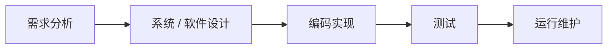

# 瀑布模型：为什么把开发工作按阶段一步步往下做

> [!summary]- 快速复习卡片（学完再看）
> **作用/定位**：瀑布是软件**过程模型**，回答需求、设计、编码、测试等工作怎样组织，不是“软件生命周期本身”。  
> **核心机制**：阶段顺序明确；前一阶段的成果经检查后成为下一阶段的输入。  
> **题干信号 → 第一反应**：需求较稳定、严格阶段推进、文档/里程碑评审、晚期变更代价大 → 优先想到瀑布。  
> **易错点**：经典瀑布强调顺序推进，不等于现实中发现错误也绝不回头；真正的问题是**越晚回头，依赖旧成果的东西越多，返工越大**。  
> **下一步**：如果不想等到很晚才看到可运行成果和用户反馈，就会自然引出 [[迭代与增量模型]]。

上一站 [[软件工程的定位]] 已经分清了三个层次：

- **软件生命周期**：软件从产生需求到开发、运行维护、最终淘汰的一生；
- **软件过程**：为了把软件做出来并维护，要开展哪些工程工作；
- **软件过程模型**：需求、设计、编码、测试这些工作**具体怎么组织和推进**。

现在开始看第一个具体过程模型。

假设要开发一套日志归档系统，需求已经比较明确：日志保留多久、谁能查询、怎样验收都基本说清楚了。

这时团队面临的第一个问题不是“软件一生有哪些阶段”，而是：

> **需求、设计、编码、测试这么多工作，应该按什么顺序做，怎样避免大家各做各的？**

**瀑布模型给出的答案很直接：把工作分成前后衔接的阶段，前一阶段先形成经过检查的成果，再把这个成果交给下一阶段继续做。**

## 瀑布到底是怎么“往下流”的

经典瀑布模型把开发工作按阶段顺序推进。

它最重要的不是记住图长得像瀑布，而是理解这条依赖关系：

> **前一阶段回答的问题没说清楚，后一阶段就没有可靠依据继续做。**

例如日志归档系统中：

| 阶段 | 当前主要解决什么 | 形成什么依据给下一阶段 |
| --- | --- | --- |
| 需求分析 | 要保存什么、保存多久、谁能查、验收标准是什么 | 需求规格 |
| 设计 | 数据怎样存、模块怎样拆、接口怎样定义 | 设计说明 |
| 编码 | 按设计把功能实现出来 | 程序及相关实现成果 |
| 测试 | 检查实现是否符合需求和设计 | 测试与缺陷记录 |
| 运行维护 | 上线后修复问题、适应合理变化 | 持续可运行的软件 |

所以瀑布模型的核心可以压成一句话：

> **先把上一阶段该回答的问题解决并形成成果，再把这个成果作为下一阶段的输入。**

教材还强调：每个阶段结束时通常伴随**里程碑、审查和确认**。这也是为什么题目出现“阶段评审、文档成果、前一阶段输出作为后一阶段输入”时，要优先想到瀑布。

## 为什么这种方式看起来很合理

因为很多开发工作本来就存在依赖。

还是日志归档系统：

- 需求没有确定“保存 1 年还是 7 年”，存储设计就很难定；
- 存储方案没有确定，编码人员就不知道按什么结构实现；
- 程序还没有实现，测试人员也无法验证最终行为。

所以瀑布的优势很直观：

1. **阶段职责清楚**：当前阶段主要解决什么比较明确；
2. **成果容易检查**：每一阶段都有可以评审和确认的产物；
3. **管理容易组织**：什么时候完成一个阶段、什么时候进入下一阶段比较清晰。

如果需求本身比较稳定，而且项目很重视阶段文档和正式评审，这种组织方式就比较容易发挥优势。

但问题也正好藏在这里。

## 为什么“晚一点才发现需求错了”会特别贵

假设一开始大家都认为：

> “日志归档后，只需要偶尔离线查询。”

于是设计阶段选择了一套偏低成本、查询较慢的存储方案，编码和测试也都基于这个假设完成了。

到了系统测试甚至用户验收时，用户才说：

> “归档后的日志其实必须支持秒级检索。”

这时不是只改一句需求就结束了。

因为旧需求已经被后续工作使用：

**需求变了 → 设计可能要改 → 代码跟着改 → 测试用例重新验证 → 相关文档也要同步修改。**

这就是瀑布模型晚期变更成本高的根本原因：

> **不是“改需求”这一个动作很贵，而是后面的很多成果已经依赖旧需求。发现得越晚，需要跟着重做的下游成果越多。**

所以教材指出，瀑布模型的一个突出问题是：用户往往需要较长时间才能看到真正的软件系统；如果这时才发现和期望不一致，损失会比较大。

## 瀑布是不是“绝对不能回退”

**不是“发现错误也不许改”，但经典瀑布的重点确实是严格的阶段顺序，而不是频繁回头反馈。**

这里要分两个层次理解。

### 考试口径

教材把经典瀑布描述为**严格串行化的过程模型**，强调：

- 一个阶段接一个阶段推进；
- 前一阶段结果是后一阶段输入；
- 每个阶段结束后进行审查和确认；
- 理想假设是当前阶段的问题应尽量在本阶段解决。

所以题目拿“严格顺序推进”与“多轮反馈、持续迭代”比较时，前者明显更偏瀑布。

### 工程现实

如果后面真的发现前面错了，当然不能明知错误还继续开发。

实际只能回去修正。

但这恰恰暴露了瀑布的弱点：

> **瀑布不是“物理上不能回头”，而是它没有把频繁反馈和反复修正设计成核心工作方式；一旦回头，往往需要处理已经建立起来的依赖和返工。**

因此考试中不要把“瀑布不能回退”背成绝对真理。

更准确地记：

> **经典瀑布强调阶段顺序和一次性完成；回退不是它擅长的正常节奏，晚期回退通常代价较大。**

## 瀑布模型和“软件生命周期”到底什么关系

这是最容易和上一站混在一起的地方。

**软件生命周期**回答：

> 软件从产生需求到开发、运行维护、最终淘汰，会经历怎样的一生？

**瀑布模型**回答：

> 生命周期中的需求、设计、编码、测试等工作，采用什么方式组织？

所以：

> **瀑布模型 ≠ 软件生命周期本身。**

但这里还有一个教材术语陷阱。

> [!warning] “软件生命周期模型”这个词不要和“软件生命周期”混为一谈
> 教材在介绍软件过程模型时说明：**软件过程模型有时也称“软件生命周期模型”**。
>
> 因此考试资料里看到“瀑布是一种生命周期模型”，通常是在把“生命周期模型”当作“过程模型”的另一种叫法。
>
> 但如果说“瀑布模型就是软件生命周期本身”，就把**软件的一生**和**组织开发任务的模型**混成了一件事。

可以这样记：

- **软件生命周期**：一生；
- **软件过程模型 / 生命周期模型**：这一生里的工程任务按什么规则组织；
- **瀑布模型**：其中一种组织规则。

## 瀑布模型真正依赖什么前提

瀑布最舒服的场景，是前面的判断相对可靠。

例如：

- 主要需求已经比较明确；
- 需求预计不会频繁大幅变化；
- 各阶段的成果能够较清楚地定义和评审；
- 项目需要比较明确的阶段控制和文档依据。

这不等于：

- “大型项目一定用瀑布”；
- “银行项目一定用瀑布”；
- “需求一变化瀑布就完全不能用”。

这些都太绝对。

考试真正要抓的是：

> **需求越稳定、阶段成果越容易提前确定，瀑布的顺序式组织越自然；需求越不稳定、越需要早反馈，瀑布的弱点越明显。**

## 为什么学完瀑布，下一站就是迭代与增量

现在可以看到瀑布最大的矛盾了。

它希望：

> **先把前面阶段做得足够完整，再继续往后。**

这样确实容易管理。

但代价是：

- 用户可能很晚才看到真正可运行的软件；
- 真实反馈来得比较晚；
- 前面理解错了，后面已经积累很多依赖；
- 需求发生变化时，返工链可能很长。

于是下一个很自然的问题就是：

> **能不能不要等整个系统都做完才给用户看，而是先做出一部分可用能力，得到反馈后再继续完善？**

这就是下一站 [[迭代与增量模型]] 要解决的问题。

## 考试第一动作

过程模型题不要先背一堆优缺点，先找题干在强调什么。

- **严格阶段顺序、前阶段输出是后阶段输入、里程碑评审、需求较稳定**  
  → 优先想到 **瀑布模型**。

- **较早得到可运行成果、分批交付功能、较早获得用户反馈**  
  → 优先想到 **增量式开发**。

- **每一轮把风险分析放在核心位置**  
  → 优先想到 **螺旋模型**。

- **需求说不清，先快速做样品让用户确认**  
  → 优先想到 **原型模型**。

2022-H2-综合知识-22 就曾以瀑布作为比较基线，让考生识别“更早交付可用能力、较早获得客户反馈、降低需求变化带来的代价”等特征更符合增量式开发。

因此反过来记瀑布：

> **顺序推进 + 阶段成果 + 晚反馈 + 晚改代价大。**

## 自测

1. “软件从产生需求、开发、运行维护直到淘汰”描述的是瀑布模型吗？

> [!answer]- 第 1 题答案与解析
> **答案：不是，这是软件生命周期。**
> **解析：**生命周期描述软件从生到死；瀑布描述生命周期中的开发工作怎样按阶段组织。教材有时把“过程模型”称为“生命周期模型”，但不能因此把“模型”和“生命周期本身”混为一谈。

2. 瀑布模型进入测试后发现需求理解错误，是不是因为“绝对禁止回退”，所以只能按错需求继续做？

> [!answer]- 第 2 题答案与解析
> **答案：不是。**
> **解析：**错误当然需要修正。经典瀑布强调严格顺序推进，频繁反馈并不是其核心节奏；后期回退通常意味着需求、设计、代码、测试和文档等多个下游成果一起返工，所以代价较大。

3. 为什么瀑布之后要继续学习迭代与增量，而不是直接跳到别的模型？

> [!answer]- 第 3 题答案与解析
> **答案：因为迭代/增量首先针对瀑布“可运行成果和反馈出现较晚”的问题。**
> **解析：**把开发拆成多轮、分批形成可用能力，可以让用户更早看到结果并提供反馈。具体怎样区分“迭代”和“增量”，下一篇再讲。

## 上一站 / 下一站

- **上一站**：[[软件工程的定位]] —— 已经分清生命周期、软件过程和过程模型；本篇第一次真正回答“这些工程工作怎么排”。
- **下一站**：[[迭代与增量模型]] —— 瀑布把工作按阶段向后推进，但用户反馈和可运行成果往往来得较晚；下一篇开始解决“能不能一轮一轮做、分批交付”的问题。
