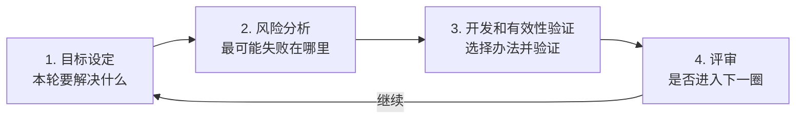

# 螺旋模型：也是一轮轮开发，为什么核心却是“先处理风险”

> [!summary]- 快速复习卡片（学完再看）
> **作用/定位**：螺旋模型也是多轮推进，但每一轮不是单纯“继续加功能”，而是围绕当前主要风险组织工作。  
> **四项活动**：目标设定 → 风险分析 → 开发和有效性验证 → 评审。  
> **题干信号 → 第一反应**：风险驱动、风险分析、每轮评审是否继续 → 螺旋。  
> **易错点**：有迭代 ≠ 螺旋；做过一次风险评估 ≠ 螺旋。关键是**风险分析是否成为每轮过程的核心驱动力**。  
> **下一步**：风险有很多种；如果最大的风险是“用户自己也说不清需求”，就会自然进入 [[原型的去留与目标系统]]。

上一站 [[迭代与增量模型]] 已经知道：

> 软件可以不一次做到最后，而是拆成多轮，一轮轮改进，一批批增加能力。

但现在假设告警平台准备接入一种从未用过的设备协议。

团队最担心的不是：

> “下一轮先做短信还是报表？”

而是：

> **“这个设备协议到底能不能稳定接入？如果做了三个月才发现根本达不到要求怎么办？”**

这时，只强调“多做几轮”还不够。

**螺旋模型给出的核心思路是：每一轮先找出当前最重要的风险，分析并设法验证它，再决定后面怎样开发以及项目要不要继续。**

所以一句话区分：

> **迭代强调“反复做”；螺旋强调“每一轮为什么这样做——因为要优先处理风险”。**

## 一圈螺旋到底做什么

主教材把每个阶段/回路概括为四部分：

这四步不要背成孤立名词，要看它们之间的因果。

### 1. 目标设定：这一轮到底要解决什么

例如当前目标不是“完成整个告警平台”，而是：

> 验证新设备协议能否稳定接收事件，并满足要求的延迟。

同时明确约束：

- 延迟要求；
- 可用测试设备；
- 时间和成本边界。

### 2. 风险分析：如果失败，最可能失败在哪

例如识别出：

- 设备协议文档不完整；
- 大量事件并发时可能丢包；
- 厂商 SDK 可能不稳定。

然后针对这些不确定性选择验证方法。

### 3. 开发和有效性验证：不是机械写正式产品

风险不同，本轮采取的方法也可以不同。

例如：

- 做一个小型技术原型；
- 写模拟程序压测；
- 实现一小段关键链路；
- 对候选方案做实验比较。

所以螺旋模型里“开发”不是说每一圈都必须按同一种固定套路做完整需求、设计、编码、测试。

> **风险分析会影响这一圈应该采用什么开发或验证方法。**

### 4. 评审：风险处理得怎么样，还值不值得继续

一轮结束后要看：

- 风险是否已经降到可接受程度；
- 是否暴露了新的重大风险；
- 目标是否要调整；
- 是否值得进入下一圈。

如果发现协议根本无法达到关键要求，可能：

- 换方案；
- 修改目标；
- 补做验证；
- 甚至停止当前路线。

这就是螺旋为什么不是“画个圈的迭代模型”那么简单。

## 为什么“风险驱动”是最重要的三个字

还是同一个项目。

普通迭代可能按功能优先级安排：

> 第一轮邮件 → 第二轮短信 → 第三轮设备接入

但如果“设备接入是否可行”是整个项目最大的生死风险，那么等到第三轮才验证，可能太晚。

螺旋的思路更像：

> **先把最可能让项目失败的事情拿出来验证。**

因此它会改变开发顺序。

本来业务上“设备接入”可能不是最先交付的功能，但因为它风险最高，可以被提前验证。

这就是“风险驱动”的真实含义：

> **不是项目里存在风险，而是风险的大小会决定每一轮优先验证什么、采用什么方法、是否继续。**

## 螺旋和普通迭代到底差在哪

两者都有“一轮一轮”，所以最容易混。

| 对比 | 迭代 / 增量 | 螺旋模型 |
| --- | --- | --- |
| 都会多轮推进吗 | 会 | 会 |
| 每轮可能产生新版本吗 | 可以 | 可以 |
| 核心关注点 | 改进已有结果、增加能力、获取反馈 | **识别并降低关键风险** |
| 每轮是否必须突出风险分析 | 不一定 | **是突出特征** |
| 题干最强信号 | 分批交付、早反馈、逐轮细化 | **风险分析、风险驱动、四项活动** |

所以考试里只看到：

> “项目分成多个迭代。”

还不能直接选螺旋。

继续找：

> “每轮是否有明确的风险分析，并据此决定开发验证活动？”

如果有，才是螺旋最强题眼。

## 螺旋和原型是什么关系

这里需要把**教材顺序**和**本库学习顺序**分开。

主教材正文是先介绍原型，再介绍螺旋，并指出螺旋模型是在快速原型基础上扩展形成的，强调它把原型思想和生命周期式开发结合起来。

而本库为了先解决最容易混的判断题，采用：

> [[瀑布模型]] → [[迭代与增量模型]] → **螺旋** → 原型

这个顺序只是教学安排：

1. 先用瀑布建立“顺序推进”基线；
2. 再建立“多轮推进”的概念；
3. 马上分清“普通多轮”和“风险驱动多轮”；
4. 然后再单独回答“需求说不清时，原型到底怎么帮忙”。

> [!note] 不要把学习顺序误当教材的历史/编排顺序
> 教材的原型正文在螺旋之前；本库把原型放到下一站，是为了减少第一次学习时“迭代、螺旋、原型都在反复修改”造成的串层。

## 风险分析是不是做一次就叫螺旋

**不是。**

几乎任何正常项目都可能做风险管理。

例如项目启动时列了一张风险清单，之后开发仍完全按瀑布式阶段推进，这不能只凭“做过风险分析”就判成螺旋。

螺旋真正强调：

> **每一圈都围绕目标和风险进行分析，根据风险选择开发/验证手段，再评审是否进入下一圈。**

所以做题时：

- 看到“项目有风险” → 证据不够；
- 看到“进行风险管理” → 仍要继续看；
- 看到“目标设定 → 风险分析 → 开发和验证 → 评审，并反复循环”  
  → **螺旋模型**。

2020-H2-综合知识-39 就直接用这四项活动要求识别螺旋模型。

## 螺旋模型适合什么问题

它的优势在于：

> **高风险和高不确定性的关键问题可以更早暴露、更早验证。**

因此复杂项目、大型软件或技术风险明显的场景，常能体现它的价值。

但不要把适用条件背成绝对规则：

- 不是“大型软件一定使用螺旋”；
- 不是“小项目绝对不能用螺旋”；
- 也不是“风险越多越必须用螺旋”。

风险分析本身也需要专业判断、时间和成本。

考试更稳定的判断仍然是：

> **有没有把风险分析放到每轮过程的核心位置。**

## 为什么下一站是原型

现在知道：

> 螺旋会根据风险选择本轮最合适的开发和验证方法。

那么一种非常常见的风险是什么？

不是性能，也不是协议，而是：

> **用户自己都说不清最后的软件到底应该长什么样、怎么操作、哪些功能才真正有用。**

这时如果继续写厚厚的需求文档，可能还是说不清。

一种办法就是：

> 先快速做一个看得见、能试用的样品，让用户通过实际操作来暴露和澄清需求。

这就是下一站 [[原型的去留与目标系统]] 要解决的问题。

## 考试第一动作

看到过程模型题，先找下面这些词。

- **目标设定 → 风险分析 → 开发和有效性验证 → 评审**  
  → 直接锁定 **螺旋模型**。

- **风险驱动 / 高风险优先验证**  
  → 优先想到 **螺旋模型**。

- **只是反复改进、分批增加功能、早交付**  
  → 先考虑 [[迭代与增量模型]]，不要因为“反复”就选螺旋。

- **用户需求模糊，先做样品让用户确认**  
  → 下一站的 **原型模型**。

## 自测

1. 一个团队每两周开发一个版本，并不断增加功能，就一定是螺旋模型吗？

> [!answer]- 第 1 题答案与解析
> **答案：不一定。**
> **解析：**这只能证明存在迭代/增量特征。要判断螺旋，还要看每轮是否以风险分析为核心驱动力。

2. “目标设定 → 风险分析 → 开发和有效性验证 → 评审”对应什么模型？

> [!answer]- 第 2 题答案与解析
> **答案：螺旋模型。**
> **解析：**这是教材和 2020-H2-综合知识-39 都直接使用的核心识别结构。

3. 为什么螺旋模型可能把一个业务优先级并不高的技术问题提前验证？

> [!answer]- 第 3 题答案与解析
> **答案：因为它按风险驱动，而不只按功能交付顺序驱动。**
> **解析：**如果该技术问题一旦失败会推翻关键方案，就值得提前验证，避免后期才暴露重大损失。

4. 项目启动时做过一次风险登记，之后严格按瀑布推进，能仅凭“有风险分析”判成螺旋吗？

> [!answer]- 第 4 题答案与解析
> **答案：不能。**
> **解析：**螺旋强调风险分析进入每轮循环，并影响本轮开发验证方式和是否继续，而不是一次性做一张风险表。

## 上一站 / 下一站

- **上一站**：[[迭代与增量模型]] —— 已经知道软件可以多轮开发；本篇进一步分清“多轮”本身不是螺旋，**风险驱动**才是关键。
- **下一站**：[[原型的去留与目标系统]] —— 风险可能来自技术、成本、性能，也可能来自“需求根本说不清”；下一篇专门看怎样用原型把需求的不确定性变成可见反馈。
