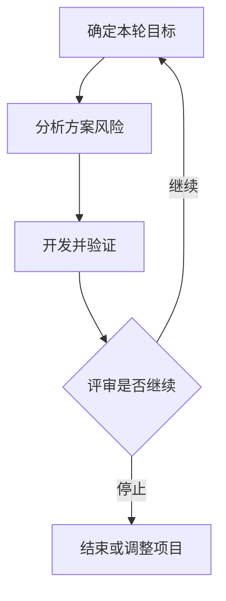

# 螺旋模型

> [!summary] 快速复习卡片
> - **核心结论**：每轮先明确目标与风险，再开发验证，最后评审是否继续。
> - **做题入口**：目标设定、风险分析、开发验证、评审 → 螺旋模型。

**螺旋模型**是风险驱动的软件过程模型。假设告警平台要接入一种陌生设备，最大的疑问是它能否可靠上报事件。直接做完整产品可能到最后才发现协议不可行，因此先用一轮工作验证这一风险。

第一轮可只验证设备接入；通过后再验证大规模事件处理。风险分析会影响本轮采用什么开发或验证方法，而不是给普通迭代补一张风险表。

每轮评审都可能决定继续、修正方向或停止。模型适合需要系统处理高风险的复杂开发，但风险分析本身有成本；不能把“低风险项目绝不能采用”作为规则。

2018 年下半年综合知识第 28 题以四项活动识别螺旋模型；仓库资料属于来源待核验的真题解析资料。

## 自测

> [!question]- 这一轮风险无法控制，还要按计划进入下一圈吗？
> 不应机械继续，应在评审中调整方案、补充验证或停止。
