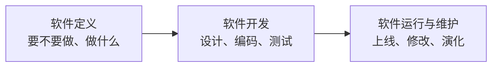
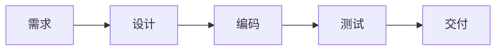
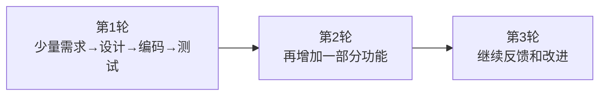
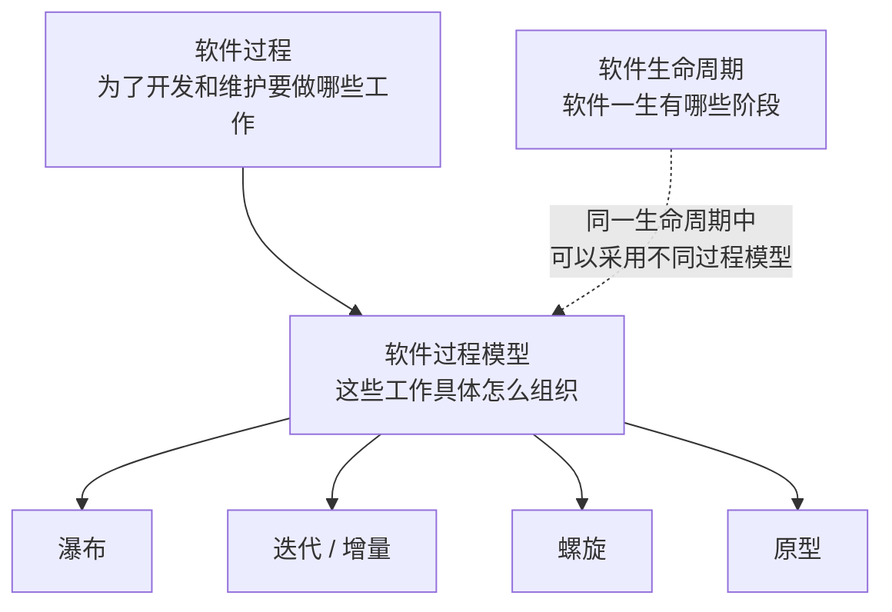

# 软件工程的定位

> [!summary] 先只记这三句话
> - **软件生命周期 = 软件“一生要经历哪些阶段”。**
> - **软件过程 = 为了把软件做出来并维护下去，要开展哪些工作、这些工作怎样协作。**
> - **软件过程模型 = 把这些工作具体组织起来的套路，例如瀑布、原型、螺旋、迭代增量。**
>
> **做题第一动作：先看题目在问“处于哪个阶段”，还是“这些活动怎么组织”。**

运维接手一个系统时，可能遇到程序能启动、部署文档却不全，功能能演示、恢复方案却不可用的情况。问题在于团队只交出了代码，没有交出可持续使用的软件系统。

**软件工程**就是用系统化、规范化、可度量的方法组织软件的开发、运行和维护。编码只是其中一项活动；需求、设计、测试、交付、维护和管理同样属于软件工程。

例如建设一个告警平台：先明确谁使用、要解决什么问题和怎样验收，再设计、开发、测试、上线，最后持续维护。需求记录、设计文档、代码、测试结果和运行手册都是软件工程成果。

历史上的**软件危机**主要表现为进度和成本难以控制、质量难以保证、维护困难等。软件工程通过明确活动、职责、产物和检查点降低这些问题，但不能保证项目永不失败。

## 生命周期、软件过程、过程模型到底差在哪

这三个概念会同时出现“需求、设计、编码、测试”，所以最容易混。不要按名词背，先看它们分别在回答什么问题。

| 概念 | 它在回答什么 | 你应该抓什么 |
|---|---|---|
| **软件生命周期** | 软件从产生到退出，要经历哪些阶段？ | **阶段、时间位置** |
| **软件过程** | 为了开发和维护软件，要做哪些活动，活动怎样协作？ | **活动、角色、产物、控制** |
| **软件过程模型** | 这些活动具体按什么方式排列、迭代和推进？ | **组织套路** |

最短记忆：

> **生命周期看“阶段”；软件过程看“工作”；过程模型看“工作怎么排”。**

## 先看生命周期：软件现在走到哪一步

传统软件生命周期方法学常把软件的一生概括为：

所以生命周期关心的是：

> **“这件事现在属于软件一生中的哪一个阶段？”**

例如：

- 可行性研究：还在决定“要不要做、怎么做”，属于**软件定义**阶段；
- 编码和测试：属于**软件开发**阶段；
- 系统上线后的修改和修复：属于**运行与维护**阶段。

2019 年下半年综合知识第 22–23 题就是按这种传统生命周期口径考阶段归属。

> [!tip] 生命周期题的第一动作
> 看到“属于哪个阶段、开发之后是什么、可行性研究在哪一步”，先想：
>
> **定义 → 开发 → 运行维护**

### 顺带分清：可行性分析管什么、不管什么

同一类“项目前期”题还会换个角度问：**哪一项工作不属于可行性分析的范畴**。

可行性研究通常从四个方面展开：

| 范畴 | 它回答什么 | 题干里的典型选项 |
| --- | --- | --- |
| 经济可行性 | 值不值得做：成本效益、直接/间接收益、有形/无形收益 | 候选方案的成本/效益分析、无形收益 |
| 技术可行性 | 现有技术能力和信息技术能否支持系统目标 | 技术能力约束、技术风险 |
| 法律可行性 | 政策、法律、道德、制度上是否现实 | 社会、法律因素 |
| 用户使用可行性 | 用户侧能不能真正用起来 | 行政管理制度、人员素质和培训要求 |

判据：

> **只在“要不要做、能不能做、值不值得做”这四个范畴里找答案。**

选项里出现“分析现有系统存在的运行问题”时，它是在调查系统本身，不属于上面四个范畴，正是该类题要选的那一项。

> **真题口径**：2013 年下半年综合知识第 27 题问“以下叙述中，(27)不属于可行性分析的范畴”，选项 A 对候选方案进行成本/效益分析、B 分析现有系统存在的运行问题、C 评价项目实施后可能取得的无形收益、D 评估现有技术能力和信息技术是否足以支持系统目标的实现，正确答案 **B**（A、C 落在经济可行性，D 落在技术可行性）。出处为真题解析资料（资料版，来源待核验）。

## 再看软件过程：团队到底要做哪些工作

软件过程不是在问软件“活到哪一步”，而是在问：

> **“为了把这个软件做出来并长期维护，团队究竟要开展哪些工作？”**

通常会涉及：

- 需求；
- 分析与设计；
- 实现；
- 测试；
- 部署与维护；
- 项目管理、配置管理、质量保证等支持活动。

也就是说，软件过程关注的不是单纯的时间阶段，而是**活动、角色、产物、检查点怎样共同完成软件开发和维护**。

所以：

> **软件过程 ≠ 编码过程。**

编码只是整个软件过程中的一项活动。

## 最后看过程模型：这些工作到底怎么排

假设两个团队都要做同一个商城系统，它们都逃不开需求、设计、编码、测试这些工作。

但可以有不同的组织方法。

### 团队 A：瀑布

特点是各阶段按顺序向后推进。

### 团队 B：迭代/敏捷式推进

它仍然在做需求、设计、编码、测试，只是把这些活动拆进多轮迭代中。

所以：

> **生命周期没有因为使用瀑布或迭代而“消失”；变化的是软件过程的组织方式。**

## 用同一个商城项目一次分清

假设要建设一个网上商城。

### 问：这个商城从出生到退役会经历什么？

需求提出 → 定义 → 开发 → 上线 → 运行维护 → 最终退出。

这是在看：

> **软件生命周期**

### 问：开发商城时团队要做什么？

需求分析、架构设计、编码、测试、配置管理、质量保证、维护等。

这是在看：

> **软件过程**

### 问：这些工作怎么安排？

可以：

- 全部需求基本确定后再设计、编码、测试 → **瀑布模型**；
- 先做原型让用户确认需求 → **原型模型**；
- 每一轮先分析风险再开发 → **螺旋模型**；
- 每轮交付一部分功能并不断反馈 → **迭代/增量、敏捷思想**。

这是在看：

> **软件过程模型**

## 三者的关系

不要把它背成“生命周期包含瀑布模型”。

更准确的理解是：

> **生命周期提供“软件一生”的观察视角；软件过程描述要开展的工程活动；过程模型再规定这些活动怎样被组织和推进。**

## 最容易错的三个判断

> [!warning] 易混淆
> 1. **“瀑布模型是软件生命周期本身。”**  
>    错。瀑布是**过程模型**，强调开发活动怎样按阶段组织。
>
> 2. **“生命周期和软件过程都出现需求、设计、编码，所以它们其实是一回事。”**  
>    错。生命周期看这些工作处在软件一生的什么位置；软件过程看具体开展哪些工作以及怎样协作。
>
> 3. **“敏捷没有软件生命周期。”**  
>    错。敏捷仍然有需求、开发、交付、维护，只是过程组织方式更偏迭代和持续反馈。

## 考试第一动作

看到题干先问自己一句：

> **它是在问“现在在哪个阶段”，还是在问“这些工作怎么组织”？**

- “可行性研究属于哪个阶段？” → **生命周期**
- “需求稳定、阶段依次推进，适合哪种模型？” → **瀑布模型**
- “强调风险分析，反复迭代的是哪种模型？” → **螺旋模型**
- “为了开发维护软件要有哪些活动、角色、产物？” → **软件过程**

## 考前速记

> **生命周期：一生有哪些阶段。**  
> **软件过程：这一生要做哪些工程工作。**  
> **过程模型：这些工作按什么套路推进。**
>
> **阶段 → 生命周期；怎么干 → 软件过程；瀑布/螺旋/原型/迭代 → 过程模型。**

## 下一站

现在已经知道“软件开发到底有哪些工作，以及这些概念为什么不是一回事”。

下一步就看：

> **如果需求比较稳定，这些工作最简单的组织方式是什么？**

→ [[瀑布模型]]

## 自测

1. “可行性研究属于软件定义、软件开发还是运行维护”是在考什么？

> [!answer]- 第 1 题答案与解析
> **答案：软件生命周期。**题目在问工作处于软件一生中的哪个阶段。

2. 同一个商城项目，团队 A 用瀑布，团队 B 用迭代。它们主要是哪一层不同？

> [!answer]- 第 2 题答案与解析
> **答案：软件过程模型不同。**两边仍然要经历需求、设计、实现、测试和维护等活动，只是组织和推进方式不同。

3. “需求、设计、编码、测试、配置管理、质量保证”是在强调生命周期还是软件过程？

> [!answer]- 第 3 题答案与解析
> **答案：软件过程。**这里关注的是为了开发和维护软件要开展哪些工程活动。
