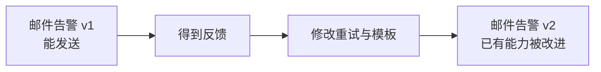
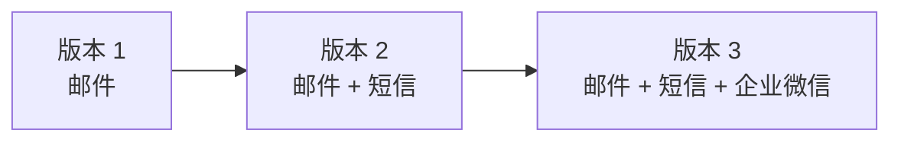
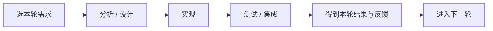

# 迭代与增量模型：一轮轮改进，和一批批增加功能有什么区别

> [!summary]- 快速复习卡片（学完再看）
> **迭代**：反复回到已有结果上继续修正、细化、提高。  
> **增量**：每一轮在已有系统上增加一部分新的可用能力。  
> **关系**：同一轮开发可以既是迭代，又产生增量；两者不是互斥选项。  
> **题干信号**：反复改进已有能力 → 迭代；分批交付、较早得到可用系统和客户反馈 → 增量。  
> **易错点**：一轮轮做 ≠ 自动就是螺旋；只有把**风险分析作为每轮核心驱动力**时，才是下一站 [[螺旋模型]] 的突出特征。

上一站 [[瀑布模型]] 已经看到了一个问题：

> 如果要等需求、设计、编码、测试一大串工作基本走完，用户才看到真正的软件，那么反馈可能来得太晚；前面理解错了，后面就已经积累很多返工。

于是很自然会问：

> **能不能不要一次把整个系统做到底，而是拆成多轮，每轮都得到一个结果，再根据结果继续做？**

可以。

但这里马上会出现两个很像的词：**迭代**和**增量**。

先不要背定义，直接看同一个告警平台。

## 先看“迭代”：同一个东西反复改

第一版邮件告警已经能发送，但发现两个问题：

- 失败重试太频繁；
- 告警模板不够清楚。

第二轮没有增加新的通知渠道，只是把原来的邮件能力重新设计、修改和测试。

这叫：

> **迭代：已有的东西再做一轮，让它更正确、更完整或更好用。**

所以迭代的观察重点是：

> **这一轮是不是在重新审视、修正和细化已有结果？**

可以把它理解成“同一块内容继续打磨”。

## 再看“增量”：系统多了一块新能力

还是同一个平台。

第一版只有：

> 邮件告警

第二轮在原有系统上新增：

> 短信告警

第三轮再新增：

> 企业微信告警

这叫：

> **增量：不是只把原来的东西改好，而是在已有系统上再增加一部分新的可用能力。**

所以增量的观察重点是：

> **这一轮结束后，系统是不是比上一版“多会了一件事”？**

这里“分批”很重要。

不是等邮件、短信、企业微信全部开发完以后才第一次交付，而是让较早的版本就具有一部分有意义的能力。

这也是为什么增量式开发能够更早让用户看到、使用和评价软件。

## 同一轮可以既是迭代，又是增量

最容易错的地方就在这里。

第二轮开发时：

- 把已有的邮件重试逻辑修好；
- 同时新增短信通知。

那么这一轮：

- 对邮件能力来说，是**迭代**；
- 对整个产品能力来说，又产生了新的**增量**。

所以：

> **迭代和增量不是两个非此即彼的盒子，而是看同一轮开发的两个角度。**

| 观察角度 | 问自己什么 | 例子 |
| --- | --- | --- |
| 迭代 | 已有内容有没有被重新修正、细化？ | 修正邮件重试 |
| 增量 | 系统有没有增加新的可用能力？ | 新增短信通知 |

主教材在 RUP 中也把二者组合使用：项目拆成多个迭代，每次只处理一部分需求，完成分析、设计、实现、测试、部署，并在已完成部分上继续增加功能。

## 它为什么比“一次做到最后”更早得到反馈

瀑布的问题之一是：

> 用户较晚才看到完整可运行系统。

迭代/增量把这个时间提前。

例如不必等“邮件 + 短信 + 电话 + 企业微信 + 报表”全部完成，第一轮就先交付邮件告警。

用户马上可能发现：

> “告警正文里必须带主机 IP，否则值班人员无法快速定位。”

这个反馈可以进入后续轮次，而不是等整个系统都完成才发现。

所以它带来的关键变化是：

**较早有结果 → 较早暴露问题 → 后续轮次可以调整。**

2022-H2-综合知识-22 就直接以瀑布作比较：题干强调**降低需求变更成本、更容易获得客户对已完成工作的反馈、客户更早使用软件并获得价值**，对应的是**增量式开发**。

## 一轮里面还做需求、设计、编码、测试吗

**做。迭代/增量不是把这些工程活动取消，而是把它们放进多轮开发中。**

例如某一轮只做“短信告警”这一部分需求，仍然可能经历：

所以不要理解成：

> 瀑布有需求、设计、编码、测试；迭代就没有这些阶段。

真正变化的是：

> **这些活动不再只为整个项目走一遍，而是可以围绕部分需求反复进入。**

## “一轮轮做”是不是就叫螺旋模型

**不是。**

这是这一篇最重要的边界。

普通迭代也会：

- 做一轮；
- 看结果；
- 调整；
- 再做下一轮。

螺旋模型同样会多轮推进。

它们真正的区别不在“有没有循环”，而在：

> **每一轮由什么问题来决定重点。**

普通迭代/增量更关注：

- 本轮要改进什么；
- 本轮增加哪些能力；
- 怎样更早获得可用结果和反馈。

而 [[螺旋模型]] 的突出特点是：

> **每一轮都把风险识别和风险分析放到核心位置，并根据风险决定本轮怎样开发、验证以及是否继续。**

所以考试看到“一轮一轮”还不能直接选螺旋。

必须继续找：

> **题干有没有突出风险分析？**

## 迭代/增量和敏捷是不是一回事

也不是。

**迭代、增量描述的是开发推进方式；敏捷是一类更完整的软件开发思想和方法。**

敏捷通常会采用迭代增量式开发，主教材也明确写到这一点，但不能倒过来说：

> “只要用了迭代/增量，就是敏捷。”

后面学 XP、Scrum 等敏捷方法时，还会看到适应变化、人员协作、短周期反馈等更多特征。

当前只要记住：

> **敏捷常用迭代增量，但迭代增量不等于敏捷全部。**

## 考试第一动作

看到过程模型题，先抓题干的“主动作”。

- **反复修正、逐轮细化已有结果**  
  → 先想到 **迭代**。

- **每次增加一部分可用功能、客户较早使用软件、较早获得反馈**  
  → 先想到 **增量**。

- **一轮中既修改旧功能，又新增功能**  
  → **迭代和增量可以同时存在**。

- **多轮推进，但每轮突出风险识别、分析和处理**  
  → 不要停在“一般迭代”，继续锁定 **[[螺旋模型]]**。

## 为什么下一站是螺旋模型

现在已经解决了瀑布的一个问题：

> 不必等整个系统最后才看到结果，可以一轮一轮推进。

但“多轮”本身还没有回答另一个问题：

> **如果项目里最可怕的不是需求变化，而是某项技术可能根本做不成、性能可能达不到、成本可能失控，该优先做什么？**

这时，下一轮开发不能只按“下一项功能是什么”来安排。

要先问：

> **当前最大的风险是什么？怎样尽早验证它？**

这就是 [[螺旋模型]]。

## 自测

1. 第一版只有邮件告警；第二版新增短信告警。这主要体现迭代还是增量？

> [!answer]- 第 1 题答案与解析
> **答案：增量。**
> **解析：**系统在已有能力上增加了新的可用功能。

2. 第二版没有新增功能，只把邮件重试算法和模板反复修改得更合理。这主要体现什么？

> [!answer]- 第 2 题答案与解析
> **答案：迭代。**
> **解析：**重点是在已有结果上继续修正和细化。

3. 第二轮既修正邮件重试，又新增短信告警，必须二选一说它是“迭代”或“增量”吗？

> [!answer]- 第 3 题答案与解析
> **答案：不必二选一，两者可以同时存在。**
> **解析：**修正邮件体现迭代，新增短信体现增量。

4. 一个项目每两周做一轮，是不是仅凭这一点就能判断它采用螺旋模型？

> [!answer]- 第 4 题答案与解析
> **答案：不能。**
> **解析：**多轮只是迭代特征之一；螺旋模型还必须突出每轮的风险分析与风险驱动。

## 上一站 / 下一站

- **上一站**：[[瀑布模型]] —— 瀑布让阶段和交付依据很清楚，但反馈和可运行成果可能出现较晚；本篇开始把开发拆成多轮。
- **下一站**：[[螺旋模型]] —— 已经知道“可以一轮轮做”，下一步继续问：如果每一轮最重要的是先消除高风险，过程应该怎样组织？
