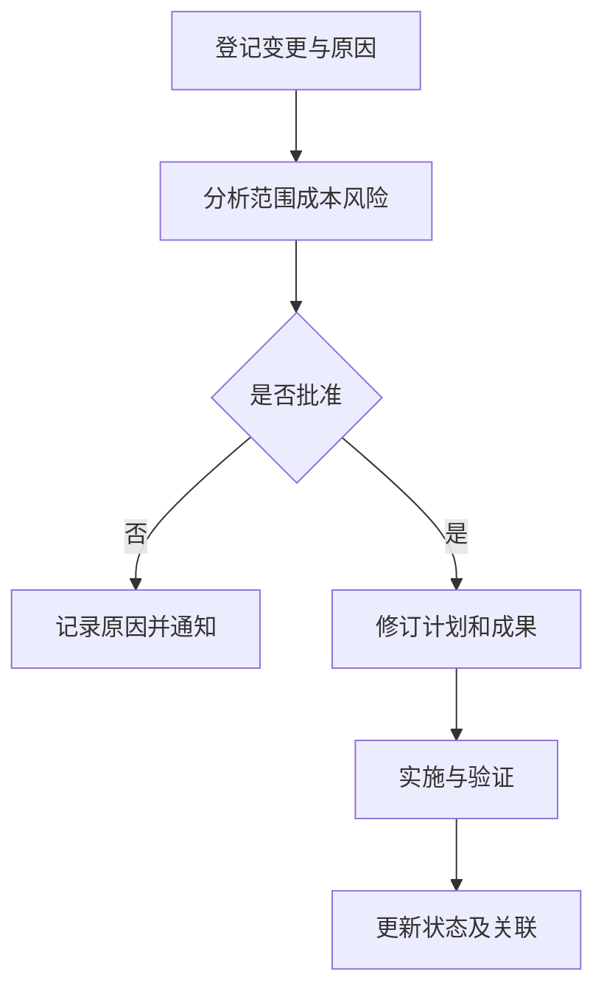

# 需求变更控制

> [!summary] 快速复习卡片
> - **核心结论**：登记并描述变更，分析影响与成本，决定是否批准，再实施、验证并更新关联成果。
> - **做题入口**：需求基线后收到变更 → 先分析影响再决策，不能直接改代码；CCB 是决策机构。

**需求变更控制**使需求有序调整。假设已批准的告警系统新增“所有通知保留一年”，影响的不只是一个配置，还可能包括存储容量、查询设计、成本和验收用例。

**CCB（变更控制委员会）**代表相关方裁定是否接受变更，属于决策机构，通常不负责提出具体技术方案或亲自编码。批准后还要重新协商交付范围、时间或资源，并同步需求、设计、代码和测试。

保留原始变更请求及批准依据，使每项实施能找到来源。只记录“改完了”无法说明为何改变，也无法确定测试范围。控制变更的目的不是拒绝变化。

## 历年怎么考

2019-H2-综合知识-24/25 直接考需求变更管理过程，其中明确出现“问题分析和变更描述 → **变更分析和成本计算** → 变更实现”，并考对变更控制原则的判断。做题时最容易错的是**一收到需求就直接实施**；正确顺序必须先做影响/成本分析，再进入批准与实施。

## 自测

> [!question] 自测
> 1. CCB 批准新增需求后，开发只改代码就算结束吗？
>
> > [!answer]- 第 1 题答案与解析
> > **答案**：不算，还要同步相关文档、计划、测试、跟踪关系和变更状态。

## 上一站 / 下一站

- **上一站**：[[需求规格与确认验证]] —— 规格被评审并形成基线后才有稳定参照；本篇解决“基线之后还能不能改、怎样改才不失控”。
- **下一站**：[[需求双向追踪矩阵]] —— 变更一旦批准，真正困难的是找出哪些设计、代码和测试会受影响；下一篇用追踪关系解决这件事。