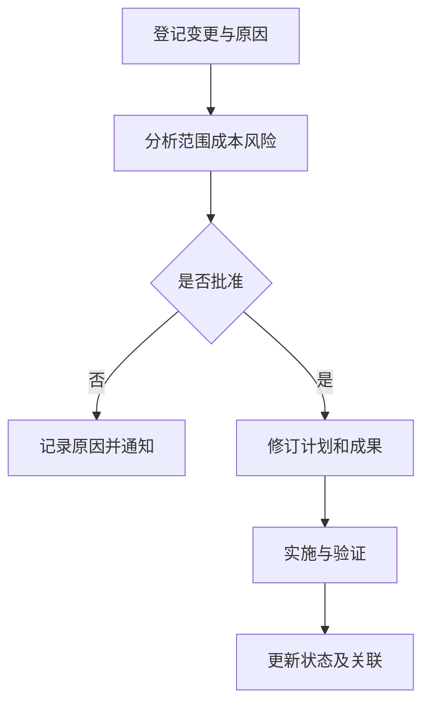

# 需求变更控制

> [!summary] 快速复习卡片
> - **核心结论**：登记并描述变更，分析全部影响，决定是否批准，再实施、验证并通知相关人。
> - **做题入口**：需求基线后收到变更 → 先评估并决策，不能直接改代码；CCB 是决策机构。

**需求变更控制**使需求有序调整。假设已批准的告警系统新增“所有通知保留一年”，影响的不只是一个配置，还可能包括存储容量、查询设计、成本和验收用例。

**CCB（变更控制委员会）**代表相关方裁定是否接受变更，属于决策机构，通常不负责提出具体技术方案或亲自编码。批准后还要重新协商交付范围、时间或资源，并同步需求、设计、代码和测试。

保留原始变更请求及批准依据，使每项实施能找到来源。只记录“改完了”无法说明为何改变，也无法确定测试范围。控制变更的目的不是拒绝变化。

## 自测

> [!question]- CCB 批准新增需求后，开发只改代码就算结束吗？
> 不算，还要同步相关文档、计划、测试、跟踪关系和变更状态。
