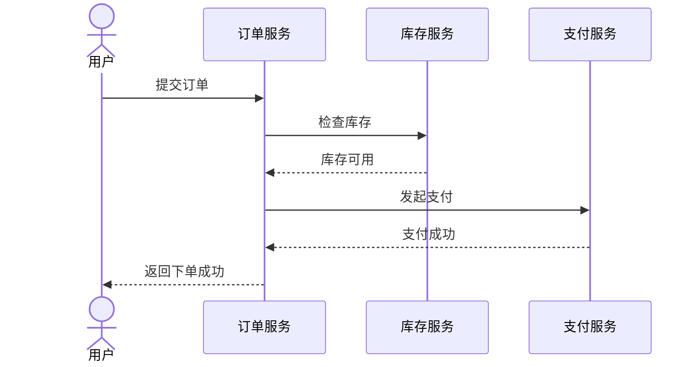
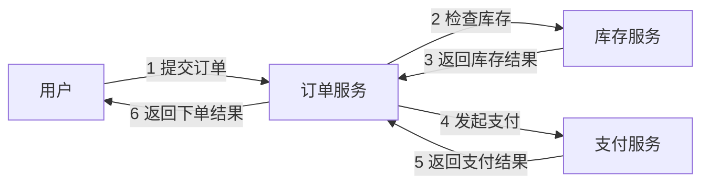

# UML 序列图与通信图：同一次下单，什么时候看“先后”，什么时候看“谁和谁通信”

> [!summary]- 快速复习卡片（学完再看）
> **共同点**：都属于交互图，都在看多个对象怎样通过消息协作。  
> **序列图**：重点看消息发生的时间先后，时间通常从上往下。  
> **通信图**：重点看对象之间的连接关系以及消息编号。  
> **题干信号 → 第一反应**：强调“谁先谁后” → 序列图；强调“哪些对象互相连接并通信” → 通信图。  
> **易错点**：两张图描述的可以是同一次交互，只是观察重点不同。

上一站 [[UML类图与基本关系]] 已经看清系统里有哪些类、类之间是什么关系。

但静态关系还没有告诉我们：真正执行“提交订单”时，这些对象到底怎样合作。

一次下单可能发生：

1. 用户把订单提交给订单服务；
2. 订单服务去问库存服务有没有货；
3. 库存确认后，订单服务再调用支付服务；
4. 支付完成后，订单服务把结果返回给用户。

现在出现两个不同的问题：

> **问题 1：这些消息到底谁先发生、谁后发生？**
>
> **问题 2：到底有哪些对象互相连接、互相发消息？**

前一个问题更适合**序列图**，后一个问题更适合**通信图**。

## 怎样从一个用例建立交互图

输入不是一组随意挑选的对象，而是“确认告警”用例的场景说明和已经确定的职责：值班人员提交确认，系统查询告警、改变状态并保存结果。

### 第 1 步：先写清单一路径

本例主成功路径：告警存在且处于待确认状态，当前人员有权限，保存成功。异常路径如“告警已确认”先另列，不要一开始把所有分支塞进一张图。

### 第 2 步：确定参与交互的对象及职责

| 对象 | 在本场景中的职责 |
| --- | --- |
| 值班人员 | 发起确认 |
| 告警确认界面 | 接收输入、展示结果 |
| 确认告警控制器 | 协调本次用例 |
| 告警 | 校验并改变自身状态 |
| 告警仓储 | 查询和保存告警 |

### 第 3 步：按触发顺序写消息

依次写：`提交确认 → 查询告警 → 确认 → 保存 → 返回成功`。每条消息都要有发送者、接收者和清楚的动作名称；“处理数据”这类模糊消息不能帮助实现或评审。

### 第 4 步：选择强调方式

- 要检查“查询是否先于确认、保存是否发生在状态改变之后”，画序列图；
- 要检查“控制器究竟与哪些对象直接通信”，画通信图，并给消息编号；
- 两张图若描述同一路径，其对象、消息和先后不能互相矛盾。

### 第 5 步：与用例和类职责交叉核对

检查用例每一步是否都有消息承担、消息是否发给真正负责该行为的对象、异常路径是否需要单独片段，以及图中是否凭空出现类图没有职责依据的“万能管理器”。通过后，交互图才是用例实现的一次可执行说明。

## 序列图：像看聊天记录，重点是“时间顺序”

先看同一次下单：

这张图最容易理解的方式就是把它当成一段聊天记录：

> **从上往下看，谁先发消息、谁后发消息。**

所以序列图特别适合回答：

- 第一步是谁调用谁？
- 库存检查发生在支付之前还是之后？
- 某个对象收到消息后又调用了谁？
- 一次业务过程中的消息先后怎样排列？

大白话：

> **序列图 = 把一次对象协作按时间顺序排开。**

## 通信图：像看群成员之间“谁能找谁”

还是同一次下单，如果我们不把“时间轴”放在最显眼的位置，而是更关心：

- 用户和订单服务连接；
- 订单服务和库存服务连接；
- 订单服务和支付服务连接；
- 哪条连接上传的是第几条消息。

就更接近通信图的观察方式。

下面用示意图帮助理解重点：

通信图真正想突出的是：

> **哪些对象彼此有通信链路，以及消息沿这些链路怎样传。**

为了看出先后，消息通常会带编号。

大白话：

> **通信图 = 先看“谁和谁连着”，再靠消息编号看调用顺序。**

## 两张图到底是不是在讲两件完全不同的事

**不是。**

它们完全可以描述同一次“提交订单”。

区别只是你现在更想看什么：

| 现在最关心什么 | 更适合 |
| --- | --- |
| 消息的时间顺序 | 序列图 |
| 对象之间的连接/协作网络 | 通信图 |
| “先库存还是先支付” | 序列图 |
| “订单服务会和哪些对象通信” | 通信图 |

所以不要把它们背成互不相关的两个名词。

先记住：

> **它们都是交互图，只是一个把“时间”摆在前面，一个把“对象连接关系”摆在前面。**

## 考试怎么认

1. 题干强调“按时间顺序展示对象之间发送消息” → **序列图**；
2. 强调对象/角色之间的链接、消息编号和协作关系 → **通信图**；
3. 问“序列图和通信图共同属于什么” → **交互图**；
4. 不要因为两张图画法不同，就认为它们不能描述同一个场景。

## 一句话记住

> **序列图看‘先后’，通信图看‘连接’；两张图都在讲对象之间怎样发消息。**

## 自测

1. 题目要求判断“库存检查发生在支付前还是支付后”，优先看哪种图？

> [!answer]- 第 1 题答案与解析
> **答案**：序列图。
> **解析**：题目重点是消息发生的时间先后。

2. 题目要求看“订单服务与哪些对象发生通信”，优先考虑哪种图？

> [!answer]- 第 2 题答案与解析
> **答案**：通信图。
> **解析**：通信图更突出对象之间的链接和消息传递关系。

3. 序列图和通信图能不能描述同一个下单过程？

> [!answer]- 第 3 题答案与解析
> **答案**：可以。
> **解析**：它们观察的是同一种对象交互，只是强调的信息不同。

4. 建立交互图前，为什么先选定一个用例路径？

> [!answer]- 第 4 题答案与解析
> **答案**：消息顺序必须对应具体场景；先走通一条主成功路径，才能明确对象、消息和先后，再分别补异常路径。

## 上一站 / 下一站

- **上一站**：[[UML类图与基本关系]]
- **下一站**：[[UML活动图与状态机图]]：交互图已经看清“多个对象怎样发消息”；下一步要分清另一对很容易混的图——“整个流程怎么走”和“一个订单自己怎么换状态”。
