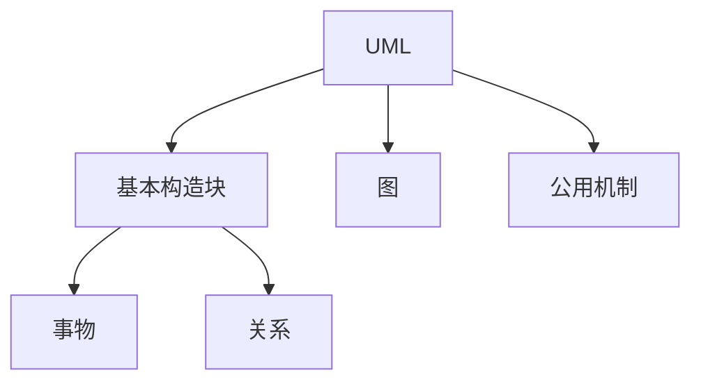

# UML 总览：组成、事物、关系、图、视图到底是什么层级

> [!summary]- 快速复习卡片（学完再看）
> **大白话**：UML 是软件系统的一套统一画图语言。  
> **三大组成**：基本构造块 + 图 + 公用机制。  
> **基本构造块**里面再分：事物 + 关系。  
> **四类事物**只是“事物”的分类；**四种基本关系**只是“关系”的分类；**13 种图**只是“图”的分类。  
> **视图**是“从哪个角度看同一个系统”，不是 UML 三大组成里的第四项。  
> **题干第一反应**：先判断它问的是“组成层级、基本关系、具体图，还是观察视角”。

[[面向对象分析OOA]]、[[面向对象设计OOD]] 已经在回答：系统里有哪些对象、这些对象应该怎样分工和协作。

但想清楚以后还有一个现实问题：

> **这些设计不能只放在脑子里，怎样让产品、开发、测试和架构人员看到同一套意思？**

还是用网上商城。

你可能已经想清楚：

- 有用户、订单、商品；
- 一个用户可以有多个订单；
- 下单时订单服务先检查库存，再调用支付；
- 订单会从待付款变成已付款、已发货；
- 软件最后要部署到不同服务器。

如果每个人都随便画，大家还是可能把同一个系统理解成不同样子。

所以先记住一句最重要的话：

> **UML = 软件系统的一套统一画图语言。**

正式说法是：**UML（Unified Modeling Language，统一建模语言）是一种标准建模语言。** 它负责“怎样把系统模型表达出来”，不是规定项目必须按什么步骤开发。

---

## 先只看一棵树：UML 的组成到底是什么

第一次学习 UML，最容易被“组成、事物、关系、图、视图”这些词同时砸过来。

不要平铺背。先只看下面这棵主树：

这棵树已经解决了大部分混乱：

> **UML 三大组成 = 基本构造块 + 图 + 公用机制。**
>
> **基本构造块 = 事物 + 关系。**

所以：

- “事物”不是和“基本构造块”平级；
- “关系”也不是 UML 的第四大组成；
- “四类事物”只是“事物”下面的分类；
- “四种关系”只是“关系”下面的分类；
- “13 种图”只是“图”下面的分类。

### 用搭积木理解最简单

可以把 UML 想成一套规定好的积木画法：

- **事物**：你有哪些积木；
- **关系**：这些积木怎样连接；
- **图**：把积木和连接组织起来，最后拼成的一张具体图；
- **公用机制**：整套画法共同遵守的一些表达规则。

这时候再看教材术语，就不需要自己二次翻译了。

---

## 事物：到底是在说什么

先不要背“四类事物”，先问一句：

> **我这张 UML 图里到底要画哪些东西？**

这些“可以出现在模型里的东西”，统称为**事物（Thing）**。

例如商城里可能出现：

- 用户类、订单类、接口、构件、服务器结点；
- 一次交互；
- 一个订单状态变化；
- 一个用于整理模型元素的包；
- 一条补充说明。

教材又把这些事物分成四类：

| 事物分类 | 大白话 | 典型例子 |
| --- | --- | --- |
| **结构事物** | 模型里的“名词”，比较静态的东西 | 类、接口、构件、结点 |
| **行为事物** | 模型里的“动作和变化” | 交互、状态机、活动 |
| **分组事物** | 把一批模型元素组织起来 | 包 |
| **注释事物** | 给模型补解释和约束 | 注解 |

所以正确层级是：

> **UML → 基本构造块 → 事物 → 四类事物。**

不是“UML 既由基本构造块组成，又由四类事物组成”两套平级答案。

---

## 关系：为什么有了“事物”还不够

如果只画“用户、订单、支付接口”几个框，你仍然不知道它们之间是什么关系。

所以基本构造块里还有第二部分：**关系（Relationship）**。

还是商城：

- 订单服务临时调用支付网关；
- 用户和订单本来就有业务联系；
- 会员用户是一种用户；
- 微信支付把支付接口规定的能力真正做出来。

教材把 UML 的基本关系概括为四种：

- 依赖；
- 关联；
- 泛化；
- 实现。

这一篇只需要知道它们处在什么层级：

> **UML → 基本构造块 → 关系 → 四种基本关系。**

具体怎样一眼区分，去 [[UML类图与基本关系]]。

---

## 图：不是另一套“事物”，而是把前面的东西真正画出来

现在已经有了：

- 要画的东西——事物；
- 它们怎么连——关系。

接下来才能真正组织成一张**图（Diagram）**。

例如还是同一个商城：

| 现在要回答的问题 | 更适合的 UML 图 |
| --- | --- |
| 谁来使用系统、系统能提供什么功能 | [[UML用例图|用例图]] |
| 系统有哪些类、类之间怎么连 | [[UML类图与基本关系|类图]] |
| 下单时谁先调用谁 | [[UML序列图与通信图|序列图]] |
| 哪些对象彼此连接并发消息 | [[UML序列图与通信图|通信图]] |
| 一件业务一步步怎么走 | [[UML活动图与状态机图|活动图]] |
| 一个订单一生怎样换状态 | [[UML活动图与状态机图|状态机图]] |
| 软件拆成哪些构件 | [[UML构件图与部署图|构件图]] |
| 软件最终跑在哪些结点上 | [[UML构件图与部署图|部署图]] |

主教材按 UML 2.0 列出 13 种图。

第一次学习**不要把 13 个图名当成和“事物、关系”平级的新体系**。它们只是：

> **UML → 图 → 13 种具体图。**

我们的笔记也不机械拆成 13 张，而是按考试中真正需要区分的问题压成 5 张核心图卡。

---

## 公用机制：先知道它属于三大组成，第一轮不要把自己卡住

“公用机制”是 UML 三大组成之一，指整套 UML 中共同使用的一些表达机制和规则。

第一轮学习这里**只需要知道它属于 UML 三大组成之一**。

因为对当前做题最重要的是先搞懂：

1. 基本构造块里有什么；
2. 事物和关系分别是什么；
3. 题目描述的场景该选哪一种图。

不要因为“公用机制”这个词抽象，就在总览第一页展开成一门 UML 规范课程。

---

## 视图：它根本不在上面那棵“三大组成树”里

这是最容易混乱的一点。

**视图（View）不是 UML 三大组成里的第四项。**

先想现实场景。

还是同一个商城：

- 产品经理关心：用户能做什么；
- 设计人员关心：有哪些类、接口和关系；
- 并发设计人员关心：运行时进程怎样通信；
- 开发人员关心：软件构件怎样组织；
- 运维人员关心：软件部署到哪里。

大家看的都是**同一个系统**，只是关注角度不同。

所以：

> **视图 = 从哪个角度看同一个系统。**
>
> **图 = 你真正画出来的一张具体图。**

一个视图可以借助一张或多张合适的 UML 图来表达，但“某一种图”不等于“某一个视图”。

教材给出五种视图：

| 视图 | 主要关注什么 |
| --- | --- |
| **用例视图** | 系统对外提供什么行为 |
| **逻辑视图** | 类、接口等关键抽象及关系 |
| **进程视图** | 并发、通信、同步等运行问题 |
| **实现视图** | 构件、文件等实现组织 |
| **部署视图** | 软件怎样映射到运行结点 |

因此必须记住：

> **“五种视图”是在讲观察角度；“13 种图”是在讲具体画图类型。它们不是同一个分类维度。**

### UML 五视图也不等于架构 4+1

[[04_软件架构视图：为什么同一系统需要多个观察视角|4+1 架构视图]] 也是“从多个角度看系统”，所以名字很像。

但考试看到“视图”时要先看题干语境：

- 在问 UML 模型组织 → UML 五视图；
- 在问软件架构多视图模型 → 4+1。

不要因为名字接近就直接画等号。

---

## 最后把所有容易混的词放回正确层级

| 你看到的词 | 它到底属于哪里 |
| --- | --- |
| UML 三大组成 | 基本构造块 + 图 + 公用机制 |
| 四类事物 | 基本构造块 → 事物 → 四类事物 |
| 四种基本关系 | 基本构造块 → 关系 → 四种关系 |
| 13 种图 | UML → 图 → 具体图类型 |
| 五种视图 | 观察同一个系统的五个角度，不是三大组成的第四项 |

真正考试时如果题目问：

- **“UML 由什么组成？”** → 基本构造块 + 图 + 公用机制；
- **“基本构造块有什么？”** → 事物 + 关系；
- **“四类事物是什么？”** → 结构 / 行为 / 分组 / 注释；
- **“四种基本关系是什么？”** → 依赖 / 关联 / 泛化 / 实现；
- **“应该用哪一种 UML 图？”** → 看题目到底想表达什么；
- **“视图是什么？”** → 看系统的一个关注角度，不等于具体图。

---

## UML 为什么放在软件工程这里详细学

官方大纲把 UML 放在“计算机语言 → 建模语言”中，这个**考试归属没有改变**。

但是从第一次学习的顺序看，UML 更自然地接在分析和设计后面：

> **OOA：业务世界里有什么对象？**  
> ↓  
> **OOD：这些对象在软件里怎样分工、协作、提供接口？**  
> ↓  
> **UML：怎样把这些分析和设计用统一规则画给大家看？**  
> ↓  
> **OOP：怎样用代码把设计实现出来？**

所以仓库现在采用：

- **计算机软件与语言**：只保留 [[建模语言与UML|建模语言-UML定位]]，告诉你 UML 属于建模语言；
- **软件工程 / 分析与设计**：作为 UML 的完整学习主事实源。

这不是改考试大纲，而是把**考试归属**和**教学顺序**分开处理。

---

## 推荐学习顺序

现在不要回去背 13 个图名，按问题一路学：

1. [[UML用例图]]：先站在系统外面看“谁来用、系统能做什么”；
2. [[UML类图与基本关系]]：再看系统里面“有哪些类、它们怎么连”；
3. [[UML序列图与通信图]]：一次业务执行时“谁先找谁、谁和谁通信”；
4. [[UML活动图与状态机图]]：分清“事情怎么走”和“对象怎么变”；
5. [[UML构件图与部署图]]：最后看“软件拆成什么、放哪里运行”。

## 自测
1. “结构事物、行为事物、分组事物、注释事物”是 UML 三大组成吗？

> [!answer]- 第 1 题答案与解析
> **答案**：不是。
> **解析**：它们是“基本构造块 → 事物”下面的四种分类。UML 三大组成是基本构造块、图、公用机制。

2. “依赖、关联、泛化、实现”处在哪一层？

> [!answer]- 第 2 题答案与解析
> **答案**：基本构造块中的“关系”。
> **解析**：先有基本构造块，再分事物和关系；四种关系是关系的下位分类。

3. “部署图”和“部署视图”是一回事吗？

> [!answer]- 第 3 题答案与解析
> **答案**：不是。
> **解析**：部署图是具体 UML 图；部署视图是从部署角度观察系统。

## 上一站 / 下一站

- **上一站**：[[面向对象设计OOD]] —— OOD 已经明确类、职责、接口和协作；UML 是把这些分析/设计模型按统一规则表达出来的语言，不是新的开发阶段。
- **下一站**：[[UML用例图]] —— 总层级已经理顺，下一步先站到系统外面，看“谁使用系统、系统对外提供什么功能”。
