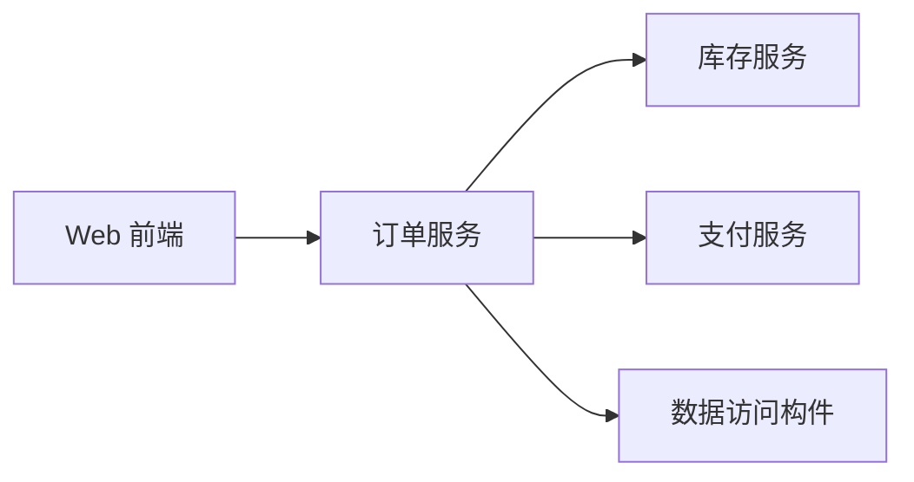
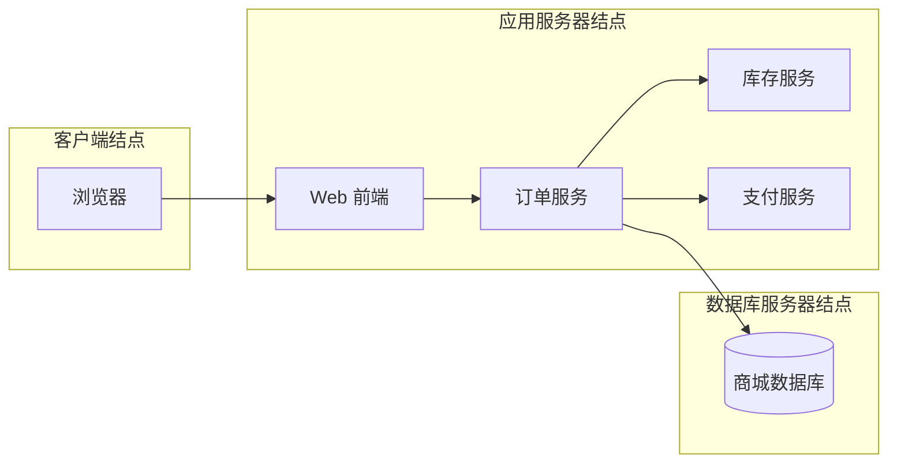

# UML 构件图与部署图：是在看“软件拆成哪些块”，还是看“这些块跑在哪”

> [!summary]- 快速复习卡片（学完再看）
> **构件图**：看软件由哪些可替换/可组织的实现构件组成，以及构件之间怎样依赖。  
> **部署图**：看软件制品/构件最终部署到哪些结点、设备或运行环境。  
> **题干信号 → 第一反应**：模块/构件/接口/依赖 → 构件图；服务器/结点/设备/部署位置 → 部署图。  
> **易错点**：构件图主要回答“软件怎么拆”，部署图主要回答“软件放哪里跑”。

前面的 [[UML活动图与状态机图]] 已经把“流程怎么走”和“对象怎么变”分清了。

现在商城真正要上线，又遇到两个完全不同的问题。

第一个问题：

> 商城软件本身被拆成哪些部分？订单、库存、支付之间怎样依赖？

第二个问题：

> 这些软件部分最后到底跑在浏览器、应用服务器，还是数据库服务器上？

前一个更接近**构件图**，后一个更接近**部署图**。

## 怎样从设计约束建立构件与部署模型

告警平台已经有“告警接入、告警处理、通知、数据存取”四类实现职责，部署约束是：外部设备通过接入服务上报，应用服务访问独立数据库，通知服务对接外部消息网关。

### 先建立构件图：明确软件责任和接口

1. 从可独立实现、替换或部署的责任中找构件候选；
2. 为每个构件写提供接口和需要接口；
3. 连接依赖，并避免循环依赖；
4. 用用例检查多个构件能否协作完成外部功能。

| 构件 | 提供的能力 | 依赖的能力 |
| --- | --- | --- |
| 告警接入构件 | 接收、校验原始告警 | 告警处理接口 |
| 告警处理构件 | 分级、确认、状态管理 | 数据存取、通知接口 |
| 通知构件 | 生成并提交通知 | 外部消息网关 |
| 数据访问构件 | 查询、保存告警 | 数据库 |

构件边界来自实现责任与接口，不等同于把每一个类都画成构件。

### 再建立部署图：把制品映射到运行结点

1. 列出运行结点：接入区应用结点、业务应用结点、数据库结点；
2. 列出需要部署的制品或构件实例；
3. 将它们放到实际执行结点；
4. 标出结点间通信路径和必要协议/端口约束；
5. 检查性能、安全和可用性要求是否允许该部署。

本例可把告警接入构件部署到接入区应用结点，把告警处理与通知构件部署到业务应用结点，把数据访问所依赖的数据存储放到数据库结点。外部消息网关仍位于系统边界外。

最后双向核对：构件图中的每个需要运行的实现构件，在部署图上都应有承载位置；部署图上的每个软件制品，也应能追溯到构件或其他明确实现来源。构件图解决“软件怎样组成”，部署图解决“这些实现放到哪里运行”。

## 构件图：先别管服务器，先看“软件是怎么拼起来的”

假设商城被拆成：

- Web 前端；
- 订单服务；
- 库存服务；
- 支付服务；
- 数据访问构件。

下面只是帮助理解问题的概念示意，不用 Mermaid 图形代替 UML 的标准构件记号：

这张图最关心的是：

> **软件里面有哪些可组织的实现部分，它们之间怎样依赖和提供能力。**

大白话：

> **构件图 = 把程序拆成几个软件块，再看这些软件块怎么连。**

题目出现“构件、组件、接口、依赖、实现组织”等词时，优先想到构件图。

## 部署图：软件已经有了，接下来问“放哪台机器”

现在软件已经拆好了，但真正上线还得决定：

- 用户的浏览器跑在客户端；
- Web/订单服务跑在应用服务器；
- 数据库跑在数据库服务器。

这时候重点已经不是“订单服务和支付服务在逻辑上是什么关系”，而是：

> **软件最终被放到了哪些结点上运行。**

大白话：

> **部署图 = 把软件块放到真实运行位置上，看它们到底跑在哪。**

教材中的“结点（Node）”可以先理解成承载软件运行的物理设备或执行环境。

## 两张图为什么经常一起出现

因为真实项目通常是连续的：

1. 先确定软件由哪些构件组成；
2. 再决定这些构件部署到哪里。

但考试要你分清它们的主问题：

| 题目在问什么 | 更适合 |
| --- | --- |
| 系统有哪些软件构件 | 构件图 |
| 构件之间怎样依赖/提供接口 | 构件图 |
| 软件部署到哪些服务器/结点 | 部署图 |
| 软件与硬件运行环境怎样映射 | 部署图 |

所以最稳的判断不是看“图里有没有服务器”几个字，而是问：

> **现在主要在讨论软件内部组成，还是软件到运行环境的映射？**

## 和“实现视图/部署视图”是什么关系

[[UML总览]] 已经讲过：**图不等于视图。**

- 构件图常用于表达实现组织方面的信息；
- 部署图常用于表达部署方面的信息；
- 但“构件图”是一种具体 UML 图，“实现视图/部署视图”是观察系统的关注角度。

所以不要看到名字接近就直接画等号。

## 考试怎么认

1. “模块、构件、接口、软件依赖关系” → **构件图**；
2. “物理结点、服务器、设备、运行环境” → **部署图**；
3. “某个软件制品部署到哪个结点” → **部署图**；
4. “系统由哪些可替换软件部分组成” → **构件图**；
5. 看到“实现视图/部署视图”时先判断题目问的是视角还是具体 UML 图。

## 一句话记住

> **构件图回答“程序拆成什么”，部署图回答“这些程序块放哪儿跑”。**

## 自测

1. 题目要求描述订单服务依赖支付服务、库存服务，优先考虑哪种图？

> [!answer]- 第 1 题答案与解析
> **答案**：构件图。
> **解析**：题目重点是软件构件之间的组成和依赖关系。

2. 题目要求说明 Web 服务部署在应用服务器、数据库部署在数据库服务器，优先考虑哪种图？

> [!answer]- 第 2 题答案与解析
> **答案**：部署图。
> **解析**：题目重点是软件与运行结点之间的部署映射。

3. 构件图和实现视图是不是完全同义？

> [!answer]- 第 3 题答案与解析
> **答案**：不是。
> **解析**：构件图是一张具体 UML 图；实现视图是观察系统实现组织的一个关注角度。

4. 构件图完成后，建立部署图至少要做哪项双向检查？

> [!answer]- 第 4 题答案与解析
> **答案**：需要运行的构件是否都有承载结点，部署图上的软件制品是否都能追溯到明确的实现来源。

## 上一站 / 下一站

- **上一站**：[[UML活动图与状态机图]] —— 已经区分流程和对象状态；本篇最后看实现构件与运行结点。
- **下一站**：[[实体类边界类与控制类]] —— UML 核心图已经走完，回到 OOD 的职责设计：一次用例中哪些类保存业务信息、哪些负责外部交互、哪些负责协调流程。

想重新看 UML 的整体层级，回 [[UML总览]]。
