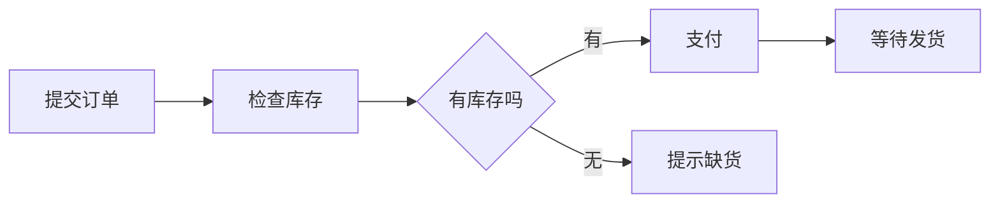
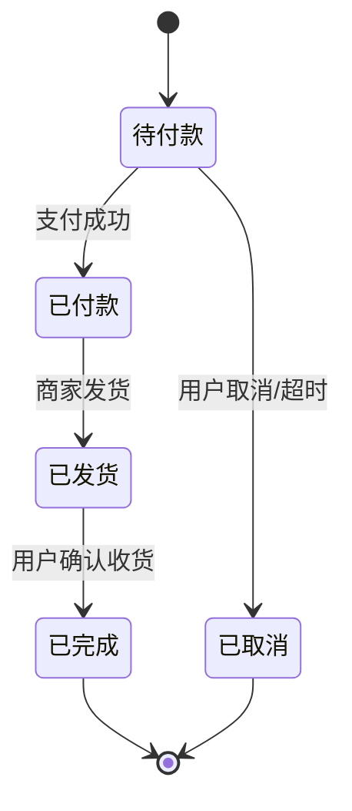

# UML 活动图与状态机图：是在看“流程怎么走”，还是看“一个订单怎么变”

> [!summary]- 快速复习卡片（学完再看）
> **活动图**：看一件事情经过哪些步骤、分支和汇合，重点是“流程怎么走”。  
> **状态机图**：盯住一个对象，看它在事件触发下从什么状态变成什么状态。  
> **题干信号 → 第一反应**：业务流程/步骤顺序/分支 → 活动图；对象生命周期/状态转换/事件触发 → 状态机图。  
> **易错点**：两张图都可能出现箭头，但一个跟踪“事情”，一个跟踪“对象”。

上一站 [[UML序列图与通信图]] 看的是多个对象之间怎么发消息。

现在还是商城下单，但我们换两个问题。

第一个问题：

> 用户下单这件事情，**整个流程到底怎么往前走**？

第二个问题：

> 某一张订单从创建开始，**它自己会经历哪些状态**？

这两个问题看起来都像“有箭头、有变化”，但不是同一回事。

## 活动图：像看一张“办事流程”

用户下单可能经历：

1. 提交订单；
2. 检查库存；
3. 有库存就进入支付；
4. 没库存就结束；
5. 支付成功后等待发货。

这里我们没有死盯着“订单对象现在是什么状态”，而是在看：

> **一件业务从第一步到最后一步怎样流动，中间在哪里分支。**

这就是**活动图（Activity Diagram）**最直观的用途。

大白话：

> **活动图 = 把一件事情的办理流程画出来。**

教材强调活动图关注步骤之间的流，重点不是“到底哪个对象执行了哪一步”。

所以题目出现：

- 工作流；
- 业务流程；
- 操作步骤；
- 条件分支；
- 并行/汇合；

先想到活动图。

## 状态机图：别看整个流程，只盯着“这一张订单”

现在不要再看“下单这件事有几步”，只盯住某一个订单对象。

它可能经历：

- 待付款；
- 已付款；
- 已发货；
- 已完成；
- 已取消。

这里真正的问题是：

> **同一个订单，在不同事件发生后，会从哪个状态切换到哪个状态。**

这就是**状态机图（State Machine Diagram）**。

大白话：

> **状态机图 = 盯住一个对象的一生，看它怎么变。**

教材说状态机会涉及：

- 状态；
- 转换；
- 事件；
- 活动。

做题时最重要的是看出：**事件触发状态转换。**

## 为什么两张图最容易混

因为它们都有“箭头”和“变化”。

但可以只问一个问题：

> **你现在到底在跟踪谁？**

| 你在跟踪什么 | 更适合 |
| --- | --- |
| 一件事情经过哪些步骤 | 活动图 |
| 一个对象现在处于什么状态 | 状态机图 |
| 下单流程如何分支 | 活动图 |
| 订单从待付款变成已付款 | 状态机图 |
| 审批流程怎么走 | 活动图 |
| 设备从正常变成故障、恢复 | 状态机图 |

所以不用先背定义，先看题干的“主角”。

## 考试怎么认

1. 题干说“步骤序列、业务过程、控制流、分支/并行” → **活动图**；
2. 题干说“对象生命周期、事件触发、状态转换” → **状态机图**；
3. 如果同时出现“订单”和“支付、发货”，不要只看名词，问题目是在追流程还是追订单状态；
4. “状态 → 事件 → 新状态”是状态机图的核心判断动作。

## 一句话记住

> **活动图看‘这件事怎么一步步做’，状态机图看‘这个对象一生怎么变’。**

## 自测

> [!question] 自测
> 1. 题目要求画“请假申请 → 主管审批 → 人事备案”的流程，优先用哪种图？
>
> > [!answer]- 第 1 题答案与解析
> > **答案**：活动图。
> > **解析**：重点是整个业务过程的步骤和流转。
>
> 2. 题目要求画“工单从新建 → 处理中 → 已解决 → 已关闭”的变化，优先用哪种图？
>
> > [!answer]- 第 2 题答案与解析
> > **答案**：状态机图。
> > **解析**：这里盯住同一个工单对象的生命周期状态。
>
> 3. 两张图都有箭头时，第一步怎样区分？
>
> > [!answer]- 第 3 题答案与解析
> > **答案**：先看题目在跟踪“整个流程”还是“一个对象的状态”。
> > **解析**：流程优先活动图，对象生命周期优先状态机图。

## 下一站

[[UML构件图与部署图]]：流程和状态解决的是系统怎样运行；下一步看更靠近实现的问题——软件被拆成哪些部分，以及这些部分最后跑在哪些机器上。
