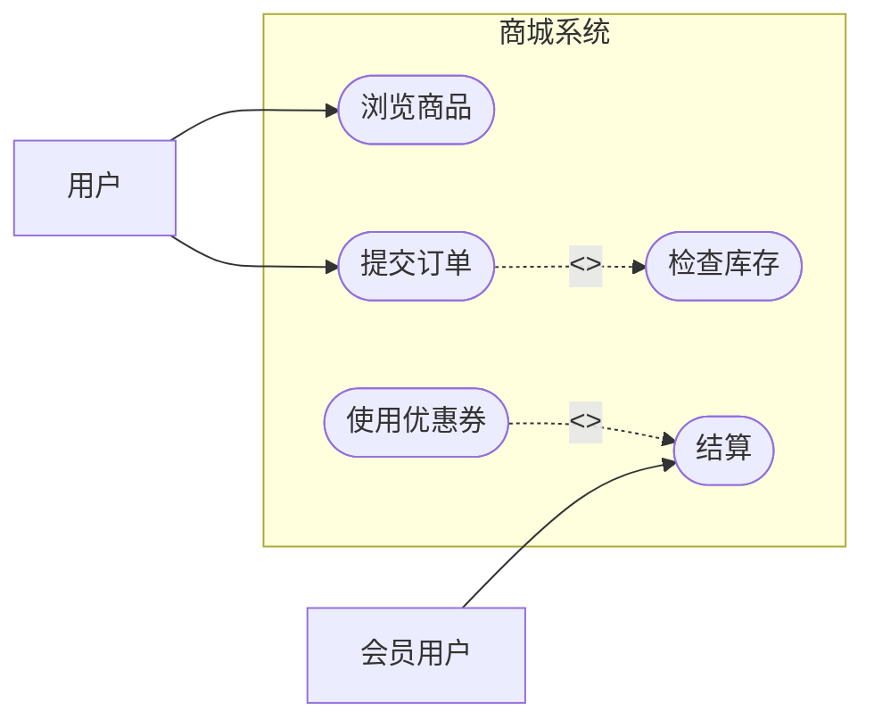

# UML 用例图：商城内部还没设计，怎样先画清“用户能用它做什么”

> [!summary]- 快速复习卡片（学完再看）
> **用例图**：站在系统外面看“谁使用系统、系统对外提供什么功能”。  
> **参与者 Actor**：系统外部和系统发生交互的角色，不等于某个具体的人。  
> **系统边界**：把“系统里面的功能”和“系统外部的人/系统”分开。  
> **include**：基础用例执行时固定包含另一个用例。  
> **extend**：在特定条件下给基础用例增加可选行为。  
> **题干信号 → 第一反应**：问外部用户需求、系统能做什么、参与者 → 先想用例图。

上一站 [[UML总览]] 已经把 UML 的层级理顺：事物和关系是基本构造块，具体的“图”是把这些材料组织起来回答某个问题。

现在先站到系统外面。

商城还没开始设计订单类、支付类这些内部结构，我们只知道老板说：

- 用户可以浏览商品；
- 用户可以下单；
- 下单时必须检查库存；
- 结算时，会员在满足条件时可以使用优惠券。

这时候最重要的不是“内部代码怎么写”，而是：

> **系统外面有哪些角色，他们需要系统提供哪些功能。**

这正是**用例图（Use Case Diagram）**要画的东西。

先大白话记住：

> **用例图 = 从系统外面画“谁来用、能干什么”。**

## 参与者 Actor：不是“画一个人”，而是画一个角色

商城里的“用户”是一个参与者。

但参与者（Actor）并不是特指张三、李四，而是一个**外部角色**。

例如：

- 普通用户；
- 会员用户；
- 第三方支付平台；
- 外部物流系统。

只要它在系统外部、会和系统发生交互，就可能成为参与者。

## 系统边界：这条框到底在分什么

用例图会用一个边界把系统包起来。

边界里面是系统对外提供的功能；边界外面是参与者。

下面只是帮助理解关系的示意，不是要求用 Mermaid 代替 UML 标准画法：

先看它表达的意思：

- 用户在系统外；
- “浏览商品、提交订单、结算”等功能在系统内；
- 用例图先关心**系统应该做什么**，不关心“内部到底怎么写代码”。

这就是教材说的“把系统看成黑盒子”的意思。

## include：这一步每次都要带上

假设“提交订单”这个功能每次执行都必须检查库存。

那就可以理解成：

> **提交订单这个大功能里，固定要包含“检查库存”这个小功能。**

这就是 `<<include>>`。

大白话：

> **include = 每次都要带上。**

它常用于把多个用例都会反复执行的一段公共行为抽出来复用。

## extend：不是每次都发生，条件到了才加上

“使用优惠券”就不一样。

用户结算时，并不是每次都一定有优惠券，也不是每次都一定满足使用条件。

所以“使用优惠券”更像：

> **在某些条件满足时，给原本可以独立完成的‘结算’再加一段可选行为。**

这就是 `<<extend>>`。

大白话：

> **extend = 条件到了，再往原功能上加一段。**

最容易混的是：

- include：基础用例执行时，包含用例是固定需要的；
- extend：基础用例本身可以成立，扩展行为只在条件满足时出现。

## 泛化：会员用户本质上还是一种用户

如果“会员用户”拥有普通用户能做的基本事情，又多了一些会员能力，就可以把它看成“用户”的一种特殊角色。

这时参与者之间可以出现**泛化**。

也就是说：

> **用例图里不仅用例之间能有关系，参与者之间也能有泛化。**

教材还说明：用例之间也可以出现泛化。

## 用例图为什么特别适合需求阶段

因为需求阶段最先关心的就是：

> **外部的人或系统希望这个系统做什么。**

用例图不急着解释内部算法、类结构、数据库表，而是先把外部可见服务画清楚。

所以它特别适合：

- 对系统所处的外部语境建模；
- 对系统需求建模；
- 识别参与者与系统功能之间的关系。

这也是为什么后面学软件架构生命周期时，用例会出现在“需求 → 架构”的入口处：需求先被看清，后面才谈内部结构怎样设计。

## 考试怎么认

1. 题干说“从系统外部观察、描述系统应该提供什么服务” → **用例图**；
2. 题干问 Actor → **系统外部角色**，不是某个具体用户实例；
3. “基础功能每次都必须调用另一个公共功能” → **include**；
4. “满足条件时才附加一段行为” → **extend**；
5. “子角色属于父角色的一种” → **泛化**；
6. 题目强调系统边界 → 注意边界把外部参与者和内部用例分开。

## 一句话记住

> **用例图不先看系统里面怎么做，而是站在门外看：谁来用，这个系统能替他做什么。**

## 自测

> [!question] 自测
> 1. “提交订单时每次都必须检查库存”，更适合 include 还是 extend？
>
> > [!answer]- 第 1 题答案与解析
> > **答案**：include。
> > **解析**：检查库存是提交订单固定需要包含的行为。
>
> 2. “结算时只有用户持有有效优惠券才执行优惠券逻辑”，更适合 include 还是 extend？
>
> > [!answer]- 第 2 题答案与解析
> > **答案**：extend。
> > **解析**：结算本身可以独立存在，优惠券逻辑只在条件满足时附加。
>
> 3. Actor 是不是一定代表某一个具体的人？
>
> > [!answer]- 第 3 题答案与解析
> > **答案**：不是。
> > **解析**：Actor 表示与系统交互的外部角色，也可以是外部系统。

## 上一站 / 下一站

- **上一站**：[[UML总览]]
- **下一站**：[[UML类图与基本关系]]：用例图先说清“系统对外要做什么”；下一步进入系统内部，看有哪些类、这些类之间到底是什么关系。
