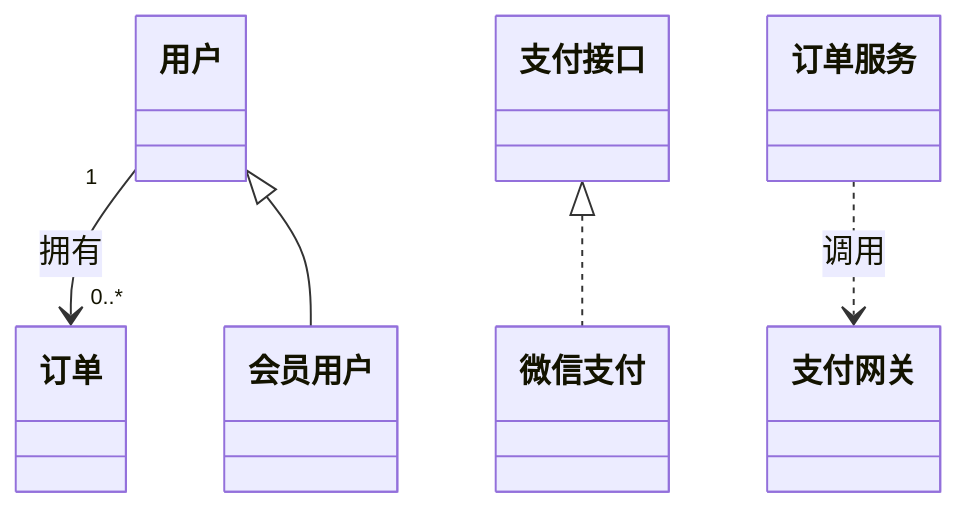

# UML 类图与基本关系：商城里的几根线，到底分别在说什么

> [!summary]- 快速复习卡片（学完再看）
> **类图**：主要看系统里有哪些类，以及类之间是什么关系。  
> **依赖**：临时“用到你”；一个变化可能影响另一个。  
> **关联**：对象之间有比较稳定的结构联系；可标多重度，聚合是特殊关联。  
> **泛化**：特殊类属于一般类，子类继承父类；空心三角实线指向父类。  
> **实现**：类/构件兑现接口规定的契约；空心三角虚线指向接口。  
> **题干信号 → 第一反应**：先判断题目是在说“临时使用、长期连接、父子类型、实现接口”中的哪一种。

上一站 [[UML用例图]] 已经先从系统外面说清：谁会使用商城、商城应该提供哪些功能。

现在进入系统内部。

系统里有：用户、订单、会员用户、支付接口、微信支付、订单服务、支付网关。

如果只把这些名字一个个写出来，你仍然不知道：

- 一个用户到底能有几个订单？
- 会员用户和普通用户是什么关系？
- 微信支付为什么能当作一种支付方式？
- 订单服务只是偶尔调用支付网关，还是和它存在固定结构？

所以类图真正要解决的问题是：

> **系统里有哪些“类”，以及这些类之间到底是什么关系。**

## 怎样从用例和业务名词建立最小类图

以上一篇告警平台的“确认告警”用例为输入，不要直接把需求句子中的每个名词都变成类。

### 第 1 步：找候选类，再筛掉噪声

从用例和术语表找出告警、值班人员、设备、确认记录、告警编号、10 秒等候选。筛选后：

- 告警、值班人员、设备、确认记录具有独立职责或身份，可作为类候选；
- 告警编号更适合作为“告警”的属性；
- 10 秒是性能约束，不是类。

### 第 2 步：给类分配最小职责

| 类 | 关键属性 | 关键行为 |
| --- | --- | --- |
| 告警 | 编号、级别、状态、发生时间 | 确认、判断是否待通知 |
| 值班人员 | 人员编号、联系方式 | 接收告警信息 |
| 设备 | 设备编号、所属区域 | 产生告警 |
| 确认记录 | 确认人、确认时间 | 保存确认事实 |

若一个候选只有名称、没有可说明的职责，先不要急着放进图。

### 第 3 步：从业务事实确定关系和多重度

- 一台设备可以产生多条告警：设备 `1` — 告警 `0..*`；
- 一条告警在本例最多有一条有效确认记录：告警 `1` — 确认记录 `0..1`；
- 一名值班人员可以产生多条确认记录：值班人员 `1` — 确认记录 `0..*`。

多重度必须来自业务规则；不确定时标待确认，不能凭绘图习惯填写。

### 第 4 步：只在语义成立时增加其他关系

如果设计出“短信通知器”和“应用通知器”共同实现“通知接口”，这是实现关系；控制器临时调用通知接口，是依赖关系。不要因为两类名称相近就画泛化，也不要把所有调用都画成长期关联。

### 第 5 步：用场景反查类图

沿“设备产生告警 → 值班人员确认 → 生成确认记录”走一遍，检查每个对象能否承担动作、关系方向是否合理、多重度是否允许该实例组合。类图只回答静态结构；消息先后还要用 [[UML序列图与通信图]] 验证。

这张图先不用背线型，先看每根线在说什么。

## 依赖：我只是“用到你”

假设订单服务在生成订单后，需要临时调用一次支付网关。

订单服务并不表示“自己里面包含一个支付网关”，只是某个功能运行时要用它。

这类关系可以先理解成：

> **A 做自己的事情时，要借用 B；B 的变化可能影响 A。**

正式术语叫**依赖（Dependency）**。

教材用虚线表示依赖，方向通常指向被依赖的一方。

做题看到“调用、使用、参数、局部对象、一个变化会影响另一个”这类语境，先考虑依赖。

## 关联：这两个对象本来就有联系

用户和订单不是“偶尔借用一下”的关系。

商城业务本身就要记录：哪个用户有哪些订单。

这类比较稳定的结构联系叫**关联（Association）**。

关联上常会标**多重度**：

- `1`：一个；
- `0..1`：零个或一个；
- `0..*`：零个或多个；
- `1..*`：至少一个。

所以“一个用户可以有多个订单”可以理解成：

> 用户 `1` —— 订单 `0..*`

### 聚合为什么又属于关联

如果题目说“整体—部分”，例如“购物车包含多个购物项”，就会遇到**聚合**。

聚合不是和关联完全平级的第五种基本关系，而是**一种特殊的关联**，专门强调整体和部分。

考试先记住这一层级，暂时不要把 UML 各种整体—部分细分无限展开。

## 泛化：会员用户本质上还是用户

“会员用户”不是和“用户”毫无关系的新东西。

会员用户拥有普通用户的基本属性和行为，只是在此基础上增加会员能力。

所以可以说：

> **会员用户是一种用户。**

这种“特殊—一般”的关系叫**泛化（Generalization）**。

大白话就是：

> **子类 is-a 父类。**

图形上是**空心三角 + 实线**，三角形指向更一般的父类。

看到“继承、父类/子类、特殊/一般、某某是一种某某”时，优先想到泛化。

## 实现：接口先定规矩，具体类来兑现

假设商城规定所有支付方式都必须提供：

- 发起支付；
- 查询支付结果。

这些要求写在“支付接口”里。

微信支付真正把这些操作做出来。

这不是“微信支付继承了一个普通父类”的重点，而是：

> **接口先约定必须提供什么能力，具体类负责把这份约定实现出来。**

这叫**实现（Realization）**。

典型场景就是：

> **接口 ↔ 实现接口的类/构件。**

图形上是**空心三角 + 虚线**，指向被实现的接口。

## 四种关系一遍怎么分

不要先背线，先问一句人话：

| 题目真正想说什么 | 第一反应 |
| --- | --- |
| A 做事时临时要用 B | 依赖 |
| A 和 B 本身存在稳定连接 | 关联 |
| B 是 A 的一种特殊类型 | 泛化 |
| B 按照接口 A 的约定把能力做出来 | 实现 |

然后再把图形记法补上：

| 关系 | 常见图形记忆 |
| --- | --- |
| 依赖 | 虚线箭头 |
| 关联 | 实线，可标多重度/角色 |
| 泛化 | 空心三角实线 → 父类 |
| 实现 | 空心三角虚线 → 接口 |

## 考试怎么认

1. 题干强调“一个元素变化会影响另一个、临时调用/使用” → 先想**依赖**；
2. 强调“对象之间固定连接、一对多、多对多” → **关联**；
3. 强调“特殊类可替代一般类、继承” → **泛化**；
4. 强调“接口规定契约，具体类负责完成” → **实现**；
5. 强调整体—部分 → 先想到**聚合属于特殊关联**，再看题目是否要求继续细分。

## 一句话记住

> **依赖是“用到你”，关联是“本来就连着”，泛化是“我是一种你”，实现是“我把你规定的接口做出来”。**

## 自测

1. `订单服务` 只在支付时调用 `支付网关`，更像依赖还是泛化？

> [!answer]- 第 1 题答案与解析
> **答案**：依赖。
> **解析**：这里重点是一个类在完成工作时临时使用另一个类，不是父子类型关系。

2. `会员用户` 是 `用户` 的一种特殊类型，属于什么关系？

> [!answer]- 第 2 题答案与解析
> **答案**：泛化。
> **解析**：特殊—一般、子类—父类是泛化的典型信号。

3. `微信支付` 按 `支付接口` 的约定实现支付能力，属于什么关系？

> [!answer]- 第 3 题答案与解析
> **答案**：实现。
> **解析**：接口给出契约，具体类兑现契约，是实现关系。

4. 需求中出现一个名词，就应该立即把它画成类吗？

> [!answer]- 第 4 题答案与解析
> **答案**：不应该。
> **解析**：先判断它是否具有独立身份、属性或职责；数值约束可能只是属性或规则，多重度也必须由业务事实确认。

## 上一站 / 下一站

- **上一站**：[[UML用例图]]
- **下一站**：[[UML序列图与通信图]]：类图已经看清“系统里有哪些类、类之间怎么连”；下一步看一次下单真正执行时，这些对象怎样互相发消息。
