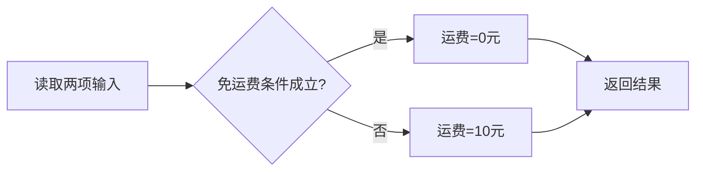

# 结构化详细设计工具：怎样写清一个模块内部的步骤和判断

> [!summary]- 快速复习卡片（学完再看）
> - **详细设计**：说明一个模块内部怎样完成任务。
> - **基本顺序**：列输入输出 → 找判断条件和动作 → 排执行步骤 → 写伪码并检查。
> - **工具选择**：看步骤用流程图；查条件组合用判定表；写算法用 PDL；NS、PAD 用结构化图形表示。
> - **边界**：DFD 看数据怎样流动；SC 看模块怎样组织和调用；详细设计工具看一个模块里面怎样运行。

## 先看一个具体任务

假设网店要计算一笔订单的运费：黄金会员免运费；其他会员订单满 100 元也免运费；否则收 10 元。

程序员需要知道：要读哪些信息、怎样判断、最后返回什么结果。把这些内部步骤写清楚，就是**详细设计**。概要设计已经决定有哪些模块和接口；详细设计继续说明每个模块内部的算法和需要的局部数据。

本篇只处理“计算运费”这个模块内部的逻辑，不讨论它由哪个模块调用，也不讨论订单数据如何在整个系统中流转。

## 从需求句子变成可执行步骤

### 1. 列出输入和输出

| 类型 | 本例内容 |
| --- | --- |
| 输入 | 会员等级、订单金额 |
| 输出 | 运费金额 |
| 中间判断 | 是否免运费 |

“中间判断”不是外部传进来的数据，而是模块根据输入算出的结果。

### 2. 把规则拆成条件和动作

- 条件一：是不是黄金会员？
- 条件二：订单金额是否达到 100 元？
- 动作一：运费设为 0 元。
- 动作二：运费设为 10 元。

将条件组合和对应动作排在一起，就得到**判定表**：

| 条件或动作 | 规则 1 | 规则 2 | 规则 3 |
| --- | --- | --- | --- |
| 黄金会员？ | 是 | 否 | 否 |
| 订单满 100 元？ | — | 是 | 否 |
| 运费设为 0 元 | 执行 | 执行 | 不执行 |
| 运费设为 10 元 | 不执行 | 不执行 | 执行 |

规则 1 中已经是黄金会员，订单金额不再影响结果，所以第二个条件写“—”，表示“无关”。判定表的作用是检查：条件组合有没有漏掉，每种组合会执行什么动作。

### 3. 决定程序先做什么、遇到条件怎样分支

本例只处理一笔订单，所以先读取两项输入，再判断免运费条件，设定运费，最后返回结果。没有“重复处理多笔订单”的要求，因此不需要循环。



图里的菱形是条件判断，箭头表示接下来走哪条路。代入普通会员、订单 80 元，会走“否”分支并返回 10 元；代入普通会员、订单 120 元，会走“是”分支并返回 0 元。

### 4. 用 PDL 把逻辑写成伪码

**PDL（程序设计语言，常称伪码）**用接近程序语言的写法描述算法。它让开发者看清控制结构，但不要求像真正的程序那样可以直接编译运行。

```text
PROCEDURE 计算运费(会员等级, 订单金额)
    IF 会员等级是黄金会员 OR 订单金额 >= 100元 THEN
        运费 = 0元
    ELSE
        运费 = 10元
    END IF
    RETURN 运费
END PROCEDURE
```

这里的 `IF / ELSE` 表示选择；先判断、再赋值、最后返回结果，表示顺序。若模块要逐条处理一批订单，再在外层增加循环。

## 五种常见表达工具怎么区分

这些工具是在表达同一个模块逻辑时可选择的不同方式，不是每个项目都要把同一逻辑画五遍。

| 工具 | 用白话理解 | 适合看什么 | 本例中怎么用 |
| --- | --- | --- | --- |
| **程序流程图** | 用方框、菱形和箭头画执行路线 | 步骤顺序、条件分支和控制流 | 上图展示判断后走哪条路 |
| **NS 图（盒图）** | 把顺序、选择、循环装进嵌套方框 | 结构边界和嵌套层次；不允许随意跳到任意位置 | 将免运费判断放入一个选择结构 |
| **PAD 图** | 用层次化图形逐层展开程序 | 自顶向下的细化过程，也可表达数据结构 | 从“计算运费”逐层展开成读取、判断、返回 |
| **判定表** | 把条件组合和动作做成表格 | 条件多时查有没有漏组合或动作冲突 | 本例的三列规则 |
| **PDL（伪码）** | 用接近代码的文字写算法 | 让开发人员精确交流模块内部逻辑 | 上面的 `IF / ELSE` 伪码 |

程序流程图更直观看执行路线；NS 和 PAD 强调结构化、层次化的图形表达；判定表专门整理条件与动作；PDL 更接近文字版算法。遇到复杂条件组合时，先用判定表把规则理清，再写伪码，通常更容易检查。

## 结构化程序设计的三个基本动作

模块内部的步骤通常用三种控制结构组合：

- **顺序**：先做 A，再做 B。本例先读取输入，再返回运费。
- **选择**：根据条件走不同分支。本例按免运费条件设定 0 元或 10 元。
- **循环**：重复处理，直到达到结束条件。本例只有一笔订单，因此没有循环。

“自顶向下、逐步求精”是先说清模块总任务，再逐层补出细节。例如“计算运费”先分成读取、判断、返回；再把“判断”细化为两个输入条件。通常让控制路径清楚，避免任意跳转。具体项目的入口、出口约定由设计规范确定，做题时按教材的结构化控制模型判断。

## 别把三种设计层次混在一起

| 题目在问 | 工具或方法 | 关注对象 |
| --- | --- | --- |
| 数据从哪里来，经过什么加工，流向哪里？ | DFD | 系统的数据流和处理 |
| 系统分成哪些模块，模块之间怎样调用？ | SC（系统结构图） | 模块层次和调用关系 |
| 某一个模块内部先做什么，怎样判断或重复？ | 程序流程图、NS、PAD、判定表、PDL 等 | 模块内部算法和控制逻辑 |

2021 年下半年综合知识第 30 题把“顺序图”列为不属于结构化设计工具的选项。顺序图属于 UML，用来表示对象之间按时间发生的消息交互；看到“对象生命线、消息先后”就想到顺序图。该题资料来源仍待核验，题目只用于说明这个区分，不据此推断其他题频。

## 做题时按这个顺序判断

1. 题干问“总体模块结构、模块调用”——考虑 SC。
2. 题干问“数据经过哪些处理、如何流动”——考虑 DFD。
3. 题干问“单个模块内部的步骤或算法”——考虑详细设计工具。
4. 再看要表达的重点：执行路线选流程图；条件组合选判定表；算法文字选 PDL；结构层次选 NS 或 PAD。
5. 若题目出现 UML 对象间的消息和时间顺序，识别为顺序图，不要因为它也画成图就归入结构化详细设计工具。

## 自测

1. 需求有三个条件组合，担心漏掉一种情况，应先用哪种工具整理？

> [!answer]- 第 1 题答案与解析
> **答案**：判定表。
> **解析**：判定表逐列列出条件组合及对应动作，方便检查遗漏和冲突。

2. “黄金会员免运费，否则检查订单是否满 100 元”主要用了哪两种程序控制结构？

> [!answer]- 第 2 题答案与解析
> **答案**：顺序和选择。
> **解析**：程序先按顺序读取并判断；根据判断结果选择免运费或收取 10 元。单笔订单不需要循环。

3. “模块内部怎样执行”与“模块之间谁调用谁”分别看哪一类工具？

> [!answer]- 第 3 题答案与解析
> **答案**：前者看详细设计工具，后者看 SC。
> **解析**：详细设计解释单个模块内部的算法与控制步骤；SC 表示模块层次和调用关系。

## 上一站 / 下一站

- **上一站**：[[模块内聚类型]] —— 模块职责已经划分清楚，本篇说明一个模块内部怎样执行。
- **下一站**：[[概念数据模型与实体联系]] —— 本篇处理程序步骤；下一篇转向现实中的数据对象及其关系。
