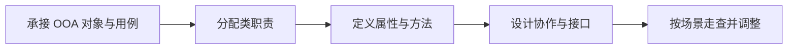

# 面向对象设计 OOD：怎样把分析对象变成可实现的职责、接口和协作

> [!summary]- 快速复习卡片（学完再看）
> **定位**：OOD 接在 OOA 后面，把问题域对象组织成可实现的软件类。
> **建立主线**：承接分析模型 → 分配类职责 → 定义属性与方法 → 设计对象协作和接口 → 走查职责与需求。
> **教材抓手**：类把信息和行为封装在一起；职责继续分解为属性和方法。
> **易错点**：OOD 不是编码，也不等于画类图；UML 只是表达分析与设计结果的语言。

## OOD 在做什么

[[面向对象分析OOA]] 重点理解问题域；OOD 则把分析结果转化为可实现的软件设计。典型工作包括：

- 进一步确定类与对象；
- 分配职责；
- 确定类之间的关系；
- 设计对象之间的协作；
- 明确对外接口；
- 运用抽象、封装、继承、多态等机制组织设计。

教材强调：一个类承担一定职责，职责还要继续落实为属性和方法。因此只列出几个类名，还没有完成 OOD。

## 从告警分析对象建立一版 OOD

假设 OOA 已从“设备产生告警，值班人员确认告警”中识别出：告警、设备、值班人员、通知规则，以及“确认告警”用例。下面不直接写代码，而是完成一版最小设计。

### 第 1 步：承接 OOA 产物，不从技术类名起步

先拿到两类输入：

- 领域对象：告警、设备、值班人员、通知规则；
- 用例场景：值班人员查看一条待确认告警并执行确认，系统保存状态，之后不再重复通知。

如果一开始只写 `Controller`、`Manager`、`Util`，却说不清它们对应哪项业务职责，设计已经脱离分析结果。

### 第 2 步：给每个类分配清晰职责

教材将 OOD 类常分为实体类、控制类和边界类。用这个分类检查职责落点：

| 设计类 | 类型 | 本例职责 | 不该承担什么 |
| --- | --- | --- | --- |
| `告警` | 实体类 | 保存告警编号、级别、状态；执行“确认”状态变更 | 不负责页面输入和整套用例编排 |
| `确认告警控制器` | 控制类 | 协调查询告警、执行确认、保存结果和通知策略 | 不长期保存告警业务数据 |
| `告警确认界面` | 边界类 | 接收值班人员请求并展示成功或错误 | 不直接修改数据库中的告警状态 |
| `告警仓储` | 持久化接口 | 按编号查询并保存告警 | 不决定告警能否确认 |

判断标准不是“每个类都做一点”，而是让变化原因尽量集中：界面变化主要影响边界，流程变化主要影响控制，核心状态规则主要留在实体。

### 第 3 步：把职责拆成属性和方法

以“告警”类为例：

| 设计内容 | 结果 | 来自哪里 |
| --- | --- | --- |
| 属性 | 告警编号、级别、状态、发生时间 | OOA 对象特征与用例数据 |
| 方法 | `确认()` | “确认告警”业务行为 |
| 约束 | 只有待确认状态可以确认 | 用例规则 |

`确认告警控制器`则需要 `确认告警(告警编号, 操作人)` 之类的入口方法。这里定义的是职责契约，不要求此时写出 Java 或 C++ 方法体。

### 第 4 步：沿一个用例设计对象协作和接口

把“确认告警”走一遍：

1. `告警确认界面`接收告警编号和操作人；
2. `确认告警控制器`调用`告警仓储`查询告警；
3. 控制器请求`告警.确认()`，由告警对象检查当前状态；
4. 成功后由仓储保存状态；
5. 控制器返回“确认成功”，通知策略据新状态停止重复通知。

此时接口至少要说清：

- 输入：告警编号、操作人；
- 成功输出：确认后的告警状态；
- 异常：告警不存在、已经确认、没有操作权限；
- 调用方向：边界 → 控制 → 实体/仓储，而不是界面跨层直接改状态。

### 第 5 步：按场景走查并调整设计

逐条检查：

1. OOA 中的重要对象和用例是否都能追到设计类或接口；
2. 每个职责是否有明确承担者，有没有多个类重复负责；
3. 一个类是否同时处理界面、业务规则和存储，导致职责过杂；
4. 属性和方法是否足以完成用例正常路径与异常路径；
5. 对外接口是否暴露了不必要的内部实现细节。

如果“已确认告警还能再次确认”，问题不是少画了一条 UML 线，而是业务约束没有落实到类职责与方法中。

## 和 OOA、OOP 怎么区分

| 阶段 | 主要问题 |
| --- | --- |
| OOA | 业务世界里有哪些对象、关系和行为？ |
| OOD | 软件里的对象怎样组织、协作和提供接口？ |
| OOP | 怎样用编程语言把这些对象和协作实现出来？ |

因此，“识别问题域对象”更偏 OOA；“为类分配职责、确定接口和协作”更偏 OOD；“用 Java/C++ 等实现继承和多态”更偏 OOP。

## 想清楚以后，怎样把设计画给别人看

还是用商城举例。

OOD 已经想清楚：有用户、订单、支付接口；订单服务会调用库存服务；订单从待付款变成已付款。

但如果这些设计只留在脑子里，其他开发人员还是不知道你具体是怎么理解的。

所以这时会用到本章后面的 [[UML总览]]：

> **OOD 负责把软件怎么设计想清楚，UML 负责把这些设计按统一规则画出来。**

比如：

- 先站在系统外看用户要什么 → [[UML用例图]]；
- 类和类之间怎么连 → [[UML类图与基本关系]]；
- 一次下单时谁先调用谁 → [[UML序列图与通信图]]；
- 订单生命周期怎么变 → [[UML活动图与状态机图|状态机图]]；
- 软件构件和部署位置 → [[UML构件图与部署图]]。

这里要特别注意：**UML 不是 OOD 后面多出来的一个开发阶段。** 实际 OOA、OOD 过程中都可以使用 UML。学习路线把 UML 放在 OOD 后集中学习，只是为了先理解“分析/设计在做什么”，再集中学“这些结果怎么表达”。

## 与实体类、边界类、控制类的关系

[[实体类边界类与控制类]] 是面向对象分析设计中常见的职责划分方式，可以帮助从用例逐步落到设计结构，但它不能替代 OOD 的完整定位。

## 易错点

- OOD 不等于编码；编码属于后续 [[面向对象程序设计OOP]]。
- OOD 也不只是“画类图”，图只是表达设计的一种方式。
- UML 是表达工具，不等于 OOD 本身，也不是一个强制独立阶段。
- OOA 与 OOD 有连续性，实际项目边界可能迭代往返，不应理解成绝对一次性切换。

## 知识链

前置：[[面向对象方法]] → [[面向对象分析OOA]]  
表达工具：[[UML总览]] → [[UML用例图]] → [[UML类图与基本关系]] → [[UML序列图与通信图]] → [[UML活动图与状态机图]] → [[UML构件图与部署图]]  
后续实现：[[实体类边界类与控制类]] → [[面向对象程序设计OOP]]

## 自测

1. 题干强调“确定类的职责、接口以及对象间协作”，应优先判断为 OOA、OOD 还是 OOP？

> [!answer]- 第 1 题答案与解析
> **答案**：OOD。
> **解析**：这是在把分析结果进一步组织成可实现的软件设计。

2. 已经识别出“告警”对象后，为什么还不能说 OOD 完成了？

> [!answer]- 第 2 题答案与解析
> **答案**：还需为类分配职责，并把职责落实为属性、方法、接口和对象协作，再用用例场景走查。

3. “用类图把已经设计好的类和关系画出来”说明 UML 和 OOD 是什么关系？

> [!answer]- 第 3 题答案与解析
> **答案**：OOD 负责设计内容，UML 负责统一表达这些内容。
> **解析**：UML 是建模语言，不是额外的开发阶段或 OOD 本身。

## 上一站 / 下一站

- **上一站**：[[面向对象分析OOA]] —— 已经识别问题域中的对象和关系；本篇把分析结果进一步组织成软件职责、接口和协作。
- **下一站**：[[UML总览]] —— OOD 负责“设计什么”，UML 负责“怎样按统一规则表达这些分析和设计结果”；UML 不是额外开发阶段。
