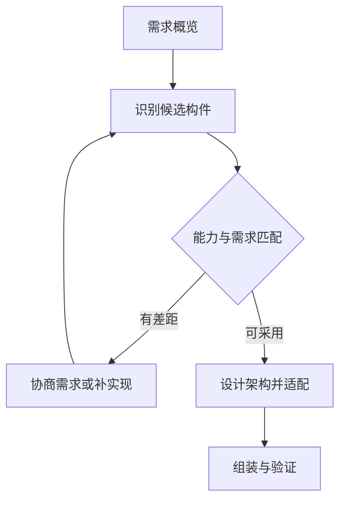

# CBSE开发过程

## 有了构件，还不能直接开始拼

上一站 [[构件模型与容器]] 解决“构件怎样被标准化描述和运行”。真正开发系统时还会遇到更现实的问题：**现成构件和原始需求往往不能完全吻合，先改需求、换构件、补实现，还是调整架构？**

因此 CBSE 过程不是“找到构件 → 拼起来”两步，而是一条会反馈的链：**需求概览 → 找候选构件 → 核对差距并协商可调整需求 → 设计架构/平台 → 定制适配 → 组装验证**。

> [!summary] 快速复习卡片
> - **核心结论**：先识别可复用构件，再协商需求和架构，完成适配、组装与验证。
> - **做题入口**：根据可获得构件调整可协商需求，是 CBSE 相对纯自研的突出特点。

**CBSE（基于构件的软件工程）**把重点从全部自行实现转向选择并集成已有构件。可买到的通知服务支持某些渠道，但未必支持业务提出的全部规则，需要在成本与需求之间做决策。

先形成系统需求概览，识别候选构件；核对能力与限制，与用户协商可调整的需求；选择架构、构件模型和平台；对不匹配接口进行适配，必要时补自研能力；最后组装并验证系统。

不能为迁就产品擅自删除不可让步的业务或安全要求。架构和平台又会限制候选构件范围，因此搜索、需求和设计之间存在反馈。

构件都通过各自测试，仍需集成与系统验证。

### 用通知服务的差距走一轮 CBSE 决策

教学例子：需求要求“订单确认后发短信和邮件”，候选构件目前只支持短信；同时，所有通知必须遵守的用户授权检查不能省略。先记录需求概览并搜索候选构件；核对后发现“首发暂不发邮件”可与业务方协商，但授权检查是不可让步的安全要求。若业务同意分阶段交付，就把首发需求和后续邮件需求写入范围记录；架构上保留通知接口，短信构件通过接口适配接入，邮件能力列为后续构件或自研项。交付产物包括更新后的需求/架构与适配说明；组装后验证授权拒绝、短信成功及失败路径，并确认未承诺的邮件能力没有被伪报成功。若业务不能接受缺少邮件，则换构件或补开发，而不是偷偷删需求。

## 自测

> [!question] 自测
> 1. 发现构件缺少强制安全能力，能为了复用直接删掉需求吗？
>
> > [!answer]- 第 1 题答案与解析
> > **答案**：不能，必须保留必要要求，选择替代构件或补充实现并验证。
