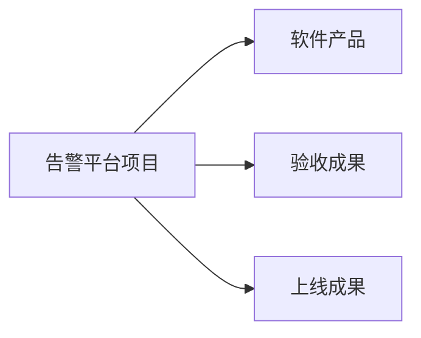

# 工作分解结构 WBS：怎样把完整项目范围逐层拆成可管理的工作包

> [!summary]- 快速复习卡片（学完再看）
> **定位**：WBS 以可交付成果为导向，逐层定义项目的完整工作范围。
> **建立顺序**：确认范围 → 选分解口径 → 逐层拆分 → 定义工作包 → 检查完整性并停止。
> **工作包门槛**：可管理、有明确交付成果和完成标准、能分配唯一责任主体。
> **题干信号 → 第一反应**：问“项目要做哪些工作”看 WBS；问“谁先谁后、持续多久”转到活动网络与进度计划。
> **易错点**：WBS 不是组织结构图，也不是把任务越拆越细越好。

上一站 [[软件项目管理的范围]] 说明了项目管理要管范围、人员、时间、质量和风险。真正开始计划时，不能直接给开发人员排日期，因为此时连“全部要交付什么”都可能没拆清。

**WBS（Work Breakdown Structure，工作分解结构）就是把完整项目范围按同一口径逐层展开，直到形成可以管理和验收的工作包。**

它先回答：

> **这个项目为了完成全部交付，到底要做哪些工作？**

它不直接回答工作先后和工期；那是下一站 [[活动依赖与进度计划]] 的任务。

## 用告警平台完整建立一份 WBS

项目目标是交付一套可上线的告警平台，范围包括告警接入与处理、验收测试，以及上线交付。下面从这句范围说明开始逐层分解。

### 第 1 步：先固定顶层范围和边界

先写清项目最终需要交付什么，以及明确不包含什么。本例顶层交付是：

> 一套能接收设备告警、识别 P1 告警、通知值班人员并记录确认状态的可部署告警平台。

如果“短信运营商采购”“监控设备改造”不在本项目范围，应在范围说明中排除。边界不清，后面树画得再漂亮也会漏项或越界。

### 第 2 步：选择一层的分解口径

教材允许按产品物理结构、功能、实施过程、实施单位、目标等方式分解。本例顶层采用**可交付成果口径**：

同一层尽量保持同一种观察口径。若一边写“通知模块”，另一边写“开发阶段”，就把产品组成和实施过程混在了一层，容易重复计算工作。

### 第 3 步：继续向下拆到工作包

把每个顶层成果继续分解，并给节点编码：

| WBS 编码 | 父项 | 本层成果 |
| --- | --- | --- |
| 1.1 | 告警平台项目 | 软件产品 |
| 1.1.1 | 软件产品 | 告警接入模块 |
| 1.1.2 | 软件产品 | 告警处理模块 |
| 1.1.3 | 软件产品 | 通知模块 |
| 1.2 | 告警平台项目 | 验收成果 |
| 1.2.1 | 验收成果 | 验收测试报告 |
| 1.3 | 告警平台项目 | 上线成果 |
| 1.3.1 | 上线成果 | 部署包 |
| 1.3.2 | 上线成果 | 部署与恢复说明 |

编码只是帮助定位，不证明分解正确。真正的检查是：子项合起来是否完整覆盖父项，而且彼此没有重复承担同一成果。

> **补充理解：100% 检查。** 对每个父项都问“这些直接子项合起来，是否覆盖父项的全部范围；有没有一项工作被两个子项重复包含”。这是检查遗漏和重复的实用方法，不要把百分比理解成给每个节点机械分配数值。

### 第 4 步：为底层工作包写清管理信息

只写“通知模块”仍不足以安排项目。至少需要一份工作包说明：

| 字段 | `1.1.3 通知模块`示例 |
| --- | --- |
| 范围 | 接收待通知告警，查询当班人员，向约定消息网关提交通知请求并记录结果 |
| 交付成果 | 可部署的通知模块及接口说明 |
| 完成标准 | 正常、无当班人员、网关失败三类约定场景通过验收 |
| 责任主体 | 通知模块负责人（唯一责任归口） |
| 边界 | 不包含外部消息网关本身的建设 |

“唯一责任主体”不等于只能一个人干，而是必须有一个明确的责任归口，不能出现“大家都负责，所以没人对结果负责”。

### 第 5 步：检查是否该停止分解

教材说要分解到工作包可控、可管理，不能过于复杂，也不能过细。实际可以逐项问：

1. 是否有明确、可验收的交付成果；
2. 是否能给出清楚的完成标准；
3. 是否能分配一个唯一责任主体；
4. 是否已经可以估算工作量、成本和所需资源；
5. 是否可以在项目周期内跟踪和控制；
6. 继续拆分是否仍能提高管理价值，而不是变成个人每日操作清单。

前五项满足，且继续细分只会增加维护成本时，就可以停止。教材给出 WBS 树通常不超过 6 层的经验原则，作用是提醒不要无限细拆；它不能替代上面的工作包质量判断。

例如“编写第 37 行代码”“上午给同事发消息”通常不是有独立交付价值的工作包。相反，如果“告警处理模块”仍无法估算、无法指定完成标准，就还需要继续分解。

## 完成后怎样检查整棵 WBS

从下往上和从上往下各检查一次：

- **从上往下查完整性**：每项项目范围是否都落入某个分支；
- **从下往上查归属**：每个工作包是否只服务于明确父项，是否存在重复；
- **查交付成果**：每个工作包是否产生可以验收的结果；
- **查责任**：每个工作包是否有唯一责任归口；
- **查边界**：范围外工作是否被误放进来；
- **查粒度**：是否有的包大到不可控、有的包细到个人操作。

修正后，WBS 才能成为资源、成本、进度和风险计划的共同范围基础。

## WBS 和活动计划不能混

| 问题 | WBS | 活动依赖/进度计划 |
| --- | --- | --- |
| 核心问题 | 要完成哪些范围和交付成果 | 这些活动按什么先后执行、持续多久 |
| 主要结构 | 层级分解 | 时间与依赖网络 |
| 最底层关注点 | 工作包 | 活动、前驱、历时和里程碑 |
| 本例 | 通知模块、验收报告、部署包 | 先完成接口，再并行开发，最后联调 |

所以 WBS 做完以后，还要从工作包中定义活动，再进入 [[活动依赖与进度计划]]；不能直接把 WBS 的上下层关系当成时间先后关系。

## 考试第一动作

看到题干后先问它在考哪个维度：

- “以可交付成果为导向、逐层定义完整工作范围、工作包” → WBS；
- “前驱、持续时间、关键路径、里程碑” → 活动与进度计划；
- “工作包越细越好” → 错，分解必须兼顾可管理与不过细；
- “工作包由多人参与，所以不需要唯一负责人” → 错，执行者可以多人，但责任主体应明确。

## 自测

1. WBS 能直接表示两个任务谁先谁后吗？

> [!answer]- 第 1 题答案与解析
> **答案**：不能。
> **解析**：WBS 主要表达项目范围和可交付成果的层级分解，任务依赖与时间顺序需要活动关系表示。

2. “告警平台 → 软件产品、验收成果、上线成果”拆完以后，为什么还不能立即给每个人排日期？

> [!answer]- 第 2 题答案与解析
> **答案**：这些成果还需要继续拆成可管理的工作包，明确交付成果、完成标准和责任主体；之后才能定义活动与进度。

3. 一个工作包由三个人协作完成，是否违反“唯一主体负责”？

> [!answer]- 第 3 题答案与解析
> **答案**：不一定。
> **解析**：可以多人执行，但应有唯一责任归口对工作包结果负责。

4. 怎样判断 WBS 可以停止继续分解？

> [!answer]- 第 4 题答案与解析
> **答案**：当工作包已有可验收成果和完成标准，能够估算、分配责任、跟踪控制，继续细分不再增加管理价值时可以停止。

## 上一站 / 下一站

- **上一站**：[[软件项目管理的范围]] —— 已确定项目管理需要控制完整交付范围；本篇把范围拆成可管理工作包。
- **下一站**：[[活动依赖与进度计划]] —— 工作包已经明确，下一步定义具体活动、前驱关系、历时和里程碑。
