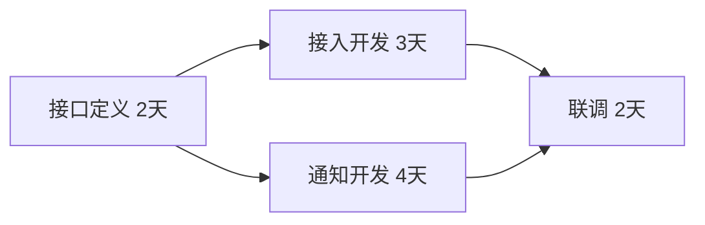

# 活动依赖与进度计划

## 第二步：工作拆出来后，再决定先后和工期

上一站 [[工作分解结构WBS]] 已经回答“要做什么”。现在才进入时间维度：**哪些活动必须等前驱完成、哪些可以并行、整条项目最早多久完成？**

因此做题先分清：WBS 是**范围分解**；活动网络/进度计划是**依赖与时间安排**。看到网络图时第一动作是找前驱关系和所有起点到终点路径，再判断最长路径。

> [!summary] 快速复习卡片
> - **核心结论**：定义活动、排序、估资源与历时、制定计划、持续控制；汇合点等最晚完成的前驱。
> - **经典题型怎么做**：先画/读出前驱关系，再累计每条路径时间；总工期看最长路径，能并行的任务不要直接相加。
> - **易错点**：关键路径由“最长总持续时间”决定，不是活动数量最多；资源不足时，即使依赖允许并行也可能实际串行。

**活动依赖**说明某项工作开始前需要哪些工作完成。WBS 列出了要做什么，进度计划还要把它们放到时间上。

教学例子：接口定义需 2 天，完成后接入开发需 3 天、通知开发需 4 天，两项均完成才能联调 2 天。假设资源足够、两项可并行，则接口完成后等待较慢的通知开发，再联调，总计 8 天，而不是把两条并行工作都累加。

如果两项由同一个人串行完成，时间又会不同，所以依赖图不自动解决资源冲突。

## 历年怎么考

仓库标准化题库里，这类题长期围绕两种动作：一类是识别活动定义、排序、资源估算、历时估算、计划与控制等过程；另一类是根据网络图计算关键路径、总工期和可延迟时间。2019 年下半年综合知识仍直接出现关键路径计算，因此做题第一步不是背定义，而是先找所有从起点到终点的路径并累计持续时间，最长者决定总工期。

## 自测

> [!question] 自测
> 1. 并行任务都完成才能联调，汇合时看较短还是较长的任务？
>
> > [!answer]- 第 1 题答案与解析
> > **答案**：看最晚完成的前驱；还需确认资源允许并行。
