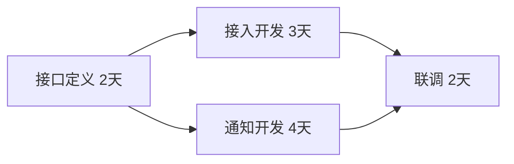

# 活动依赖与进度计划

> [!summary] 快速复习卡片
> - **核心结论**：定义活动、排序、估资源与历时、制定计划、持续控制；汇合点等最晚完成的前驱。
> - **做题入口**：先列前驱与持续时间，再排可并行工作，不要把所有活动时间直接相加。

**活动依赖**说明某项工作开始前需要哪些工作完成。WBS 列出了要做什么，进度计划还要把它们放到时间上。

教学例子：接口定义需 2 天，完成后接入开发需 3 天、通知开发需 4 天，两项均完成才能联调 2 天。假设资源足够、两项可并行，则接口完成后等待较慢的通知开发，再联调，总计 8 天，而不是把两条并行工作都累加。

如果两项由同一个人串行完成，时间又会不同，所以依赖图不自动解决资源冲突。

2018 年下半年第 22 题考活动定义、排序、资源估算、历时估算、计划和控制的过程；资料为来源待核验的真题解析资料。本例为教学练习。

## 自测

> [!question]- 并行任务都完成才能联调，汇合时看较短还是较长的任务？
> 看最晚完成的前驱；还需确认资源允许并行。
