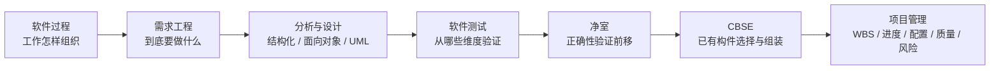

# 软件工程基础知识 · 考前速记

> [!summary] 8～10 分钟主线
> **先定坐标（软件生命周期 / 软件过程 / 过程模型）→ 再看过程怎么组织 → 需求怎么确定 → 设计怎么落地（结构化 / 面向对象 / UML）→ 测试怎么验证 → 净室和 CBSE 怎么补 → 项目管理怎么把交付管住。**
> 本页只做复习提炼，主事实源仍是原子卡；优先级取舍见 [[软件工程基础知识-复习优先级]]，第一次学习顺序见 [[01_综合知识/04_软件工程基础知识/学习路线|学习路线]]。

## 1. 一眼看全章

上图是**阅读顺序**，不是优先级排行（整章坐标先看 [[软件工程的定位]]）：过程模型之间是并列选择，[[CMMI成熟度等级]] 评的是组织过程能力，不是“另一种开发流程”；[[RUP四加一视图]] 也不属于 RUP 生命周期的第三条坐标。复习时先拿 P0，再用 P1/P2 补齐；净室把缺陷预防前移，见 [[净室软件工程]] 与 [[净室盒子结构]]。

## 2. 题干关键词 → 知识点

**过程与过程改进**

| 题干信号 | 第一反应 | 回看 |
| --- | --- | --- |
| 需求较稳定、严格阶段推进、文档/里程碑评审、晚期变更代价大 | 瀑布模型 | [[瀑布模型]] |
| 反复改进已有能力；分批交付、较早得到可用系统和客户反馈 | 迭代与增量模型 | [[迭代与增量模型]] |
| 风险驱动、每轮先做风险分析、每轮评审是否继续 | 螺旋模型 | [[螺旋模型]] |
| 需求模糊、用户说不清、先做样品/界面让用户试 | 原型模型（抛弃型 / 演化型） | [[原型的去留与目标系统]] |
| 软件重用、已有构件、构件库、选择/适配/组装 | 构件组装模型（过程模型视角） | [[构件组装模型]] |
| 四阶段 + 九工作流、用例驱动、体系结构中心、迭代增量 | RUP | [[RUP]]、[[RUP九类工作流]] |
| 初始 → 已管理 → 已定义 → 量化管理 → 优化 | CMMI 成熟度等级 | [[CMMI成熟度等级]] |

**需求工程**

| 题干信号 | 第一反应 | 回看 |
| --- | --- | --- |
| 业务需求 / 用户需求 / 功能需求；性能、质量、标准、实现约束 | 需求层次与非功能需求 | [[需求层次与非功能需求]] |
| “需求怎么形成” / “已有需求以后怎么变、怎么追、怎么管版本” | 需求开发 / 需求管理 | [[需求开发与需求管理]] |
| 面谈、专题讨论、问卷、观察、原型、头脑风暴 | 需求获取方法 | [[需求获取方法]] |
| 规格是否完整、正确、一致、可行、可验证；评审批准形成基线 | 需求规格与确认验证 | [[需求规格与确认验证]] |
| 基线后收到新变更、影响分析、CCB 决策 | 需求变更控制 | [[需求变更控制]] |
| 需求 → 设计/代码/测试；设计/代码/测试 → 需求依据 | 需求双向追踪矩阵 | [[需求双向追踪矩阵]] |

**分析与设计（含 UML）**

| 题干信号 | 第一反应 | 回看 |
| --- | --- | --- |
| 数据流 / 加工 / 数据存储 / 外部项；父图子图边界一致；图上名称含义不清 | 数据流图 DFD / 数据字典 | [[数据流图DFD]]、[[数据字典]] |
| 模块之间依赖多深；调用方必须知道或修改另一个模块内部数据 | 模块耦合类型 / 模块信息隐藏被破坏 | [[模块耦合类型]]、[[模块信息隐藏]] |
| 一个模块内部为什么把这些功能放在一起 | 模块内聚类型 | [[模块内聚类型]] |
| 步骤顺序 / 条件组合 / 算法伪码 / 结构层次（业务流图 / DFD / SC 的阶段分工） | 程序流程图、判定表、PDL、NS/PAD | [[结构化详细设计工具]]、[[结构化分析与设计分工]] |
| 有哪些实体、属性、联系；1:1、1:N、M:N | 概念数据模型（E-R） | [[概念数据模型与实体联系]] |
| 问题域对象、职责/接口、继承多态；页面、外部接口、一次用例的流程协调分别由谁承担 | OOA / OOD / OOP 先判阶段；实体 / 边界 / 控制类 | [[面向对象方法]]、[[面向对象分析OOA]]、[[面向对象设计OOD]]、[[面向对象程序设计OOP]]、[[实体类边界类与控制类]] |
| 外部角色能用哪些功能 / 类及关系 / 谁先调用谁 / 一个对象怎样换状态 | UML 用例图 / 类图 / 序列图 / 状态机图 | [[UML总览]]、[[UML用例图]]、[[UML类图与基本关系]]、[[UML序列图与通信图]]、[[UML活动图与状态机图]]、[[UML构件图与部署图]] |
| 从旧代码恢复设计；严格数学语义验证性质 | 逆向工程 / 形式化方法 | [[逆向工程]]、[[形式化方法]] |

**测试与项目管理**

| 题干信号 | 第一反应 | 回看 |
| --- | --- | --- |
| 被测程序有没有运行；桌面检查、审查、走查、静态分析 | 静态 / 动态测试 | [[静态测试与动态测试]] |
| 用例是否利用内部结构 | 黑盒 / 白盒 / 灰盒 | [[黑盒白盒与灰盒测试]] |
| 等价类、边界值、错误推测 | 黑盒用例设计方法 | [[黑盒用例设计方法]] |
| 语句、判定/分支、路径覆盖谁更强 | 白盒覆盖的判断 | [[白盒覆盖的判断]] |
| 模块内错误还是模块间接口/协作错误 | 单元 / 集成测试 | [[单元测试与集成测试]] |
| 完整系统对照系统规格；客户按合同接收；用户在实际环境试用；两个方案比效果 | 系统 / 验收 / Alpha 与 Beta / A/B 测试 | [[系统测试与验收测试]]、[[Alpha与Beta测试]]、[[AB测试]] |
| 修改后旧能力是否被破坏；谁来重复执行 | 回归测试 / 测试自动化 | [[回归测试]]、[[测试自动化]] |
| 响应时间、吞吐、资源消耗；逼近或超过承受能力 | 性能 / 负载 / 压力测试 | [[性能负载与压力测试]] |
| WBS、前驱、关键路径、总工期 | 工作分解结构 / 活动依赖与进度计划 | [[工作分解结构WBS]]、[[活动依赖与进度计划]] |
| 配置项、基线、版本、变更控制；SQA 审计；风险应对 | 管理范围 / 配置管理 / 质量保证 / 风险管理 | [[软件项目管理的范围]]、[[软件配置管理]]、[[版本控制与基线]]、[[软件质量保证SQA]]、[[软件风险管理]] |

## 3. 核心流程与最小计算：变量、单位、适用条件

1. **关键路径与总工期**（→ [[活动依赖与进度计划]]）
   单条路径历时 $T_i=\sum$（该路径上各活动历时）；总工期 $T=\max(T_1,T_2,\dots)$，即“最长路径”，不是活动数量最多。
   教学例：接口定义 $2$ 天 →（接入开发 $3$ 天 / 通知开发 $4$ 天并行）→ 联调 $2$ 天；两条路径为 $2+3+2=7$ 天、$2+4+2=8$ 天，总工期取 $8$ 天。
   单位与活动历时单位一致（本例为“天”）。**适用条件**：前驱关系明确、资源足够允许并行；汇合点等最晚完成的前驱，资源不足时“允许并行”也可能实际串行，必须按资源约束重排。

2. **白盒要覆盖到哪些结构**（→ [[白盒覆盖的判断]]）
   覆盖目标是语句、判定/分支、路径等不同对象。教学例：两个**相互独立**的布尔判定 $A$（字段不全）、$B$（夜间提交），各有真/假两种结果，因此形成 $2\times2=4$ 条组合路径。
   只让每个判定都取过真和假，可达到语句与判定/分支覆盖，但仍可能漏掉 $A$ 真 $B$ 真、$A$ 假 $B$ 假两条路径。**适用条件与边界**：循环会使路径数急剧增长，通常难以实现全路径覆盖；覆盖率只说明走过哪些结构，不代表结果正确。

3. **黑盒用例设计三步**（→ [[黑盒用例设计方法]]）
   等价类（划有效/无效输入类别）→ 边界值（查端点及紧邻值）→ 错误推测（按经验补空值、小数、超长字符串等）。教学例：重试次数只接受 $1\sim5$ 的整数时，检查边界 $1$、$5$，并检查紧邻的 $0$、$2$、$4$、$6$；每个用例都要有预期结果。

4. **DFD 建立五步**（→ [[数据流图DFD]]、[[数据字典]]）
   明确目标与范围 → 顶层图（整个系统看作一个加工）→ 第一层分解 → 只继续分解仍不清楚的加工 → 从外到内检查。检查项：父子图边界输入输出一致；每个加工至少一进一出；每条数据流至少一端接加工；外部项不直接连数据存储。箭头写**数据名**，不写“然后/下一步”。

5. **需求变更控制链与配置基线**（→ [[需求变更控制]]、[[需求双向追踪矩阵]]、[[软件配置管理]]、[[版本控制与基线]]）
   问题分析与变更描述 → 影响分析与成本计算（成本应包含需求文档、设计、实现等所有被牵动的工作）→ CCB 决策 → 实施变更 → 同步需求、设计、代码、测试、计划与状态。追踪矩阵维护方式：统一编号 → 列需求与成果清单 → 填有证据的关联 → 正反两向查漏 → 纳入变更维护。配置侧同理：标识受控成果与版本 → 记录变更依据 → 批准后实施并验证 → 形成一致的产品配置并报告；基线是“一组经过评审批准、在特定范围内作为后续依据的配置项版本”，变更后形成新基线而不是覆盖旧基线。

## 4. 易错陷阱：为什么容易错

1. **瀑布 ≠ “发现错误也绝不回头”**：顺序推进是工程组织方式；真正的问题是越晚回头，依赖旧成果的东西越多，返工越大。题干出现“需求相对稳定”时先想瀑布。
2. **有迭代 ≠ 螺旋，迭代增量 ≠ 敏捷全部**：只看到“一轮轮做”很容易误判；螺旋的判据是**风险分析是否成为每轮过程的核心驱动力**（目标设定 → 风险分析 → 开发和有效性验证 → 评审）。敏捷还有“适应型而非预设型、以人为本而非以过程为本”等坐标，也不是没有过程；看到短周期、持续反馈、从简单做起优先想 [[极限编程XP]]，迭代管理骨架看 [[Scrum迭代管理]]，方法家族看 [[水晶系列方法]]，按“客户可识别能力”组织开发看 [[特征驱动开发FDD]]。
3. **CMMI 是过程能力评估，不是开发模型；RUP 四阶段也不是四个瀑布阶段**：CMMI 容易被和瀑布、螺旋、RUP 并列成“又一种流程”，且三级“已定义”不是四级（四级必须出现定量目标、过程性能和可预测性，固定过程域/目标的数量有版本敏感性）。RUP 一个阶段里可以同时开展需求、设计、实现、测试等多个工作流，九类工作流是**纵向工作种类**而非九个先后阶段，4+1 视图也不属于“四阶段 + 九工作流”两条轴。
4. **结构化的几张图不能互换**：业务流图看业务处理流转、DFD 看数据被加工和传递、SC 看模块组织和调用、程序流程图/NS/PAD/PDL 看单个模块内部怎样执行。DFD 不描述程序控制顺序，SC 也不是“更细的 DFD”。
5. **内聚与耦合是两个维度**：内聚看模块内部、耦合看模块之间，高内聚常伴随低耦合但并非绝对——模块职责单一，仍可能直接修改另一个模块的内部数据。顺序内聚与过程内聚也要分开：有先后顺序不等于顺序内聚，先查有没有“前一步输出 → 后一步输入”的数据接力。
6. **黑盒/白盒不能按测试阶段或“有没有源码”判断，覆盖率也不等于正确率**：“黑盒=功能测试”这类标签不能替代判据——**用例设计是否利用内部结构**；知道源码不自动等于白盒，动态测试与黑盒不是同级二选一，灰盒仍会漏掉未掌握的内部细节。覆盖再全也只说明走过哪些结构；2022 年那道题在给定选项里问“测试强度最高”答案是路径覆盖，但不能把这句扩张成万能排序。同理，验证通过 ≠ 用户满意（规格本身可能没写对用户任务，两侧边界见 [[验证与确认V&V]]），只测合法值中间的样例会漏掉边界与非法输入，只复测原失败用例也不足以证明周边行为未被破坏；Web 场景的链接与表单还有专门检查点，见 [[Web链接与表单测试]]。
7. **提交、打标签、发布版本都不自动等于基线**：基线要经过评审批准并明确适用范围；“基线不能修改”也是绝对化错误，准确说法是基线变更必须受控并保留记录。
8. **逆向工程 ≠ 重构 ≠ 再工程**：逆向工程重在从已有实现恢复理解；重构是在尽量保持外部行为不变前提下改善内部结构；再工程范围更大，可包含理解旧系统、重构、迁移或重新实现。

## 5. 高频对比

**组 1：过程模型的判据不是“有没有迭代”**

| 模型 | 核心区分 | 典型例子/题干 | 考试问法或陷阱 |
| --- | --- | --- | --- |
| 瀑布 | 阶段顺序明确，前一阶段成果经检查成为下一阶段输入 | 需求稳定、文档与里程碑评审、晚期变更代价大 | 问“缺陷能否回头改”时不要答“绝不回头” |
| 迭代 | 反复回到已有结果上修正、细化、提高 | 原型基础上反复改进 | 迭代与增量不是互斥选项 |
| 增量 | 每轮在已有系统上增加一部分新的可用能力 | 分批交付、尽早得到可用系统和反馈 | 一轮轮做不等于螺旋 |
| 螺旋 | 每轮围绕当前主要风险组织工作 | 风险分析、每轮评审是否继续 | 关键是风险分析是否成为每轮核心驱动力 |
| 原型 | 需求说不清时先做可看可试的样品 | 抛弃型用完就丢；演化型继续完善成产品 | 原型能演示 ≠ 达到生产系统要求，构件复用另见 CBSE |

**组 2：RUP / CMMI 的坐标别串位**

| 对比项 | 核心区分 | 典型例子 | 考试问法或陷阱 |
| --- | --- | --- | --- |
| RUP 四阶段 | 横向时间轴：初始 → 细化 → 构造 → 移交 | 一个阶段内多种工作流并行 | 不是四个瀑布阶段 |
| RUP 九类工作流 | 纵向工作种类：六类工程（业务建模、需求、分析与设计、实现、测试、部署）+ 三类支持（配置与变更管理、项目管理、环境） | 问“九类中不包括谁” | 成本管理不是独立核心工作流，项目管理才是 |
| RUP 三特点 | 用例驱动、以体系结构为中心、迭代和增量 | 题目问 RUP 特点 | 4+1 视图用于“以体系结构为中心”，不是第三坐标 |
| CMMI 等级 | 初始 → 已管理 → 已定义 → 量化管理 → 优化 | 项目级可计划可监控 → 2；组织标准过程 → 3 | 三级不是四级；四级必须有定量与可预测 |

**组 3：结构化 vs 面向对象，以及 OO 各阶段**

| 对比项 | 核心区分 | 典型例子 | 考试问法或陷阱 |
| --- | --- | --- | --- |
| 结构化方法 | 常按“功能 → 数据流 → 模块”逐步分解 | 先问这项功能有哪些输入、加工和输出 | 与面向对象是**建模中心不同**，不是新方法必然对 |
| 面向对象方法 | 强调现实世界有哪些对象，各自知道什么、能做什么、怎样协作 | 先问哪些对象参与、告警对象有什么状态 | 不要把所有名词都画成类 |
| OOA | 理解问题域里的对象、属性、服务和关系 | 教材五类活动：对象类、结构、主题、属性、服务 | 结构分一般—特殊、整体—部分；不要急着定数据库表 |
| OOD | 把分析结果细化成可实现的类、职责、接口和协作 | 承接分析模型 → 分配职责 → 定义属性方法 → 设计协作接口 | OOD 不是编码，也不等于画类图 |
| OOP | 用语言机制实现类、对象、继承、多态和消息协作 | 三大特点：封装、继承、多态 | 阶段之间会迭代进行，边界不如结构化清晰 |
| UML | 统一表达分析和设计结果的建模语言 | 用例图、类图、序列图、状态机图等 | 不是 OOD 与 OOP 之间强制的独立开发阶段 |

**组 4：内聚与耦合的易混对**

内聚教材由高到低：**功能 → 顺序 → 通信 → 过程 → 时间 → 逻辑 → 偶然**；耦合教材由低到高：**非直接 → 数据 → 标记 → 控制 → 通信 → 公共 → 内容**。

| 易混对 | 核心区分 | 典型例子 | 考试问法或陷阱 |
| --- | --- | --- | --- |
| 内聚 vs 耦合 | 内聚看模块**内部**为什么放在一起；耦合看模块**之间**联系多深 | 校验告警模块 vs 通知模块只传告警编号 | 两个维度分开判，高内聚不自动低耦合 |
| 顺序内聚 vs 过程内聚 | 前一步输出是否直接成为后一步输入 | 解析报文 → 用字段结构做标准化 / 先记审计再刷新缓存再提示 | 有顺序 ≠ 顺序内聚 |
| 通信内聚 vs 顺序内聚 | 围绕同一份数据但未必构成严格数据链 / 前一步结果喂给后一步 | 对同一告警统计、展示、写审计 | 都处理同一批数据时看有没有数据接力 |
| 数据耦合 vs 标记耦合 | 只传必要简单数据 / 把完整记录或数据结构一起传出 | 只传告警编号、级别 / 传整个告警记录对象 | 参数多少不决定耦合高低，看依赖内容 |
| 标记耦合 vs 控制耦合 | 参数在描述业务数据 / 参数专门决定对方内部走哪条分支 | 传告警记录 / 传“处理模式”参数 | 不要只看“都是参数传递” |
| 公共耦合 vs 内容耦合 | 大家共享同一公共数据环境 / 一个模块直接越过另一个模块边界 | 全局告警状态表 / 直接访问对方内部数据或代码重叠 | 内容耦合最强、最应避免 |

**组 5：测试的三个分类轴不能混**

| 分类轴 | 判据 | 典型答案 | 考试问法或陷阱 |
| --- | --- | --- | --- |
| 测试方式 | 被测程序有没有真正运行 | 桌面检查、审查、走查、静态分析 / 实际输入数据运行 | 关键不是“有没有工具” |
| 测试依据 | 用例设计是否利用内部结构 | 黑盒依据外部规格；白盒依据代码结构；灰盒用部分内部信息 | 不要按测试阶段或“有没有源码”判断 |
| 质量保证视角 | 检查“按规格做对”还是“做的是用户要的” | 验证 = 把产品做对；确认 = 做对的产品 | V&V 不是第三种测试技术 |

黑盒、白盒各自可能漏掉什么：黑盒可能漏掉未被输入触发的内部路径；白盒可能漏掉规格要求但代码根本没实现的功能。

**组 6：覆盖强度与测试层次/场景**

| 覆盖目标 | 核心区分 | 教学例子 | 边界提示 |
| --- | --- | --- | --- |
| 语句覆盖 | 语句是否执行过 | 输入严重告警，通知与日志两条语句都执行 | 有条件为假的出口还没测 |
| 判定/分支覆盖 | 每个判定的真/假出口是否都走过 | 再输入普通告警覆盖另一出口 | 判定都覆盖仍可能漏组合路径 |
| 路径覆盖 | 组合形成的路径是否都执行 | 要覆盖四条组合需分别运行四种输入 | 循环使路径数急剧增长，通常难以穷尽 |

| 层次/场景 | 核心区分 | 典型例子 | 考试问法或陷阱 |
| --- | --- | --- | --- |
| 单元 vs 集成 | 测模块自身 / 测模块之间的接口与协作 | 单模块逻辑与边界 / 参数含义不一致导致协作失败 | 不要记成“单元只能白盒、集成只能黑盒” |
| 系统 vs 验收 | 完整系统对照系统规格 / 用户按合同与业务任务决定接收 | 开发测试团队验证全流程 / 客户按值班交接、查询记录接收 | 关键看目的、依据和责任方，不是谁更高级 |
| Alpha vs Beta | 开发环境或受控模拟环境 / 用户在实际使用环境反馈 | 先邀请值班人员在测试环境操作，再让部分团队实际试用 | 不能只因“参与者是真实用户”就判 Beta |
| A/B 测试 | 可比较用户随机分组、同期比较方案效果 | 两组分别用 A、B 版完成告警确认 | 不是 Alpha/Beta 缩写，也不能证明系统无缺陷 |
| 性能 / 负载 / 压力 | 评价指标 / 观察不同工作量 / 探索瓶颈与不可接受点 | 95% 响应时间与错误率随每秒事件数变化 | 教学示例数值不是产品实测结果 |
| 回归测试 | 修改后重新检查受影响及原本正常的能力 | 加去重逻辑后确认正常通知与重试仍有效 | 不是固定“第五层”，可发生在多个层次；只复测原失败用例不够 |

## 6. 跨知识联系

- **本章内部三个入口**：[[软件工程基础知识索引]] 是章节结构事实源；[[01_综合知识/04_软件工程基础知识/学习路线|学习路线]] 管第一次学习顺序；[[软件工程基础知识-复习优先级]] 只管复习取舍。三者都不能互相替代。
- **需求 → 架构/质量**：[[需求双向追踪矩阵]] 把需求连接到设计、代码和测试；非功能需求与性能要求继续进入 [[01_综合知识/06_软件架构设计/软件架构设计索引|06 软件架构设计]] 和 [[01_综合知识/07_系统质量属性与架构评估/系统质量属性与架构评估索引|07 系统质量属性与架构评估]]。[[性能负载与压力测试]] 也在这里与质量目标衔接。
- **UML 与形式化的归属**：官方大纲仍把 UML 列在“计算机语言 → 建模语言”，[[建模语言与UML]] 作为考试归属定位卡保留，完整 UML 正文主事实源在本章 [[UML总览]] 及其子图卡；[[形式化方法]] 只负责工程作用与边界，具体语言和规格写法跳转 [[形式化语言与规格说明]]。
- **数据视角的交叉**：[[概念数据模型与实体联系]]、[[数据字典]] 与 [[对象持久化与ORM]] 分别回答“现实世界有什么实体和联系”“图上名称怎么定义”“对象状态怎样落进关系数据”，三者都不等于数据库表设计；表结构设计以 [[数据库设计基础知识索引]] 为主事实源。
- **变更控制同源**：[[需求变更控制]]、[[软件配置管理]]、[[版本控制与基线]] 都在讲“先评审批准、再受控修改、保留可追溯记录”，只是一个针对需求基线，两个针对全部受控成果。
- **维护与复用视角**：[[逆向工程]] 服务于理解遗留系统与后续再工程，继续进入 [[01_综合知识/09_软件架构的演化和维护/软件架构的演化和维护索引|09 软件架构的演化和维护]]；[[构件组装模型]] 是过程模型视角，[[构件模型与容器]]、[[CBSE开发过程]]、[[构件组装方式]]、[[构件接口适配]] 才讲 CBSE 机制与实现细节，考试先看题目问“过程”还是“技术细节”。

## 7. 闭卷自测（只列问题）

1. 软件生命周期、软件过程、软件过程模型三者分别回答什么？做题第一动作是什么？
2. 题干说“需求相对稳定、严格评审、晚期变更代价大”，为什么优先想瀑布？经典瀑布是否等于“绝不回头”？
3. 迭代和增量分别强调什么？原型有哪两种去留，为什么“一轮轮做”不能直接判成螺旋？
4. RUP 的四阶段、九类工作流和 4+1 视图各处在什么位置？CMMI 五级主链是什么，为什么它不能与瀑布、螺旋并列理解？
5. 需求开发与需求管理分别包含哪些活动，通过什么桥梁衔接？“带数字”的表述为什么不一定属于非功能需求？
6. 需求基线的意义是什么？基线后收到变更，标准处理链是哪几步？CCB 的角色是什么？
7. 正向追踪和逆向追踪分别从哪一端出发？追踪矩阵通常按哪几步建立？
8. DFD 的四类元素是什么？建立步骤和父子图平衡检查分别检查什么？为什么 DFD 不是程序流程图？
9. 耦合由低到高、内聚由高到低分别是什么顺序？顺序内聚和过程内聚、数据耦合和标记耦合各按什么信号区分？
10. 结构化方法与面向对象方法的建模中心有什么不同？OOA、OOD、OOP 与 UML 分别站在哪一层？
11. 静态/动态、黑盒/白盒/灰盒、测试层次、测试目的这几条分类轴各自的判据是什么？为什么不能混成一排？
12. 语句覆盖、判定/分支覆盖、路径覆盖之间为什么会漏？2022 年“测试强度最高”的答案能不能当成万能排序？
13. 单元与集成、系统与验收分别按什么区分？Alpha 与 Beta、A/B 测试又各在看什么？
14. 关键路径由什么决定？并行任务在什么条件下才能直接取最长路径，而不是相加？
15. 版本控制和基线、SQA 与软件测试、风险与已发生的问题分别怎样区分？为什么“提交到仓库”“基线不能改”都不准确？

## 下一站

本章把开发全过程串起来：过程怎样组织、需求怎样确定、设计怎样落地、测试怎样验证、项目怎样管住。下一步进入数据本身怎样组织与访问，见 [[数据库设计基础知识索引]]；如果直接顺着架构主线走，则进入 [[01_综合知识/06_软件架构设计/软件架构设计索引|06 软件架构设计]]。
