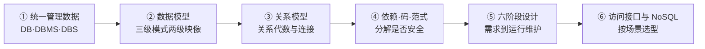

# 数据库设计基础知识 · 考前速记

## 一、一眼看全章

一条因果线：**数据散落在各程序里难以统一管理 → 交给 DBMS 统一管理 → 用数据模型、关系模型组织数据 → 关系代数查询 → 表设计不当产生冗余和增删改异常 → 函数依赖、候选码、范式改进设计 → 六阶段把需求落到可运行数据库 → 特定场景再考虑 NoSQL。** 章节入口见 [[数据库设计基础知识索引]]、[[01_综合知识/05_数据库设计基础知识/学习路线|学习路线]]。

## 二、题干关键词 → 知识点

| 题干信号 | 先定位 | 第一动作 |
| --- | --- | --- |
| 数据集合、核心管理软件、整体 / 不长期保存、文件孤立难共享 | [[数据库DB-DBMS-DBS]]、[[数据管理技术三个发展阶段]] | 先分清对象，再问“谁在管理数据” |
| 树、网、表 / 结构、操作、约束 | [[数据模型三要素与分类]] | 问三要素答结构·操作·约束，问类型才答层次/网状/关系 |
| 用户视图 / 全库逻辑结构 / 索引与文件组织 | [[数据库三级模式与两级映像]] | 抓“视图、全库、存储”对应三层与两个映像 |
| 权限、完整性、并发、日志、恢复 / 分片、位置、复制透明 | [[DBMS核心功能]]、[[分布式数据库与透明性]] | 先分“运行管理职责”还是“分布式透明性” |
| 属性、元组、域、候选码 / 三类完整性 | [[关系模型基本术语与完整性]] | 先判“型变了”还是“值变了”，再判哪类完整性 |
| 挑行、挑列、并交差 / 两表拼接与结果行列数 | [[关系代数基础运算]]、[[连接与自然连接]] | 先翻译语义再看符号；自然连接还要去掉重复公共列 |
| 已知依赖推新依赖 / 最小属性组唯一标识一行 | [[函数依赖与属性闭包]]、[[候选码求解]] | 看是否把右部缩小为子集；闭包覆盖全集只是超码，仍要验最小性 |
| 部分/传递依赖、最高范式、拆表后能否拼回 | [[范式1NF-2NF-3NF-BCNF]]、[[多值依赖与4NF]]、[[无损连接与保持函数依赖]] | 先求候选码逐层检查；两组独立事实想多值依赖；无损与依赖保持分开判 |
| 需求文档 / E-R 图 / 关系模式 / 索引 / 建库装载 | [[数据库设计六阶段]]、[[数据需求分析]] | 只看题目产物或动作属于哪个阶段 |
| 实体、属性、联系 / 局部与全局图 / 两部门图冲突 | [[ER模型与概念结构设计]]、[[ER图合并与冲突]] | 先看同一对象被“建成了什么”，再判冲突类型 |
| 外键放哪一方、联系属性放哪里、M:N 建表 | [[ER图转关系模式]] | 先判联系基数，再决定码与联系属性的落点 |
| 主外键、检查约束、不同用户看到的数据 | [[逻辑设计与完整性视图]] | 表结构、范式、约束、视图四件事一起收口 |
| 为读性能增加可直接读取的数据 / 数据分布、存储结构、索引 | [[反规范化设计]]、[[物理设计与索引]] | 先规范化并有实测瓶颈再冗余；索引按查询与修改频度权衡 |
| DDL 建结构、装载、联调、试运行 / 响应慢、恢复、清碎片、改表 | [[数据库实施与试运行]]、[[数据库运行维护与备份恢复]] | 结构定义没变是重组，变了是重构 |
| 统一 API、驱动、数据源 / SQL 嵌宿主语言 / Oracle 函数库 / 对象字段映射 | [[数据库访问接口总览]]、[[ODBC与JDBC]]、[[嵌入式SQL与OCI]]、[[ORM访问接口]] | 看是通用接口、厂商函数库、预编译还是对象映射 |
| Key→Value、JSON 文档、节点与边、列族 / 四层框架与选型 | [[NoSQL分类与特点]]、[[NoSQL体系框架与适用场景]] | 按数据形态认四类；选型看数据模型、访问模式与一致性 |

## 三、核心公式与流程

### 1. 函数依赖与属性闭包

设属性集 $X,Y,Z$，$U$ 为全部属性。$X\to Y$ 表示“$X$ 的值能唯一确定 $Y$”，是业务语义约束，不能用某份样本数据“碰巧没重复”反推。三条基本公理：自反律（若 $Y\subseteq X$，则 $X\to Y$）、增广律（若 $X\to Y$，则 $XZ\to YZ$）、传递律（若 $X\to Y$ 且 $Y\to Z$，则 $X\to Z$）。

派生规则：由 $X\to YZ$ 可得 $X\to Z$（分解，右部可拆）；由 $X\to Y$、$X\to Z$ 可得 $X\to YZ$（合并）。左边不能随意拆。属性闭包 $X^{+}$ 是从 $X$ 出发按已有依赖能推出的全部属性，迭代到不再增加：

$$
X^{(0)}=X,\qquad
X^{(i+1)}=X^{(i)}\cup\{\,B \mid (A\to B)\in F,\ A\subseteq X^{(i)}\,\},\qquad
X^{+}=X^{(k)}
$$

$F$ 为题目给出的依赖集；$A\subseteq X^{(i)}$ 表示依赖左边已全部在当前集合中；箭头只能正向使用。例：$F=\{A\to B,\ B\to D,\ D\to E\}$ 时 $A^{+}=\{A,B,D,E\}$。

### 2. 候选码：超码 + 最小性

$$
X^{+}=U \Rightarrow X \text{ 是超码};\qquad
\forall A\in X,\ (X-\{A\})^{+}\neq U \Rightarrow X \text{ 是候选码}
$$

候选码是“刚好够用”的最小属性组，主码是从多个候选码中选定的一个。例：$U=\{A,B,C,D,E\}$、$F=\{A\to B,\ B\to C,\ AD\to E\}$，$A^{+}=\{A,B,C\}$、$D^{+}=\{D\}$ 都不覆盖 $U$，而 $(AD)^{+}=U$，故 $AD$ 是候选码。入口是先找**不在任何依赖右部**的属性，最终仍以闭包与最小性为准。

### 3. 范式判定（先求候选码，再标主/非主属性）

- **1NF**：每个属性值都是不可再分的原子值。
- **2NF**：在 1NF 上，不存在候选码的真子集 $X'\subsetneq X$ 与非主属性 $A$ 使 $X'\to A$（消除对复合码的部分依赖）。
- **3NF**：每个非平凡函数依赖 $X\to Y$ 满足“$X$ 是超码”或“$Y$ 中每个属性都是主属性”。
- **BCNF**：每个非平凡函数依赖 $X\to Y$，$X$ 都必须是超码。
- **4NF**：在 1NF 上，每个非平凡多值依赖 $X\to\to Y$ 的决定因素 $X$ 都含有码。强弱关系为 $BCNF\subset 3NF\subset 2NF\subset 1NF$，逆向不成立；3NF 与 BCNF 只差“$Y$ 是主属性”这一例外是否放行。

### 4. 二元分解：无损连接与保持函数依赖

设 $R$ 分解为 $R_1,R_2$，原依赖集为 $F$。无损连接先取公共属性 $X=R_1\cap R_2$：

$$
X\to R_1 \quad\text{或}\quad X\to R_2 \quad\Rightarrow\quad \text{分解无损}
$$

判法是看 $X^{+}$ 能否覆盖某一子关系（$X^{+}\supseteq R_1$ 或 $X^{+}\supseteq R_2$）：能覆盖，该侧至多匹配一条记录，不产生伪元组。该判定式**只适用于二元分解**，三元及以上不能逐对检查后宣布整体无损。保持函数依赖则合并各子关系能维护的依赖得到 $G$，若 $G$ 仍能推出 $F$ 的每一条（记作 $F\subseteq G^{+}$）则保持。两项互不推出——无损不等于保持依赖，达到 3NF/BCNF 也不自动保证两项都满足。

### 5. 关系代数与自然连接

五种基本运算：并 $\cup$、差 $-$、笛卡尔积 $\times$、投影 $\pi$、选择 $\sigma$；交可由差导出 $R\cap S=R-(R-S)$。“满足全部要求”通常是除法 $\div$ 语义。设 $R,S$ 的同名属性为 $A_1,\dots,A_k$，自然连接三步写成：

$$
R\bowtie S=\pi_{\,(R\cup S)\setminus\{S.A_1,\dots,S.A_k\}}\Big(\sigma_{\,R.A_1=S.A_1\wedge\cdots\wedge R.A_k=S.A_k}(R\times S)\Big)
$$

即先做笛卡尔积列出所有组合，再保留同名属性值相等的行，最后投影去掉重复的公共属性列。无同名属性时，按教材口径自然连接退化为笛卡尔积。

### 6. E-R 图转关系模式

实体各自转一个关系模式：实体名→模式名，实体属性→关系属性，实体标识符→关系的码；联系自己的属性（成绩、任职日）随联系落表，不能遗漏。

| 联系基数 | 转换动作 | 关键约束 |
| --- | --- | --- |
| 1:1 | 通常不单建关系，联系并入任一方，加入对方的码与联系属性 | 外码加唯一约束；可空/非空由哪一侧必须参与决定 |
| 1:N | 并入 N 方，在 N 方加入 1 方的码与联系属性 | 每个 N 方记录只指向一个 1 方记录 |
| M:N | 必须新建独立关系，放入两端实体的码与联系属性 | 两端码共同构成该关系的码，不能把多值塞进一个字段 |

## 四、易错陷阱（为什么容易错）

1. **把客户端工具当 DBMS，或以为 E-R 图就是表结构**：真正做数据定义、存取与运行控制的是 DBMS；E-R 图只描述业务对象与联系，写出关系模式或开始判范式就已进入逻辑设计。
2. **看到重复字段就凭感觉拆表**：要先按业务语义写出函数依赖、求候选码，再判部分/传递依赖，否则无法证明分解安全。
3. **只算闭包就宣布候选码**：$X^{+}=U$ 只说明是超码，漏掉“逐个删属性验最小性”是候选码题的典型错误。
4. **把无损连接与依赖保持混成一件事**：无损只保证拼得回，依赖保持要求原规则不用拼表也检查得了；用 $R_1\cap R_2$ 的闭包判定还只对二元分解成立。
5. **看到关联就新建一张表**：只有 M:N 必须独立成关系，1:1、1:N 通常并入一方，并把联系属性一起带过去。
6. **把“建索引”当逻辑设计**：索引决定数据怎样存取，属物理设计/内模式；主码、外码、检查约束与用户视图才属逻辑设计。
7. **认为反规范化就是不规范化，或把重组与重构互换**：前者是在已规范化结构上按实测读瓶颈用受控冗余换性能；后者结构定义没变、只清碎片是重组，定义变了才是重构，还要重新评价安全性。
8. **把 NoSQL 当关系数据库的升级版**：强依赖复杂关系查询与严格事务时，关系数据库仍可能更合适。
9. **本章范围边界**：[[数据库设计基础知识索引]] 明确事务隔离级别、锁协议等内核内容不是本章稳定主线；只需知道**并发控制、日志、恢复属于 DBMS 运行管理职责**，备份与故障恢复闭环由 [[数据库运行维护与备份恢复]] 承担。

## 五、高频对比

**范式阶梯**

| 层级 | 主要检查 | 想消除的问题 |
| --- | --- | --- |
| 1NF | 属性值是否原子 | 一个格子放多个值或重复组 |
| 2NF | 非主属性是否完全依赖候选码 | 对复合码的部分依赖 |
| 3NF | 是否存在“候选码→非主属性→非主属性” | 非主属性的传递依赖 |
| BCNF | 非平凡依赖的决定因素是否都是超码 | 3NF 仍可能放行的决定因素异常 |
| 4NF | 非平凡多值依赖的决定因素是否含码 | 两组独立清单造成的组合冗余 |

**码与属性**

| 名称 | 判定 | 容易混在哪 |
| --- | --- | --- |
| 超码 | $X^{+}=U$ | 能唯一标识，但可能还有多余属性 |
| 候选码 | 超码且任何真子集都不是超码 | 忘了最小性检查 |
| 主码 | 从多个候选码中选定的一个 | 候选码可以有多个，主码只是其中之一 |
| 主属性 | 出现在任一候选码中的属性 | 不是“主码里的属性”那么窄 |
| 外码 | 引用另一关系码的属性（组） | 表达关系间联系，本身不一定是本关系的码 |

**其他易混对象**

| 对比组 | 对象 | 关键区分 |
| --- | --- | --- |
| 视图 vs 表 | 表 / 视图 | 表保存数据的逻辑结构；视图是用户看到数据的逻辑窗口，通常不复制一份物理数据 |
| 视图与安全 | 视图 / 权限 | 只建视图不等于权限控制完成，还要限制底层表权限并正确授权 |
| 三类连接 | θ 连接 / 等值连接 / 自然连接 | 自然连接按同名属性相等匹配并只保留一份公共列；无同名属性时退化为笛卡尔积 |
| 无损 vs 保持依赖 | 无损连接 / 保持函数依赖 | 前者问能否准确拼回，后者问原规则能否只靠子表检查 |
| 规范化 vs 反规范化 | 规范化 / 反规范化 | 先保证基本事实不重复，再按实测读瓶颈受控增加冗余 |
| 重组 vs 重构 | 重组 / 重构 | 结构定义没变、只清碎片是重组；结构定义变了才是重构 |
| 设计阶段 | 概念 / 逻辑 / 物理 | E-R 图属概念；关系模式、范式、约束、视图属逻辑；索引与存储属物理 |

## 六、跨知识联系

- 本章起点接住“信息系统为什么需要统一的数据管理”；DB/DBMS/DBS 与三级模式两级映像是后续所有设计题的坐标。
- 函数依赖 → 候选码 → 范式 → 分解检查是一条连续链，任何一环算错都会带错后面的范式与无损判定。
- 关系代数是查询语言的理论基础，连接与自然连接支撑多表查询语义，也是 [[逻辑设计与完整性视图]] 中视图取数的依据；E-R 转关系模式则是概念模型与逻辑模型的分界线。
- 物理设计与反规范化影响性能与一致性权衡，与索引、存储结构以及后续性能监测改善相连。
- 访问接口（OCI、嵌入式 SQL、ODBC/JDBC、[[ORM访问接口]]）解决“程序怎样访问数据库”，ORM 完整机制见 [[对象持久化与ORM]]；NoSQL 是本章的选型出口。

## 七、闭卷自测

1. DB、DBMS、DBS、DBA 各指什么？Navicat 属于其中哪一个？人工管理、文件系统、数据库系统三个阶段的差别是什么，“数据库底层仍用文件”能否否定数据库系统阶段？
2. 数据模型三要素是什么？层次、网状、关系模型属于三要素还是模型类型？
3. 三级模式与两级映像分别是什么？创建聚簇索引改变哪一级模式、体现哪种数据独立性？
4. 关系模式与关系实例怎么区分？实体完整性、参照完整性、用户定义完整性各约束什么？
5. “挑行”“挑列”“两个相容关系求共同元组”“满足全部要求”分别对应哪些关系运算？五种基本运算是什么？
6. 自然连接与等值连接的结果列差别在哪？没有同名属性时按教材口径会怎样？
7. 写出 $X^{+}$ 的迭代计算规则，并求 $F=\{A\to B,\ B\to D,\ D\to E\}$ 时 $A^{+}$。
8. 由 $A\to BC$ 能否推出 $A\to B$、能否推出 $AB\to BC$？分别用了哪条规则？
9. 候选码与超码的差别是什么？在 $U=\{A,B,C,D,E\}$、$F=\{A\to B,\ B\to C,\ AD\to E\}$ 下，$A$、$AD$、$ADE$ 各是什么？
10. 1NF、2NF、3NF、BCNF、4NF 分别消除什么？为什么满足 3NF 仍可能不满足 BCNF？
11. 二元分解的无损连接判定式是什么？为什么“无损”推不出“保持函数依赖”？
12. E-R 图转关系模式时，1:1、1:N、M:N 分别怎样落表？1:1 放在“必须参与”的一侧时外码需要哪些约束？
13. 逻辑设计除了把 E-R 图转成表还要完成哪几件事？视图能否替代底层表权限控制？反规范化与索引的边界、重组与重构的区分是什么？
14. NoSQL 四层框架与四类模型分别是什么？什么场景更可能考虑 NoSQL？

## 下一站

本章解决“共享数据怎样被统一管理、正确建模、安全分解并可靠运行”。数据落进数据库之后，业务逻辑如何被工程化地设计与测试，进入 [[软件工程基础知识索引]]；正常下一章为 [[软件架构设计索引]]。
