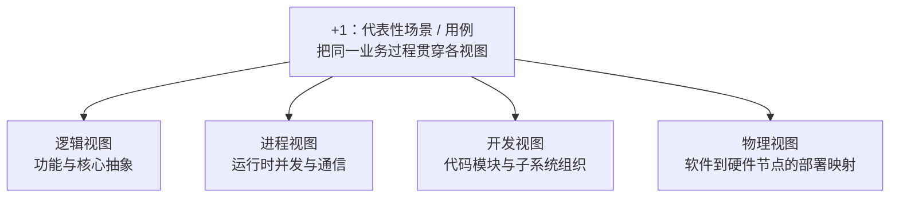

# 软件架构视图：为什么同一系统需要多个观察视角

> [!summary] 快速复习卡片
> - **一句话**：一个系统同时有功能、运行、代码组织和部署等不同关注点；视图就是围绕某一组关注点，对**同一套架构**做选择性表达。
> - **4+1**：逻辑视图、进程视图、开发视图、物理视图，再用代表性场景把四个视图串起来说明和验证。
> - **逻辑视图**：看系统为用户提供的功能以及支撑这些功能的核心抽象和关系。
> - **进程视图**：看运行时进程/线程、并发、通信、同步，以及与性能、可用性相关的运行组织。
> - **开发视图**：看代码模块、库、子系统怎样组织，关注开发、复用和配置管理。
> - **物理视图**：看软件怎样映射到硬件节点，以及部署拓扑、节点间通信等问题。
> - **+1 场景**：用代表性用例/活动贯穿四个视图，帮助说明并验证它们能否共同支撑需求。
> - **易错边界**：4+1 是多视图方案之一，不是五套互不相关的架构；“视图”也不等于某一种 UML 图。

## 唯一主问题

> **为什么同一套软件架构需要多个视图，而不是把所有信息塞进一张“总图”？**

## 先看矛盾：一张图越“完整”，为什么反而越难用

继续使用在线交易系统：登录、下单、支付、库存、通知。

如果试图做一张“什么都包括”的总图，图里可能同时出现：

- 用户能完成哪些业务功能；
- 订单、支付、库存等核心对象或服务的关系；
- 运行时有多少进程、线程，谁和谁并发通信；
- 代码仓库里有哪些模块、库和子系统；
- 服务部署在哪些服务器或节点；
- 一次“下单并支付”请求怎样从入口走到最终通知。

这些信息都真实，但它们回答的**不是同一个问题**。把它们强行叠在一起，会出现两个后果：

1. 每个人都看到大量自己不关心的信息；
2. 同一个符号容易混用——到底代表代码模块、运行进程，还是部署节点？

因此，多视图不是为了“多画几张图”，而是为了**分离关注点**：每个视图只保留当前问题真正需要的架构信息。

## 什么是“视图”

主教材说明，多视图从不同视角描述同一软件架构；每个视图反映某一类利益相关者关心的方面。

可以把它理解成一个非常具体的动作：

> **先确定“这次要回答谁的什么问题”，再从同一架构中选出与这个问题相关的元素和关系。**

所以：

- 视图不是另一套架构；
- 视图不是把同一张图换个颜色；
- 视图也不由某个绘图工具定义；
- 多个视图必须能够回到同一系统，并保持彼此一致。

主教材还指出，多视图有助于理解和交流架构、检查不同表示间的一致性，并支持后续质量分析。

## 为什么软考要重点掌握 4+1

大纲不是只写“了解多视图”，而是在软件架构生命周期范围里直接点名 **4+1 模型**，并在 ABSD 的概念与术语中列出“视角与视图”。主教材也把 4+1 作为典型多视图方案列出。

因此本卡的考试深度不是把所有多视图方法都背一遍，而是先把 4+1 的**职责边界**认清。

> [!note] “+1”为什么是场景
> 四个视图分别切开关注点之后，还需要一种办法把它们重新对到同一个需求上。代表性场景（常以用例体现）就是这条贯穿线：同一次业务活动在四个视图里分别会看到什么。

## 4+1 的四个视图分别观察什么

| 视图 | 先问的问题 | 主要观察对象 | 常见题眼 |
| --- | --- | --- | --- |
| **逻辑视图** | 系统要用哪些核心抽象来支撑用户所需功能？ | 类、对象、核心业务抽象及其关系 | 功能、对象模型、用户可见服务 |
| **进程视图** | 系统运行起来后，工作怎样并发、通信和同步？ | 进程、线程、运行时交互 | 并发、通信、同步、性能、可用性 |
| **开发视图** | 开发团队怎样组织和管理代码？ | 模块、库、子系统、层次 | 模块组织、复用、开发、配置管理 |
| **物理视图** | 软件最终部署在哪里、怎样映射到硬件？ | 硬件节点、网络拓扑、部署映射 | 节点、部署、拓扑、通信 |
| **+1 场景** | 代表性业务活动怎样贯穿并校验前四个视图？ | 用例/场景中的关键步骤 | 用例、代表性场景、串联、验证 |

这张表最重要的不是背名词，而是看到题干后能把“它到底在问什么”定位到正确视图。

## 用一个“下单并支付”场景把五部分串起来

假设代表性场景是：

> 用户提交订单 → 系统检查库存 → 用户支付 → 支付成功 → 订单更新 → 发送通知。

### 1. 从逻辑视图看：这个业务需要哪些核心抽象

你会关心订单、支付、库存、用户、通知这些核心概念，以及它们怎样形成系统功能。

例如：订单需要记录状态，支付与订单存在业务关联，库存要能判断并更新可售数量。

**此时不急着问它们跑在哪台机器上。**

### 2. 从进程视图看：运行时怎样协作

系统真正跑起来时，你开始关心：

- 支付处理和通知处理是否在不同进程/线程中；
- 支付完成事件怎样传递；
- 库存扣减是否需要同步；
- 高并发下哪些运行单元可能争用资源；
- 某个运行单元失败会不会阻塞主流程。

同一个“通知”功能，在逻辑视图里只是系统能力，在进程视图里则变成**运行时谁执行、怎样通信与并发**的问题。

### 3. 从开发视图看：代码怎样被团队组织

你会看到类似：

- `order` 模块；
- `payment` 模块；
- `inventory` 模块；
- 公共库；
- 消息适配子系统。

开发视图回答的是**源代码和开发制品如何分解、组织、复用和管理**，不是运行时到底启动了几个进程。

### 4. 从物理视图看：软件怎样落到实际节点

现在问题变成：

- 网关部署在哪些节点；
- 订单和支付服务是否分布在不同服务器/容器节点；
- 数据库位于什么节点；
- 哪些节点之间需要网络通信；
- 为可用性或吞吐量是否需要多个实例分布部署。

这一步把软件元素**映射到硬件/运行基础设施节点**。

### 5. 用 +1 场景把四个视图对起来

最后再沿“下单并支付”走一遍：

- 逻辑视图里的订单、支付等抽象是否足以支持业务？
- 进程视图里的运行单元能否完成这条交互链？
- 开发视图里负责这些能力的模块是否有清楚的归属？
- 物理视图里的部署节点是否能承载这些运行关系？

这就是“+1”的意义：**不是再增加一套独立结构，而是用代表性场景把前四个视图重新校到同一个需求上。**

## 各视图不是孤岛：真正有用的是“配合”

多视图最容易被学成五个名词列表，但架构工作真正关心的是它们之间能否互相对应。

还是上面的支付场景：

- 逻辑视图说系统有“支付”能力；
- 开发视图必须能找到承担它的代码模块；
- 进程视图要说明这些代码运行时由什么进程/线程执行以及怎样通信；
- 物理视图要说明这些运行单元最终被部署到哪些节点；
- 场景再检查这条对应链是否真的支持“支付成功后更新订单并通知”。

如果某个视图里出现关键元素，其他视图却完全找不到可对应的实现、运行或部署位置，就可能暴露跨视图不一致。

## 真题怎么考：先识别“题干在观察什么”

仓库标准化题库中，**2011 年下半年综合知识第 49 题**要求判断 RUP/UML 各视图职责的叙述。错误选项把“物理视图”的职责说错；正确的判断关键就是：

> **物理视图首先关心软件到硬件节点的部署映射，而不是把不同视图的职责混在一起。**

这类题可以用一个固定动作：

1. **圈关键词**：功能 / 并发通信 / 代码模块 / 节点部署 / 场景；
2. **只问一个问题**：“题干现在观察的是功能、运行、开发组织，还是部署？”
3. **再匹配视图**：逻辑 / 进程 / 开发 / 物理；如果题干是在用一条代表性业务活动串联前四者，则想到“+1 场景”。

### 快速识别表

| 题干关键词 | 优先想到 |
| --- | --- |
| 用户功能、对象模型、核心抽象 | 逻辑视图 |
| 进程、线程、并发、同步、通信、运行时性能 | 进程视图 |
| 模块、库、子系统、代码组织、复用 | 开发视图 |
| 服务器、硬件节点、拓扑、部署映射 | 物理视图 |
| 用例、代表性业务过程、贯穿/验证四个视图 | +1 场景 |

## 最容易混淆的边界

### 1. 逻辑视图 ≠ 开发视图

“订单、支付这些核心业务抽象怎样支撑功能”偏逻辑视图；“代码仓库中 order、payment 模块怎样组织”偏开发视图。

同一个名字可能同时出现在两个视图中，但**观察的问题不同**。

### 2. 进程视图 ≠ 物理视图

进程视图关注运行时软件单元怎样并发、通信；物理视图关注这些软件单元最终落到什么硬件节点以及节点之间怎样连接。

看到“进程”不要直接想到服务器；看到“服务器节点”也不要直接当成进程。

### 3. 视图 ≠ UML 图类型

UML 可以作为表达手段，但视图由**关注点**定义。考试问“这个视图解决什么问题”时，不要把“用哪种图画”当成核心答案。

### 4. +1 场景不是第五套平级技术结构

“+1”用代表性场景把四个视图串起来，帮助说明和验证。它和四个结构视图的作用不完全相同。

### 5. 4+1 不是唯一多视图方案

主教材同时列出 Hofmeister、SEI Views and Beyond 等多视图方案。软考大纲明确点名 4+1，所以本卡优先掌握它；不要反过来说“所有软件架构视图都只能是 4+1”。

## 本卡刻意不展开什么

- 不展开质量属性场景的六要素；
- 不展开 SAAM、ATAM 等架构评估方法；
- 不把所有多视图框架逐一展开；
- 不提前讲 ABSD 的完整流程。

这些内容分别属于后续 [[03_ABSD：如何从架构需求逐步形成可交付架构]] 与 [[01_综合知识/07_系统质量属性与架构评估/系统质量属性与架构评估索引|系统质量属性与架构评估]]。

## 一句话记住

> **多视图是把同一套架构按关注点分开观察；4+1 用逻辑、进程、开发、物理四个视图回答四类问题，再用代表性场景把它们串回同一个需求。**

## 自测

1. 为什么一张“把所有信息都画进去”的总图通常不如多视图好用？
2. 题干强调进程、线程、并发和通信，应优先想到哪个视图？
3. “支付模块在代码仓库中属于哪个子系统”和“支付服务部署在哪台服务器”分别属于哪个视图？
4. +1 场景的主要作用是什么？
5. 4+1 是否等于“系统有五套互不相关的架构”？
6. 看到“服务器、节点、部署拓扑”时，为什么不能选进程视图？

### 自测答案

1. 因为功能、运行、开发组织、部署等关注点不同，混在一张图里会增加无关信息并混淆符号含义；多视图通过分离关注点让每个表达只回答一类问题。
2. 进程视图。
3. 前者是开发视图，后者是物理视图。
4. 用代表性用例/活动贯穿前四个视图，帮助说明并验证各视图能否共同支撑需求。
5. 不是；它们是同一架构的不同侧面。
6. 因为物理视图关心软件到硬件节点的部署映射；进程视图关心运行时进程/线程及其并发通信。

## 下一站

- 上一站：[[01_软件架构是什么：为什么需要架构视角]]
- 本章入口：[[软件架构设计索引]]
- 下一站：[[03_ABSD：如何从架构需求逐步形成可交付架构|ABSD：如何从架构需求形成架构]]

## 证据锚点

- 大纲：[[官方教材/AI教材库/原始文本/系统架构第二版 大纲/p0049-p0060|大纲：4+1、视角与视图（PDF 51 页）]]
- 主教材：[[官方教材/AI教材库/原始文本/系统架构设计师教程第二版可搜索/p0265-p0276|教程：多视图与 4+1（PDF 265 页）]]
- 扩展教材，仅用于解释 4+1 各视图职责：[[官方教材/AI教材库/原始文本/软件体系结构原理、方法与实践_第2版/p0025-p0036|软件体系结构原理、方法与实践：4+1（PDF 29–35 页）]]
- 真题：[[历年真题/AI题库/标准化题库/2011-下半年/综合知识|2011 年下半年综合知识第 49 题]]
- 趋势仅作聚合优先级信号：[[历年真题/AI题库/知识点索引/第二阶段-考点映射与近年趋势|第二阶段-考点映射与近年趋势]]
