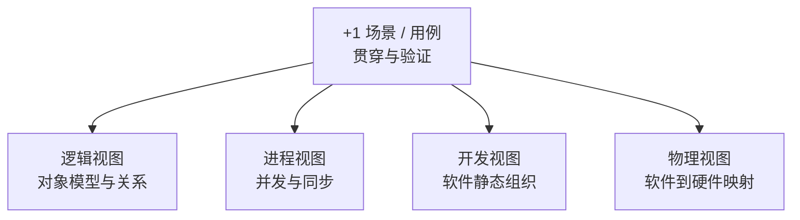

# 软件架构视图：为什么同一系统需要多个观察视角

> [!summary]- 快速复习卡片（学完再看）
> **4+1**：逻辑视图看对象模型，进程视图看并发与同步，开发视图看软件静态组织，物理视图看软件到硬件的映射；**+1 场景**负责贯穿和验证四个视图。
> **题干信号 → 第一反应**：对象关系 → 逻辑；并发同步 → 进程；模块/子系统 → 开发；部署节点 → 物理；代表性用例贯穿 → +1。
> **易错点**：+1 不是第五个同类结构视图；UML 是表达工具，不等于 4+1。

上一站 [[01B_软件架构描述：ADL、UML与IEEE1471分别解决什么]] 已经知道：同一套架构需要被不同相关方看懂。问题是，开发人员关心模块，运维人员关心部署，设计人员还要看对象关系和运行并发，**一张“总图”很难同时把这些问题讲清楚**。

所以 4+1 的核心很简单：

> **把同一套架构按不同关注点分开看，再用代表性场景把这些视图串起来。**

## 4 个视图分别看什么

| 视图 | 主要回答 | 题干第一反应 |
| --- | --- | --- |
| **逻辑视图** | 设计中的对象模型、核心抽象及关系 | 对象、对象关系、功能抽象 |
| **进程视图** | 运行时的并发与同步 | 并发、同步、运行活动 |
| **开发视图** | 软件在开发环境中的静态组织 | 模块、包、库、子系统 |
| **物理视图** | 软件怎样映射到硬件 | 服务器、节点、部署、分布式 |

例如同一个支付能力：逻辑视图看它和订单等对象怎样关联；进程视图看运行时是否并发、怎样同步；开发视图看代码属于哪个模块；物理视图看它部署在哪些节点。

**系统没有变，只是观察的问题变了。**

## 为什么还有“+1 场景”

四个视图如果各画各的，仍可能互相对不上。因此用一个代表性场景，例如“用户下单并支付”，逐个检查涉及哪些核心对象、运行时有哪些并发与同步、由哪些软件模块实现、最终部署到哪些节点。

如果同一个场景在四个视图里无法对应，就说明架构描述可能不一致。所以：

> **+1 场景是贯穿和验证线索，不是第五个与四个视图完全同类的结构视图。**

## 最容易混的地方

**逻辑视图 vs 开发视图**：逻辑视图看设计中的对象/抽象关系；开发视图看代码、模块、子系统怎样静态组织。

**进程视图 vs 物理视图**：进程视图看“运行时谁和谁并发、同步”；物理视图看“软件最终运行在哪些硬件节点”。

**视图 vs UML 图**：UML 是建模表达工具；4+1 是组织架构关注点的方法。某张 UML 图可以帮助表达某个视图，但二者不是同一分类。

另外，4+1 是组织关注点的方法，不代表每个系统都必须把四个视图画到同样详细。

## 考试怎么做

看到题干先抓关键词：

- **对象模型、对象关系** → 逻辑视图；
- **并发、同步** → 进程视图；
- **模块、子系统、静态组织** → 开发视图；
- **软件映射硬件、部署节点** → 物理视图；
- **代表性用例贯穿/验证多个视图** → +1 场景。

2011 年下半年综合知识第 47～48 题实际考查过这些视图职责，因此这里最重要的是“看到题眼能归类”。

## 自测

1. 题目问“软件模块和子系统怎样组织”，优先判断哪个视图？

> [!answer]- 第 1 题答案与解析
> **答案：开发视图。** 它关注软件的静态组织。

2. “订单服务部署在哪些服务器”与“订单和支付是否并发执行”分别属于什么视图？

> [!answer]- 第 2 题答案与解析
> **答案：物理视图；进程视图。** 前者是软件到硬件的映射，后者是运行时并发问题。

3. 为什么 +1 不能简单背成第五个同类视图？

> [!answer]- 第 3 题答案与解析
> **答案：它主要用代表性场景贯穿、说明和验证四个视图。**

## 下一站

现在已经知道**架构怎样分视图表达**。下一步还缺的是：这些架构需求、设计、文档、复审和实现究竟怎样串成开发过程，因此进入 [[03_ABSD：如何从架构需求逐步形成可交付架构]]。

## 证据锚点

- 大纲：[[官方教材/AI教材库/原始文本/系统架构第二版 大纲/p0049-p0060|系统架构第二版大纲，PDF 51 页]]
- 主教材：[[官方教材/AI教材库/原始文本/系统架构设计师教程第二版可搜索/p0265-p0276|教程 PDF 265 页，4+1 与 ABSD]]
- 真题：[[历年真题/AI题库/标准化题库/2011-下半年/综合知识|2011 年下半年综合知识第 47–48 题]]
