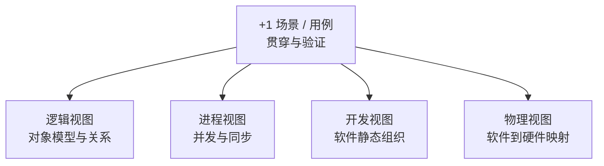

# 软件架构视图：为什么同一系统需要多个观察视角

> [!summary]- 快速复习卡片（学完再看）
> - **核心矛盾**：一个系统同时存在功能抽象、运行并发、软件静态组织、软硬件映射等不同问题，一张“总图”很难同时把它们讲清楚。
> - **4+1**：逻辑视图、进程视图、开发视图、物理视图，再由代表性场景/用例把它们串起来说明和验证。
> - **逻辑视图**：教材核心口径是设计的对象模型及关系；更一般地，它服务于系统功能抽象的表达。
> - **进程视图**：捕捉并发和同步特征；运行时通信、性能等是常见分析问题，但不要把这些工程关注点误背成定义本身。
> - **开发视图**：描述软件的静态组织结构，例如模块、子系统、库等怎样组织。
> - **物理视图**：描述软件到硬件的映射，反映分布式部署特征。
> - **+1 场景**：用代表性用例贯穿并验证四个视图，不是第五个与四视图完全同类的“结构视图”。
> - **重要例外**：4+1 是一种多视图组织方式，**不是每个系统都必须机械地把四个视图全部画齐**；应按实际关注点选择。

## 唯一主问题

> **为什么同一套软件架构需要多个视图，而不是把所有信息塞进一张“总图”？**

## 先看矛盾：一张图越“完整”，为什么反而越难用

继续使用在线交易系统：登录、下单、支付、库存、通知。

如果一张图同时放进：

- 用户能完成哪些业务功能；
- 订单、支付、库存等核心对象怎样关联；
- 运行时有哪些并发执行单元、谁和谁同步；
- 代码有哪些模块、库和子系统；
- 软件部署到哪些服务器或节点；
- 一次下单请求怎样贯穿整个系统；

这些信息虽然都是真的，却回答不同问题。

开发者想看代码组织时，不需要先在部署节点之间找模块；运维人员想看部署时，也不希望先穿过大量对象关系。

所以多视图不是“为了多画几张图”，而是为了：

> **把不同关注点分开表达，同时保证它们仍然描述同一个系统。**

## 什么是“视图”

可以把视图理解成：

> **围绕一组特定关注点，从同一架构中选择并表达相关信息。**

它不是复制一套系统，也不是换一种画图工具。

例如同一个“支付服务”：

- 在逻辑视图里，你关心它与订单、库存等核心抽象怎样协作；
- 在进程视图里，你关心运行时怎样并发、同步；
- 在开发视图里，你关心它属于哪些模块或子系统；
- 在物理视图里，你关心它最终映射到哪些硬件节点。

**对象还是那个对象，问题变了，所以表达方式也变了。**

## 4+1 到底是哪 4 个视图加什么

### 1. 逻辑视图：系统在设计层面“由哪些核心抽象组成”

主教材在 4+1 的经典口径中，把逻辑视图描述为**设计的对象模型**。

面向零基础可以这样理解：它关心系统为了支撑功能，需要哪些核心对象/抽象，以及它们之间是什么关系。

在线交易系统中，可以关注：订单、支付、库存、用户等核心抽象怎样协作。

> [!warning] 不要把“逻辑视图”背成“所有业务流程图”
> 教材经典定义重点是对象模型及其关系。业务功能是它要支撑的目标，但不要把任何“讲业务”的图都自动叫逻辑视图。

### 2. 进程视图：系统运行起来以后“哪些活动会同时发生”

主教材明确抓两个关键词：

- **并发**；
- **同步**。

例如一次下单过程中，库存处理、支付回调、消息通知可能由不同运行单元并发工作。进程视图关心它们之间怎样协调，哪些地方需要等待、通信或同步。

性能、吞吐、可用性等问题常常会借助进程视图分析，但它们是**应用这个视图时关注的问题**，不是“进程视图=性能视图”的定义。

### 3. 开发视图：软件在开发环境里“静态怎样组织”

教材把开发视图定位为软件的**静态组织结构**。

例如：

- 哪些代码属于订单模块；
- 哪些模块组成支付子系统；
- 哪些库被多个子系统复用；
- 软件包、模块、子系统之间怎样依赖。

因此开发视图主要回答“开发和维护时软件怎样拆分与组织”，不要和运行时的进程/线程混为一谈。

### 4. 物理视图：软件最终“落在哪些硬件上”

教材核心口径是：

> **软件到硬件的映射，并反映系统的分布式特征。**

例如：

- 网关部署在哪类节点；
- 订单服务实例运行在哪些服务器；
- 数据库与应用是否分布在不同机器；
- 节点之间通过什么网络连接。

容量、容灾、扩展等工程问题常会借助物理视图讨论，但同样不要反过来把这些质量问题当作物理视图的定义。

### +1. 场景：为什么还要有一个“+1”

如果四个视图分别画完，却彼此无法对应，仍然不能证明它们描述的是一套协调一致的架构。

所以 4+1 用**代表性场景/用例**把四个视图串起来。

例如“用户提交订单并完成支付”这个场景可以逐个追问：

- 逻辑视图：涉及哪些核心对象/构件？
- 进程视图：运行时有哪些并发和同步？
- 开发视图：这些能力分别由哪些软件模块实现？
- 物理视图：这些软件单元部署在哪些硬件节点？

如果同一个场景在四个视图中无法对上，就暴露了模型之间的不一致。

因此“+1”更像一条**贯穿和验证线索**，不是第五个与四视图完全并列的静态结构分类。

## 贯穿例子：一次“下单并支付”怎样跨四个视图

| 视图 | 这次场景里重点看什么 |
| --- | --- |
| 逻辑视图 | 订单、支付、库存等核心抽象如何协作 |
| 进程视图 | 支付处理、库存处理、通知是否并发，哪里需要同步 |
| 开发视图 | 订单模块、支付模块、库存模块在代码层怎样组织 |
| 物理视图 | 这些软件单元最终部署到哪些节点，节点怎样连接 |
| +1 场景 | 用“下单并支付”逐一检查上述四个视图能否互相对应 |

这就是多个视图“配合”的机制：

> **它们不是各画各的，而是从不同问题描述同一组架构决策，并通过场景保持一致。**

## 一个非常重要的边界：不是每个系统都要把 4 个视图画齐

主教材在介绍 4+1 时明确提醒：不同系统的关注点不同，并不意味着每个系统都必须机械采用全部视图。

例如一个很小的单机工具，如果没有复杂并发和分布式部署，进程视图、物理视图的表达深度就可能很低。

考试和实际设计都应理解为：

> **4+1 提供的是一套组织关注点的方法，不是“少画一张就不合格”的固定交付清单。**

这也是“视图”概念的本质：根据相关方关注点选择合适表达。

## 考试怎么认

### 题干谈“对象模型、对象关系”

优先想到：**逻辑视图**。

### 题干谈“并发、同步、运行时活动”

优先想到：**进程视图**。

### 题干谈“模块、子系统、软件静态组织”

优先想到：**开发视图**。

### 题干谈“软件映射到硬件、节点、分布式部署”

优先想到：**物理视图**。

### 题干谈“代表性用例把多个视图串起来/验证”

优先想到：**场景（+1）**。

2011 年下半年综合知识题组就直接要求辨析这些视图职责，因此这里应做到“看到题眼立即归类”，而不是只背“4+1”四个名字。

## 最容易混淆的边界

### 1. 逻辑视图 vs 开发视图

- 逻辑：设计对象模型、核心抽象及关系；
- 开发：代码/模块/子系统的静态组织。

一个是“设计中的逻辑抽象”，一个是“开发环境中的软件组织”。

### 2. 进程视图 vs 物理视图

- 进程：运行时并发、同步；
- 物理：软件到硬件的映射。

“运行在哪个服务器”不是进程视图；“两个任务是否并发”也不是物理视图。

### 3. +1 场景不是第五个同类视图

它主要负责贯穿、说明和验证四个视图。

### 4. 视图 ≠ UML 图种类

UML 是表达工具；一个视图可以使用合适的 UML 图表达，但“某种 UML 图”并不天然等于某个架构视图。

### 5. 4+1 ≠ 唯一多视图方法

本卡因为大纲和主教材明确要求 4+1，所以重点学习它；不要因此推导出“所有架构描述标准都只能用 4+1”。

## 和相邻卡片怎样分工

- [[01_软件架构是什么：为什么需要架构视角]]：回答为什么需要架构层，不展开各视图职责；
- **本卡**：回答为什么需要多个视图，以及 4+1 怎样分工；
- [[03_ABSD：如何从架构需求逐步形成可交付架构]]：回答如何沿开发过程把架构需求推进到设计、文档、复审、实现和演化。

本卡不会提前展开质量属性场景结构、ATAM/SAAM；这些留给 [[01_综合知识/07_系统质量属性与架构评估/系统质量属性与架构评估索引|系统质量属性与架构评估]]。

## 一句话记住

> **4+1 不是把系统拆成五套架构，而是用逻辑、进程、开发、物理四个视图分别回答不同关注点，再用代表性场景把它们串成同一套架构。**

## 自测

> [!question] 自测
> 1. 为什么一张包含全部架构信息的“总图”反而可能难用？
>
> > [!answer]- 第 1 题答案与解析
> > 不同信息回答不同问题，强行叠加会让关注点互相干扰，也容易混淆模型元素含义。
>
> 2. 题目出现“并发与同步”，优先判断哪个视图？
>
> > [!answer]- 第 2 题答案与解析
> > 进程视图。
>
> 3. “软件模块如何组织”和“软件部署在哪台服务器”分别属于哪个视图？
>
> > [!answer]- 第 3 题答案与解析
> > 开发视图；物理视图。
>
> 4. 场景为什么叫“+1”，而不是简单的第五个同类视图？
>
> > [!answer]- 第 4 题答案与解析
> > 它用于贯穿、说明和验证四个视图，使多个视图保持一致。
>
> 5. 4+1 是否要求任何系统都必须把四个视图画到同样详细？
>
> > [!answer]- 第 5 题答案与解析
> > 否。应按系统实际关注点选择和决定表达深度。

## 下一站

- 上一站：[[01_软件架构是什么：为什么需要架构视角]]
- 本章入口：[[软件架构设计索引]]
- 下一站：[[03_ABSD：如何从架构需求逐步形成可交付架构]]

## 证据锚点

- 大纲：[[官方教材/AI教材库/原始文本/系统架构第二版 大纲/p0049-p0060|系统架构第二版大纲，PDF 51 页]]
- 主教材：[[官方教材/AI教材库/原始文本/系统架构设计师教程第二版可搜索/p0265-p0276|教程 PDF 265 页，4+1 与 ABSD]]
- 真题：[[历年真题/AI题库/标准化题库/2011-下半年/综合知识|2011 年下半年综合知识第 47–48 题]]
