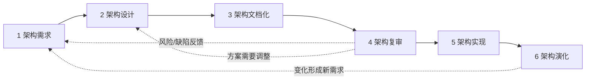

# ABSD：如何从架构需求逐步形成可交付架构

> [!summary]- 快速复习卡片（学完再看）
> - **ABSD 是什么**：以软件架构为中心、由商业需求、质量需求和功能需求共同驱动，并采用迭代、增量思想推进开发的方法。
> - **三个基础**：功能分解、**选择架构风格实现质量与商业需求**、软件模板的使用。2011 年下半年综合知识第 49 题直接考过这一点。
> - **六个子过程**：架构需求 → 架构设计 → 架构文档化 → 架构复审 → 架构实现 → 架构演化。
> - **关键机制**：六步不是一次走完的死流水线；后一步发现风险可以回到需求或设计重新迭代。
> - **复审重点**：不是“文档盖章”，而是让相关方尽早发现潜在风险、缺陷和不合理结构，并把问题反馈回前面的需求/设计。
> - **演化重点**：不是系统上线后的附属维护，而是当需求或环境变化时，在保持架构完整性的前提下规划并实施变化；变化过大时甚至可能需要新的架构。
> - **边界**：本卡只讲 ABSD 流程机制；具体架构风格放到 [[04_软件架构风格：如何用构件与连接件识别典型结构]]，质量属性场景与 ATAM/SAAM 放到下一章。

## 唯一主问题

> **ABSD 怎样把“我们需要什么样的架构”逐步推进成可说明、可评审、可实现、还能继续演化的架构？**

## 先看矛盾：知道“要有架构”，为什么还不等于会做架构

前两张卡已经解决了两件事：

- [[01_软件架构是什么：为什么需要架构视角]]：为什么系统需要架构层；
- [[02_软件架构视图：为什么同一系统需要多个观察视角]]：为什么同一架构需要多个视图表达。

但项目真正开始时，还会遇到一个更实际的问题：

> **架构不是一句“采用某某架构”就自动产生的。需求怎样进入架构？方案怎样形成？怎样让别人看懂？怎样判断风险？怎样落到实现？需求变化后又怎样调整？**

如果这些步骤没有过程约束，常见结果就是：

- 架构只停留在一张图上，和需求没有可追踪关系；
- 设计者直接跳到某种技术或风格，却说不清为什么选它；
- 方案没有经过相关方复审，问题到编码甚至上线后才暴露；
- 实现与架构慢慢偏离；
- 需求变化后只改代码，不再维护架构整体性。

ABSD 就是在解决这个“**怎样让架构贯穿开发过程**”的问题。

## ABSD 的定位：架构不是阶段产物，而是开发主线

主教材把 ABSD 描述为以软件架构为中心的软件开发方法。

考试先抓两层意思：

1. **驱动力不是只有功能需求**：商业需求、质量需求和功能需求共同影响架构；
2. **开发不是先做完架构再把它丢开**：架构需求、设计、文档、复审、实现和演化之间会持续反馈。

因此，ABSD 不应理解成“多了一份架构设计文档”，而应理解成：

> **用架构把需求、设计、实现和后续变化串成一条可反复校正的开发主线。**

## 真题先抓：ABSD 的三个基础

2011 年下半年综合知识第 49 题直接给出：ABSD 强调由商业、质量和功能需求的组合驱动软件架构设计，并考查其三个基础。

主教材口径是：

1. **功能分解**；
2. **选择架构风格来实现质量需求和商业需求**；
3. **软件模板的使用**。

考试识别时，如果题目问“ABSD 三个基础之一”，看到“选择架构风格以满足质量及商业需求”应能立即识别。

> [!warning] 不要把“架构风格”提前学成本卡的主体
> ABSD 在设计阶段会用到架构风格，但本卡只解释“它为什么在流程中出现”。各种风格的构件、连接件、约束和识别题，放到 [[04_软件架构风格：如何用构件与连接件识别典型结构]]。

## ABSD 的完整机制：六个子过程

大纲和主教材共同给出的主线是：

顺序用来帮助理解主线，但**不是不可回退的瀑布流水线**。主教材明确强调这些子过程具有相对独立性，同时允许迭代。

下面用同一个“在线交易系统”贯穿六步。

## 1. 架构需求：先确定什么问题必须由架构解决

### 这一步不是重新抄一遍需求规格说明书

架构需求的任务，是从用户和业务需求中识别出会影响系统整体结构的要求，并找出候选架构元素。

主教材把这一过程概括为两个动作：

1. **获取架构需求**；
2. **标识构件/架构元素**。

例如在线交易系统提出：

- 正常支持下单、支付、库存扣减；
- 支付高峰不能因为通知变慢而拖垮下单主链路；
- 某些服务失败时不能让整个交易流程完全不可用；
- 未来可能接入新的支付渠道。

其中“支持下单、支付”是功能目标；“高峰、故障、扩展”会进一步影响系统结构。

架构师需要从这些要求里识别候选的重要元素，例如订单、支付、库存、消息等构件，并保持需求与架构元素之间的可追踪关系。

### 这一阶段的核心输出

不是一张最终架构图，而是：

> **我们究竟有哪些架构级需求，以及哪些候选元素需要承担这些需求。**

## 2. 架构设计：把需求映射成结构方案

有了架构需求，下一步才进入“系统主要部分怎样组织”。

主教材给出的设计过程包含三个连续动作：

1. **提出架构模型/方案**；
2. **架构映射**：把已识别的实体映射到架构构件；
3. **架构细化**：继续明确构件、关系和结构。

这一步会使用架构风格等设计知识来组织系统。

### 在线交易系统例子

如果“通知变慢不能拖住交易主链路”是关键需求，就不能只写一句“增加通知模块”。你要选择一种结构安排，例如让交易主流程通过消息机制与通知处理解耦。

这里的关键机制是：

> **设计选择必须能回到架构需求解释“为什么”。**

不是先喜欢某种架构风格，再去找需求给它背书。

### 为什么这一步可能返回架构需求

设计过程中可能发现：

- 原需求太模糊，无法判断方案；
- 两个质量目标冲突；
- 某项业务约束遗漏；
- 现有候选构件不能承担需求。

因此设计和需求之间天然存在反馈，而不是单向传递。

## 3. 架构文档化：让架构成为别人可以理解和使用的共同依据

设计者脑中有方案还不够。

架构需要被开发、测试、运维、项目相关方理解，所以要文档化。

主教材提到的重要输出包括：

- **架构规格说明**；
- **质量设计说明**等相关架构文档。

文档的重点不是“页数多”，而是让不同相关方能看到自己需要的架构信息。

这正好与上一张 [[02_软件架构视图：为什么同一系统需要多个观察视角]] 连接起来：

- 开发人员需要看软件静态组织；
- 部署相关人员需要看软硬件映射；
- 对并发敏感的设计者需要看运行组织；
- 相关方还需要通过代表性场景理解架构怎样支撑需求。

所以“多视图”是架构表达手段，而“文档化”是 ABSD 流程中的一个阶段，两者不要混为同一个概念。

## 4. 架构复审：在大量实现之前主动暴露风险

这是最容易被误解成“开会确认文档”的一步。

主教材强调复审需要不同相关方参与，例如分析、设计、质量、需求/客户代表等。

复审真正要做的是：

- 检查架构是否覆盖关键需求；
- 查找潜在风险、缺陷和不合理结构；
- 发现不同视图或方案之间的不一致；
- 把发现的问题反馈回需求或设计，形成下一轮迭代。

### 在线交易系统例子

假设设计方案把订单、支付、库存、通知全部串成同步调用链。

复审时，“通知系统偶发慢响应”这个场景一走，就可能暴露：

> 通知服务变慢会把前面的交易请求一起拖长。

这时正确动作不是在复审记录里写“风险已知”然后继续，而是把风险返回设计阶段，重新调整交互结构。

> [!note] 场景在这里怎么理解
> 教材会用场景帮助架构复审。这里先理解“用具体场景检验架构是否暴露风险”即可。质量属性场景的严格组成以及 ATAM/SAAM 属于 [[01_综合知识/07_系统质量属性与架构评估/系统质量属性与架构评估索引|系统质量属性与架构评估]]，本卡不提前展开。

## 5. 架构实现：把架构构件真正落到可运行系统

架构通过复审后，不能直接等价于“写代码完成”。

主教材把实现进一步落实到：

1. 对构件进行分析和设计；
2. 实现构件；
3. 组装构件并测试。

在线交易系统中，就是把订单、支付、消息等构件具体实现，并通过明确接口、交互方式把它们组装起来。

这里要检查一个很重要的边界：

> **实现必须服从已评审的架构关系。**

如果架构设计决定通过消息解耦，开发时为了省事又改成同步直连，那么“代码能跑”也不代表 ABSD 的架构已经被正确实现。

## 6. 架构演化：系统变化时，架构也必须受控地变化

系统上线后会遇到：

- 新业务；
- 新接口；
- 新部署环境；
- 性能或可靠性目标变化；
- 原构件职责发生调整。

ABSD 不把这些变化只看成“维护代码”。

主教材给出的演化过程包括：

1. 对变化进行分类；
2. 制定架构演化计划；
3. 修改相关构件；
4. 更新构件之间的交互；
5. 重新组装和测试；
6. 进行技术评审。

核心目标是：

> **在响应变化的同时维护架构的完整性。**

如果变化非常大，原架构已经无法合理承载，新需求甚至可能推动形成新的架构，而不是无限给旧结构打补丁。

## 六步之间真正的关系：顺序主线 + 反馈迭代

初学者最容易把六步背成：

> 需求做完 → 设计做完 → 文档做完 → 评审做完 → 实现做完 → 演化。

这会漏掉 ABSD 的关键机制。

更准确的理解是：

- 六个子过程给出一条**主顺序**；
- 每一步都有相对明确的任务和产出；
- 复审可以把风险打回需求或设计；
- 演化会形成新的架构需求；
- 因此整个方法具有**迭代、增量**特征。

考试如果把 ABSD 描述成“完全线性、前一阶段结束后绝不返回”，应当警惕。

## 一张表把六步锁死

| 子过程 | 核心问题 | 典型动作 |
| --- | --- | --- |
| 架构需求 | 架构到底要解决什么 | 获取架构需求、识别候选架构元素 |
| 架构设计 | 主要元素怎样组织 | 提出模型、映射构件、细化结构、选择合适风格 |
| 架构文档化 | 怎样让相关方理解和使用架构 | 形成架构规格、质量设计等文档，多视图表达 |
| 架构复审 | 方案有什么风险和缺陷 | 相关方参与、基于需求/场景检查、问题反馈 |
| 架构实现 | 怎样把架构落到系统 | 构件设计与实现、组装、测试 |
| 架构演化 | 变化后怎样保持架构完整 | 分类变化、制定计划、修改构件/交互、再测试评审 |

## 考试怎么识别

### 题眼 1：三个基础

看到：

- 功能分解；
- 选择架构风格实现质量与商业需求；
- 软件模板；

优先想到 **ABSD**。

2011 年下半年第 49 题就是直接识别这一口径。

### 题眼 2：六个子过程排序

看到“架构需求、设计、文档化、复审、实现、演化”，要能按主线排序，并知道不是绝对不能回退。

### 题眼 3：哪个阶段负责什么

- “获取需求、标识候选架构元素” → 架构需求；
- “提出模型、映射、细化” → 架构设计；
- “形成规格说明、供相关方理解” → 文档化；
- “相关方参与、尽早发现风险” → 复审；
- “构件实现、组装测试” → 实现；
- “变化分类、演化计划、更新构件和交互” → 演化。

### 题眼 4：需求由什么驱动

ABSD 不是只看功能。题干出现“商业需求 + 质量需求 + 功能需求共同驱动”，应联想到 ABSD。

## 易错边界

### 1. ABSD ≠ 只做架构设计阶段

它覆盖架构需求、设计、文档、复审、实现和演化，是贯穿开发过程的架构主线。

### 2. 六步 ≠ 绝对线性瀑布

有主顺序，但允许反馈和迭代。

### 3. 架构复审 ≠ 文档审批

它的价值是尽早发现风险、缺陷和不合理架构，并推动返工到正确阶段。

### 4. 架构文档化 ≠ 4+1 本身

4+1 是一种多视图组织方式；文档化是 ABSD 的一个开发子过程，可以利用多视图来表达架构。

### 5. 架构演化 ≠ 随手改代码

演化需要分析变化、规划、调整构件与交互，并重新测试/评审，目标是保持架构整体性。

### 6. ABSD 中出现“架构风格” ≠ 本卡要背完所有风格

本卡只记住它是 ABSD 三个基础之一、用于支撑质量和商业需求；具体风格识别放到下一张卡。

## 一句话记住

> **ABSD 就是让架构从需求开始，经设计、文档、复审落到实现，再在变化中继续演化；关键不是背六个名词，而是理解“需求驱动、架构贯穿、复审反馈、持续演化”。**

## 自测

> [!question] 自测
> 1. ABSD 为什么不能理解成“先画好架构图，然后正常编码”？
>
> > [!answer]- 第 1 题答案与解析
> > 因为 ABSD 用架构贯穿需求、设计、文档、复审、实现和演化，并持续保持需求与架构的对应关系。
>
> 2. ABSD 的三个基础是什么？
>
> > [!answer]- 第 2 题答案与解析
> > 功能分解、选择架构风格实现质量与商业需求、软件模板的使用。
>
> 3. 六个子过程按主线顺序是什么？
>
> > [!answer]- 第 3 题答案与解析
> > 架构需求 → 架构设计 → 架构文档化 → 架构复审 → 架构实现 → 架构演化。
>
> 4. 架构复审发现“通知服务拖慢交易主链路”后，正确动作是什么？
>
> > [!answer]- 第 4 题答案与解析
> > 把风险反馈回架构需求/设计，调整方案后重新复审，而不是仅记录风险继续实现。
>
> 5. 为什么说六个子过程不是绝对线性的瀑布？
>
> > [!answer]- 第 5 题答案与解析
> > 后续阶段会暴露前序问题；复审可打回需求/设计，演化也会形成新需求，因此需要迭代。
>
> 6. “服务器从 2 台扩展到 20 台后，需要重新规划部署和构件交互”更接近哪个子过程？
>
> > [!answer]- 第 6 题答案与解析
> > 架构演化。

## 下一站

- 上一站：[[02_软件架构视图：为什么同一系统需要多个观察视角]]
- 本章入口：[[软件架构设计索引]]
- 下一站：[[04_软件架构风格：如何用构件与连接件识别典型结构]]

## 证据锚点

- 大纲：[[官方教材/AI教材库/原始文本/系统架构第二版 大纲/p0049-p0060|系统架构第二版大纲，PDF 51 页，6.2 基于架构的软件开发方法]]
- 主教材：[[官方教材/AI教材库/原始文本/系统架构设计师教程第二版可搜索/p0265-p0276|教程 PDF 268–273 页，ABSD 六个子过程及机制]]
- 真题：[[历年真题/AI题库/标准化题库/2011-下半年/综合知识|2011 年下半年综合知识第 49 题]]
- 趋势仅作优先级：[[历年真题/AI题库/知识点索引/第二阶段-考点映射与近年趋势|第二阶段考点映射与近年趋势]]
