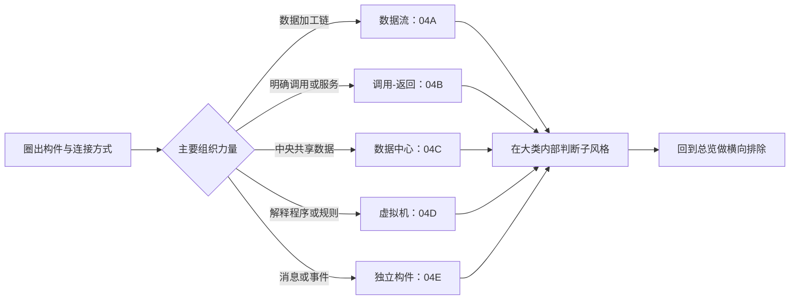

# 软件架构风格：如何用构件与连接件识别典型结构

> [!summary]- 快速复习卡片（学完再看）
> **架构风格**规定一类系统常见的构件、连接件及组合约束。
> **数据一站站加工** → 数据流；**控制沿明确调用关系传递** → 调用-返回；**多个构件围绕共享数据工作** → 数据中心；**解释环境执行程序或规则** → 虚拟机；**独立构件靠消息或事件协作** → 独立构件。
> 做题先找主导组织机制，再进入 04A～04E 判断具体子风格。

上一站 [[03_ABSD：如何从架构需求逐步形成可交付架构]] 已经说明：ABSD 在架构设计时需要选择合适的架构风格。这里先建立五类风格的全局地图；每一类的完整机制放在对应机制卡中。

## 架构风格到底规定什么

同一个订单系统都可以包含订单、支付、库存和通知，但这些构件可以采用不同方式组织：数据依次经过处理站，控制沿调用关系传递，或者构件围绕共享数据、消息或事件协作。

**软件架构风格**描述某一类系统反复出现的组织模式，通常规定：

1. **构件**：承担计算、存储或业务职责的部分；
2. **连接件**：构件之间传递数据、控制、消息或事件的方式；
3. **约束**：这些构件与连接件允许怎样组合。

> **具体架构**回答“这个系统实际上怎样设计”；**架构风格**回答“这一类系统通常按什么组织规律设计”。

> [!note] 连接件与连接子
> [[01B_软件架构描述：ADL、UML与IEEE1471分别解决什么]] 在 ADL 语境中使用 Connector（连接子）；教材风格章节常写“连接件”。本组卡按教材口径使用“连接件”，都表示构件之间的交互方式。

## 五类入口：先找系统的主要组织力量

| 第一眼要找什么 | 风格大类 | 典型成员 | 完整机制入口 |
| --- | --- | --- | --- |
| 数据是否按步骤持续或分批加工 | 数据流 | 批处理、管道-过滤器 | [[04A_数据流风格：批处理与管道过滤器为什么不同]] |
| 控制是否沿调用、服务或层次关系传递 | 调用-返回 | 主程序/子程序、面向对象、层次型、C/S | [[04B_调用返回风格：控制为什么沿明确调用关系传递]] |
| 多个构件是否围绕中央共享数据工作 | 数据中心 | 仓库、黑板 | [[04C_数据中心风格：仓库与黑板为什么都以共享数据为中心]] |
| 是否先构造解释程序或规则的执行环境 | 虚拟机 | 解释器、规则系统 | [[04D_虚拟机风格：解释器与规则系统如何构造执行环境]] |
| 相对独立构件是否靠消息或事件协作 | 独立构件 | 进程通信、事件系统 | [[04E_独立构件风格：进程通信与事件系统如何实现松耦合协作]] |

五类比较的是**系统靠什么形成主要结构**。真实系统可以同时采用多种风格；考试通常要求识别题干中最突出的机制。

## 全局横向辨析

### 管道-过滤器 vs 层次型

- **管道-过滤器**关注数据从一个处理步骤流向下一个处理步骤；
- **层次型**关注上层通过接口使用下层服务，核心是职责和依赖关系。

### 仓库 vs 黑板

- **仓库**以共享数据存储为中心，多个构件读取或修改数据；
- **黑板**以问题状态和部分解为中心，多个知识源逐步合作求解。

### 面向对象 vs 事件系统

- **面向对象**通常存在明确的对象和方法调用关系；
- **事件系统**中，发布者不必知道哪些构件会响应事件。

### 解释器 vs 规则系统

- **解释器**读取并执行程序或语言；
- **规则系统**根据当前事实，从规则集中选择满足条件的规则执行。

### 批处理 vs 管道-过滤器

- **批处理**通常等前一步完成整批数据后再交付；
- **管道-过滤器**允许数据持续流过处理链。

## 混合风格：先确定题干正在观察哪一段

大型电商系统可以整体采用分层或 C/S，在日志链路中采用管道-过滤器，在业务通知中采用事件系统。因此“系统采用哪种风格”不能脱离题干观察范围。

判断时应问：题干描述的是整个系统还是局部处理链？最强调数据、控制、共享数据、解释环境，还是消息/事件？若多个机制同时出现，问题要求识别哪个局部结构？

## 做题识别流程

如果题干只是出现“多个步骤”，还不能直接选管道-过滤器；如果只是出现“数据库”，也不能直接选仓库。必须同时核对构件怎样连接、数据或控制怎样移动、组合受到什么约束。

## 内部机制组学习顺序

1. [[04A_数据流风格：批处理与管道过滤器为什么不同]]
2. [[04B_调用返回风格：控制为什么沿明确调用关系传递]]
3. [[04C_数据中心风格：仓库与黑板为什么都以共享数据为中心]]
4. [[04D_虚拟机风格：解释器与规则系统如何构造执行环境]]
5. [[04E_独立构件风格：进程通信与事件系统如何实现松耦合协作]]

学完 04E 后回到本页，用“全局横向辨析”和“做题识别流程”完成跨类别判断，再进入软件架构复用。

## 自测

> [!question] 自测
> 某系统整体采用分层结构，日志子系统让数据连续经过清洗、转换、统计三个处理步骤，支付完成后又发布事件通知积分模块。这个系统究竟属于哪一种风格？
>
> > [!answer]- 答案与解析
> > 真实系统可以混合多种风格。整体结构体现层次型；日志子系统体现管道-过滤器；支付通知体现事件系统。先确定题干观察范围，再找主导机制。

## 上一站与下一站

- **上一站：** [[03_ABSD：如何从架构需求逐步形成可交付架构]]
- **内部第一站：** [[04A_数据流风格：批处理与管道过滤器为什么不同]]
- **内部回站：** 学完 [[04E_独立构件风格：进程通信与事件系统如何实现松耦合协作]] 后回到本页完成横向辨析。
- **下一顶级课程：** [[05_软件架构复用：为什么复用不只是复制代码]]
- **本章入口：** [[软件架构设计索引]]

## 证据锚点

- 大纲：`官方教材/系统架构第二版 大纲.pdf`，PDF 52–53 页，6.3 软件架构风格。
- 主教材：`官方教材/系统架构设计师教程第二版可搜索.pdf`，PDF 275–281 页，7.3 软件架构风格。
- 趋势：[[历年真题/AI题库/知识点索引/第二阶段-考点映射与近年趋势|第二阶段考点映射与近年趋势]]，只用于复习优先级。
