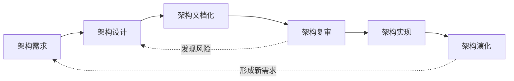

# ABSD：如何从架构需求逐步形成可交付架构

> [!summary]- 快速复习卡片（学完再看）
> **ABSD**：以软件架构为中心，让架构贯穿需求、设计、文档、复审、实现和演化。
> **三个基础**：功能分解、选择架构风格实现质量与商业需求、软件模板。
> **六个子过程**：架构需求 → 架构设计 → 架构文档化 → 架构复审 → 架构实现 → 架构演化。
> **易错点**：六步有主顺序但允许反馈迭代；ABSD 六子过程 ≠ 软件架构生命周期六阶段。

前面已经知道：[[01_软件架构是什么：为什么需要架构视角]] 说明“为什么要管系统整体结构”，[[02_软件架构生命周期：为什么架构工作从需求一直持续到上线后]] 说明架构工作贯穿系统生命期，[[03_软件架构描述：ADL、UML与IEEE1471分别解决什么]] 和 [[04_软件架构视图：为什么同一系统需要多个观察视角]] 又解决了“架构怎样被描述和观察”。

现在还差一个实际问题：

> **项目开始后，怎样把架构需求一步步变成能说明、能评审、能实现、还能继续演化的架构？**

ABSD（Architecture-Based Software Design，基于架构的软件设计）就是回答这个问题：

> **不要把架构当成前期画完就结束的一张图，而要让它成为连接需求、设计、实现和后续变化的开发主线。**

## 先记三个基础

主教材给出的三个基础是：

- **功能分解**；
- **选择架构风格来实现质量需求和商业需求**；
- **软件模板的使用**。

2011 年下半年综合知识第 49 题直接考查过这一口径。这里先知道“选择架构风格”是 ABSD 的设计手段之一，具体有哪些风格放到下一站再学。

## 六个子过程到底在做什么

| 子过程 | 大白话理解 | 题干信号 |
| --- | --- | --- |
| **架构需求** | 找出哪些需求会影响系统整体结构，并识别候选架构元素 | 获取需求、标识构件/元素 |
| **架构设计** | 根据需求形成、映射并细化架构方案 | 架构模型、映射、细化、选择风格 |
| **架构文档化** | 把架构写清楚，让相关方能够理解和使用 | 架构规格说明、质量设计说明 |
| **架构复审** | 在大量实现前检查方案，尽早发现风险和缺陷 | 相关方参与、风险、缺陷、反馈 |
| **架构实现** | 按架构约束实现、组装并测试构件 | 构件实现、组装、测试 |
| **架构演化** | 需求或环境变化后，有计划地调整架构 | 变化分析、演化计划、更新构件/交互 |

用一个例子就能串起来：在线交易系统要求“通知服务变慢不能拖住下单”。先把它识别为架构级需求；设计时选择合适的交互结构；把方案文档化；复审时用具体场景检查风险；通过后实现。如果以后业务量或外部渠道变化，再进入架构演化，而不是只在代码里打补丁。

## 为什么六步不是死流水线

复审时如果发现“通知服务仍会拖慢交易主链路”，正确动作不是盖章后继续编码，而是**返回需求或设计重新调整**。系统上线后发生重大变化，也可能形成新的架构需求。

所以要记住：

> **六个子过程有主线顺序，但允许反馈和迭代。**

这也是 ABSD 和“画一次架构图然后不再管”的根本区别。

## 两个最容易混的边界

**ABSD 六子过程 ≠ 软件架构生命周期六阶段。** 生命周期讲架构工作在整个系统生命期中的宏观位置；ABSD 讲以架构为中心怎样组织开发活动。两组都可能出现“六”，不要混背。

**架构文档化 ≠ 4+1。** 文档化是 ABSD 的一个子过程；4+1 是描述同一架构时组织多个视图的一种方式，文档化可以使用多视图表达。

## 考试怎么做

题目问“三个基础”，直接找：**功能分解 + 选择架构风格 + 软件模板**。

题目问六个子过程，按：

> **需求 → 设计 → 文档化 → 复审 → 实现 → 演化**

题目问阶段职责时，抓动作：获取需求/标识元素 → 需求；形成模型/映射/细化 → 设计；相关方查风险 → 复审；变化分析和计划 → 演化。

## 自测

> [!question] 第 1 题
> ABSD 的三个基础是什么？
>
> > [!answer]- 答案与解析
> > **答案：功能分解、选择架构风格实现质量与商业需求、软件模板的使用。**
>

> [!question] 第 2 题
> “相关方在编码前检查方案并发现潜在风险”属于哪个子过程？
>
> > [!answer]- 答案与解析
> > **答案：架构复审。** 复审的核心不是文档审批，而是尽早发现风险并反馈。
>

> [!question] 第 3 题
> 为什么六个子过程不能理解成绝对不能回退的瀑布？
>
> > [!answer]- 答案与解析
> > **答案：复审和演化都可能暴露前序问题，需要返回需求或设计继续迭代。**
>

## 下一站

ABSD 已经告诉我们“架构设计阶段需要选择合适的架构风格”，但还没有回答**有哪些典型组织方式、题目怎样识别它们**。下一站进入 [[00_软件架构风格总览：如何用构件与连接件识别典型结构]]。

## 证据锚点

- 大纲：[[官方教材/AI教材库/原始文本/系统架构第二版 大纲/p0049-p0060|系统架构第二版大纲，PDF 51 页，6.2 基于架构的软件开发方法]]
- 主教材：[[官方教材/AI教材库/原始文本/系统架构设计师教程第二版可搜索/p0265-p0276|教程 PDF 268–273 页，ABSD 六个子过程及机制]]
- 真题：[[历年真题/AI题库/标准化题库/2011-下半年/综合知识|2011 年下半年综合知识第 49 题]]
- 趋势仅作优先级：[[历年真题/AI题库/知识点索引/第二阶段-考点映射与近年趋势|第二阶段考点映射与近年趋势]]
