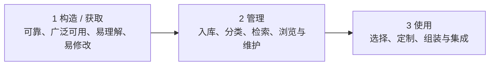

# 软件架构复用：为什么复用不只是复制代码

> [!summary]- 快速复习卡片（学完再看）
> **核心结论**：软件架构复用不是把旧项目代码复制一份，而是把经过验证的需求、架构、测试和工程经验等资产组织起来，在新系统中再次选择、定制和使用。
>
> **机会复用**：开发过程中发现能用的资产，就拿来复用；**系统复用**：开发前就规划哪些东西要复用。
>
> **可复用对象不只代码**：教材列出需求、架构设计、元素、建模与分析、测试、项目规划、过程/方法/工具、人员、样本系统、缺陷消除等 10 类资产。
>
> **基本过程**：构造/获取 → 管理 → 选择/定制/组装。可复用资产要可靠、可被广泛使用、易理解、易修改；管理阶段尤其要会分类和检索。
>
> **考试第一反应**：先判断题干问的是“何时规划复用”“复用什么”，还是“现在处于复用过程哪一步”。

## 这一篇只回答一个问题

> **软件架构复用如何把经过验证的架构及相关资产系统化地用于新系统，而不只是复制代码？**

## 先看一个具体场景

上一站 [[04_软件架构风格：如何用构件与连接件识别典型结构]] 已经学过：一些系统结构不是每次都临时发明，而是存在可以反复借鉴的稳定组织经验。

现在把场景继续往前推。

某企业先为 **A 事业部** 建了一套订单系统。这个系统已经稳定运行了一段时间，团队也验证过：

- 哪些需求是这类订单系统反复都会有的；
- 哪套架构能够支撑订单、库存、支付和通知协作；
- 哪些性能分析和容错方案有效；
- 哪些测试用例、测试数据和测试工具好用；
- 项目怎样排期、团队怎样协作、哪些缺陷最容易出现。

后来企业又要为 **B 事业部** 建第二套相似的订单系统。

最笨的办法是：

> 新建一个项目，然后所有东西重新分析、重新设计、重新测试。

另一个看似省事的办法是：

> 把第一套系统的代码仓库复制一份，再边改边用。

### 出现的问题

只“复制代码”会漏掉大量真正有价值的经验。

例如第一套系统已经验证过一套可靠的架构、性能模型、测试方案和项目流程，但这些东西并不会自动跟着一次 `copy` 变成第二个项目可控、可查、可维护的资产。

而且旧代码里既有值得保留的部分，也可能有只适合 A 事业部的特殊逻辑。**复制得越彻底，不代表复用得越好。**

### 大白话直接答案

> **真正的架构复用，是先把第一套系统中已经验证过、以后还可能再次使用的东西沉淀成“可复用资产”，再把这些资产统一管理；第二套系统根据自己的需求去检索、选择、修改和组装。**

所以它关注的不是：

> “旧项目哪几段代码能复制？”

而是：

> “上一套系统有哪些已经验证的成果值得留下？怎样保证下一套系统找得到、看得懂、改得动，并且能正确地再次使用？”

---

## 正式教材口径：复用是一种系统化的软件开发过程

主教材把**软件复用**强调为一种系统化的软件开发过程：通过识别、开发、分类、获取和修改软件实体，使它们能够在不同的软件开发过程中重复使用。

这句话最重要的不是“重复使用”四个字，而是前面的：

> **系统化。**

回到贯穿场景：第二套订单系统不是临时看到什么就复制什么，而是要把“可复用资产从哪里来、怎样管理、怎样再次使用”做成一套过程。

教材进一步把软件架构复用分为两类：**机会复用**和**系统复用**。

### 机会复用 vs 系统复用：差别在“什么时候决定复用”

仍然看第二套订单系统。

#### 机会复用

项目已经开发到一半，开发人员突然发现：

> “第一套系统里那套性能分析模型刚好能用，这次也拿过来吧。”

这就是**机会复用**：

> **开发过程中发现有可复用资产，就进行复用。**

它更像“走到这里才发现有现成的”。

#### 系统复用

第二套系统还没正式开发，团队在项目规划时就先决定：

- 哪些共同需求直接复用；
- 哪套架构作为基础；
- 哪些测试资产继续使用；
- 哪些工程流程和工具沿用；
- 哪些内容必须按 B 事业部的新需求重新定制。

这就是**系统复用**：

> **在开发之前就进行规划，提前决定哪些内容要复用。**

| 判断点 | 机会复用 | 系统复用 |
| --- | --- | --- |
| 什么时候发现/决定复用 | 开发过程中 | 开发之前 |
| 题干常见信号 | “发现已有资产可用，于是采用” | “预先规划、事先决定复用哪些资产” |
| 第一判断动作 | 看是不是“做着做着才发现” | 看是不是“开工前已经规划” |

> [!warning] 不要被“系统”两个字带偏
> **系统复用不是“复用整个旧系统”。** 这里考的是复用活动有没有在开发前被系统地规划。

---

## 为什么要复用：不是只为了少写几行代码

继续看 A、B 两套订单系统。

如果 B 系统能使用 A 系统已经验证过的成果，价值可以压成三组来记。

| 价值 | 在贯穿场景里是什么意思 |
| --- | --- |
| **少做重复工作** | 不必把已经成熟的需求、架构和工程方案全部从零再做一遍，因此可减少开发工作、开发时间和开发成本，提高生产力 |
| **把验证过的质量带过来** | 已成功使用的架构和方案再次被采用，有机会提高产品质量和互操作性，而不是每次重新踩一遍坑 |
| **后续更容易维护** | 多个相似系统建立在一套较稳定的资产基础上，团队更容易理解共同部分，也更容易统一维护 |

所以考试问“为什么要软件架构复用”，不要只答：

> “节省代码。”

教材口径至少要想到：

> **减少工作/时间/成本 → 提高生产力 → 提高质量和互操作性 → 简化维护。**

---

## 到底能复用什么：教材的 10 类资产一个都不能漏

这里是最容易把“复用”错误缩成“代码复用”的地方。

第一套订单系统真正值得留下来的东西，远不止源代码。

为了减轻记忆负担，可以把教材的 10 类同级资产分成三组，但**组内项目仍然都要认识**。

### 第一组：需求、设计和分析成果

| 教材资产 | 大白话理解 | 订单系统里的例子 |
| --- | --- | --- |
| **1. 需求** | 已经确认过的共同业务需要 | 下单、库存校验、支付、通知等共同需求 |
| **2. 架构设计** | 已经验证合理的整体结构 | 订单、库存、支付、通知怎样分工和协作 |
| **3. 元素** | 可再次使用的设计/实现元素；重点不只是复制代码，还要保留设计中做对的地方、避开做错的地方 | 通用接口、模块或其他可复用实现/设计元素 |
| **4. 建模与分析** | 已验证过的分析方法和方案模型 | 性能分析方法、容错方案、负载均衡模型 |

### 第二组：测试和工程管理资产

| 教材资产 | 大白话理解 | 订单系统里的例子 |
| --- | --- | --- |
| **5. 测试** | 测试环境和测试成果也可以复用 | 测试用例、测试数据、测试工具、测试计划等 |
| **6. 项目规划** | 以前做项目形成的成本、预算、进度和团队安排经验可以再用 | 第二套系统不必完全从零估算和拆计划 |
| **7. 过程、方法和工具** | 团队已经稳定下来的工作方式和工具环境 | 开发流程、规范、标准、方法、编码标准和工具链 |

### 第三组：组织经验和真实系统经验

| 教材资产 | 大白话理解 | 订单系统里的例子 |
| --- | --- | --- |
| **8. 人员** | 已经按同一产品系列训练和积累经验的人也形成复用能力 | 熟悉这类订单系统的架构、测试和运维人员 |
| **9. 样本系统** | 已投产系统本身可以作为高质量演示原型和工程设计原型 | A 事业部正在运行的订单系统 |
| **10. 缺陷消除** | 已经发现并解决过的共性缺陷及处理经验可以让后续系统少踩坑 | 已解决的性能瓶颈、可靠性问题及其修复经验 |

把三组重新合起来看，你会发现：

> **复用的是“经过验证、可以再次产生价值的软件资产和工程经验”，代码只是其中可能的一部分。**

### 一般复用形式：从小粒度逐步走向大粒度

教材列出的常见形式包括：

- 函数复用；
- 库复用；
- 面向对象开发中的类、接口、包复用。

教材同时指出一个总体趋势：**复用体从小粒度向大粒度发展。**

本篇把重点继续放在更大的“架构及相关资产”上，不在这里展开横向/纵向复用理论。

> [!note] 历史真题只做一个最小旁证
> 2010 年下半年第 31 题和 2018 年下半年第 35 题都把**标准函数库**作为典型的水平复用形式来识别。这里知道这个题眼即可；这两道题只说明“小粒度复用形式确实会考”，不能据此把水平/纵向复用扩成本篇第二条主线。

> [!note] 和“软件构件与构件组装”是什么关系
> [[软件构件与构件组装]] 的主问题是“构件是什么、构件怎样通过接口组装成应用”。本篇的层级更高：**哪些成果应该成为可复用资产，以及这些资产怎样被获取、管理、检索、定制和再次使用。** 因此这里只做定位和链接，不复制第二套构件正文。

---

## 完整机制：可复用资产怎样真正进入第二套系统

前面已经知道“为什么复用”和“能复用什么”，现在把它们串成完整过程。

主教材把基本过程分成 3 个阶段：

### 第 1 阶段：构造 / 获取可复用资产

第一套订单系统做完后，不是把所有产物一股脑塞进“复用库”。

真正要进入后续复用的资产，教材强调至少应该满足四个前提：

1. **可靠**：本身不能是未经验证、问题很多的东西；
2. **可被广泛使用**：不能只对一个极特殊场景有价值；
3. **易于理解**：下一个项目的人拿到后知道它解决什么、怎样使用；
4. **易于修改**：新系统有差异时，能够进行合理调整，而不是一改就崩。

回到订单系统：一套架构“在 A 系统里跑过”还不够。如果没有说明适用条件、接口关系和可调整部分，B 系统团队依然很难安全地复用它。

> **可复用资产首先要“值得复用、能被别人复用”，而不是“旧项目里存在过”。**

### 第 2 阶段：管理可复用资产

企业现在已经积累了很多需求模板、架构方案、测试资产和工程经验。

新的问题马上出现：

> **东西很多，但下一个项目找不到，等于没有。**

教材在这一阶段重点以**构件库（Component Library）**说明复用基础设施，它提供存储、管理、检索、浏览、维护等能力。放到本篇更大的资产视角里，可以理解为：必须让可复用资产有统一的组织和查找入口。

其中两个关键动作一定要会：

#### 分类：先把资产组织起来

**分类**解决的是：

> “这么多资产应该按什么规则放，才能不乱？”

例如企业可以把订单系统资产按需求、架构、测试、工具等类别组织起来，也可以继续记录适用业务、技术约束等检索信息。

#### 检索：需要时能快速找到

**检索**解决的是：

> “第二套系统提出一个需要后，怎样快速准确地找到相关资产？”

所以分类和检索不是两个孤立名词：

> **分类负责把大量资产组织得可查，检索负责在真正需要复用时把合适资产找出来。**

考试看到“构件库、存储管理、分类、查询需求、快速准确找到”，第一反应就是**管理可复用资产阶段**。

### 第 3 阶段：选择 / 定制 / 组装并使用资产

B 事业部的第二套订单系统有了具体需求以后，团队才真正开始“消费”这些资产：

1. 根据新系统需求检索资产库；
2. 选择适合这次需求的资产；
3. 根据 B 事业部差异进行**定制**，例如修改、扩展、配置；
4. 再把这些资产组装、集成到新系统中。

这里最容易出现一个误区：

> “复用资产” ≠ “原封不动照搬资产”。

教材明确包含**定制**。新系统和旧系统有差异时，可以合理修改、扩展和配置，然后再组装与集成。

构件本身怎样通过接口完成组装，仍回到 [[软件构件与构件组装]]；本篇只负责把它放在“系统化复用过程”的最后一段里定位清楚。

---

## 把贯穿场景完整走一遍

现在再看第二套订单系统，整个逻辑就连起来了。

| 时点 | 团队实际做什么 | 对应复用含义 |
| --- | --- | --- |
| 第一套系统稳定后 | 提炼共同需求、已验证架构、分析模型、测试资产、项目经验、工具流程、缺陷解决经验等 | **构造 / 获取可复用资产** |
| 资产沉淀阶段 | 统一入库，建立分类、描述、检索和维护方式 | **管理可复用资产** |
| 第二套系统开发前 | 先规划哪些资产准备复用 | **系统复用** |
| 第二套系统有具体需求后 | 检索并选择合适资产，按差异修改/扩展/配置，再组装与集成 | **使用可复用资产** |
| 如果开发中临时发现另一个旧资产正好能用 | 当场决定采用 | **机会复用** |

这就是本篇主问题的完整答案：

> **架构复用不是把第一套系统“复制成第二套”，而是把第一套系统中经过验证、具备复用条件的架构及相关资产提炼出来，经过管理和检索，再按第二套系统的需求选择、定制、组装和集成。**

---

## 考试动作：先判断题干到底在问哪一层

做题时不要先背 10 类资产，也不要看到“复用”两个字就猜。

### 第一步固定问三个问题

1. **题干在问“什么时候决定复用”吗？**
2. **题干在问“什么东西可以复用”吗？**
3. **题干在描述“复用过程现在走到哪一步”吗？**

然后再按题干信号落答案。

| 题干信号 | 第一判断 | 结论 |
| --- | --- | --- |
| “开发过程中发现已有资产可用” | 看决定复用的时间 | **机会复用** |
| “开发前预先规划哪些资产要复用” | 看决定复用的时间 | **系统复用** |
| “需求、架构、测试、项目经验、人员、样本系统……” | 看它是不是可再次产生价值的资产 | **复用对象不只代码** |
| “可靠、广泛可用、易理解、易修改” | 看资产能不能真正被再次使用 | **获取可复用资产的前提** |
| “构件库、分类、检索、浏览、维护” | 看是不是在组织和查找资产 | **管理阶段** |
| “根据新需求查找资产，修改/扩展/配置后集成” | 看是不是已经拿资产来做新系统 | **选择 / 定制 / 组装阶段** |
| “标准函数库” | 只识别历史题的典型形式 | **典型水平复用旁证** |

### 最容易错的两个点

**错法 1：把系统复用理解成“把整个系统拿来用”。**

不对。这里的判断点是：**是否在开发前就规划复用。**

**错法 2：把架构复用理解成“组件库里找代码”。**

也不够。构件只是可能的资产之一；需求、架构、模型、测试、项目规划、过程工具、人员经验、样本系统和缺陷消除经验都可能属于复用范围。

---

## 一句话记住

> **软件架构复用 = 把经过验证、具备复用条件的架构及相关资产系统化沉淀下来，先管理得“找得到”，再按新需求“选得对、改得动、装得上”。**

## 自测

> [!question] 自测 1
> 第二套系统已经开发了一半，工程师才发现第一套系统的一套性能分析模型正好可用，于是直接纳入当前项目。更符合机会复用还是系统复用？
>
> > [!answer]- 答案与解析
> > **答案：机会复用。** 关键题眼是“开发过程中才发现可复用资产”，不是开发前预先规划。

> [!question] 自测 2
> 企业在第二套系统立项时，就列出“共同需求、基础架构、测试用例和工程流程必须优先从已有资产中选择”。这属于哪一类复用？
>
> > [!answer]- 答案与解析
> > **答案：系统复用。** 因为在开发之前已经规划要复用哪些资产。

> [!question] 自测 3
> 为什么“第一套系统的代码”不能代表全部可复用对象？至少再举出 4 类教材资产。
>
> > [!answer]- 答案与解析
> > **答案示例：需求、架构设计、建模与分析、测试。** 另外项目规划、过程/方法/工具、人员、样本系统、缺陷消除以及其他可复用元素也都属于教材列出的资产范围。

> [!question] 自测 4
> 某企业已经积累大量可复用构件，但新项目经常“不知道库里有什么，也搜不到合适构件”。这首先暴露的是复用过程哪一阶段的问题？
>
> > [!answer]- 答案与解析
> > **答案：管理可复用资产阶段。** 分类负责把大量资产组织起来，检索负责根据查询需求快速准确找到相关资产；“有资产但找不到”首先是管理能力没有闭环。

> [!question] 自测 5
> 新项目从资产库找到一个旧模块后，先按新需求扩展接口、修改配置，再与其他模块集成。为什么这仍然属于复用？
>
> > [!answer]- 答案与解析
> > **答案：复用不要求原封不动照搬。** 使用可复用资产阶段本来就包含选择、定制以及组装/集成；修改、扩展、配置都属于教材明确列出的定制动作。

## 上一站与下一站

- **上一站：** [[04_软件架构风格：如何用构件与连接件识别典型结构]]——已经知道稳定的结构组织经验可以反复出现，本篇进一步把“经验和成果怎样变成可复用资产”讲完整。
- **下一站：** [[06_DSSA：如何沉淀特定领域的共性架构]]——本篇解决一般的软件架构复用；下一站才继续问：如果把这种系统化复用限定到一个特定领域，怎样沉淀一套领域共性架构。
- **本章入口：** [[软件架构设计索引]]

## 证据锚点

- 大纲：`官方教材/系统架构第二版 大纲.pdf`，6.4 软件架构复用。
- 主教材：`官方教材/系统架构设计师教程第二版可搜索.pdf`，PDF 281–283，7.4.1–7.4.4。
- 趋势：[[历年真题/AI题库/知识点索引/第二阶段-考点映射与近年趋势|第二阶段-考点映射与近年趋势]]中的“软件复用” P0 信号；只作为复习优先级，不当作精确题频。
- 历史题旁证：[[历年真题/AI题库/标准化题库/2010-下半年/综合知识|2010 年下半年综合知识第 31 题]]、[[历年真题/AI题库/标准化题库/2018-下半年/综合知识|2018 年下半年综合知识第 35 题]]；两题只用于“标准函数库”这一复用形式的识别，不外推为本篇其他子项的直接题频证据。
