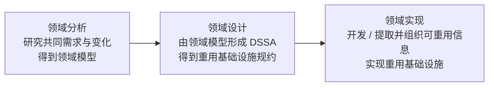
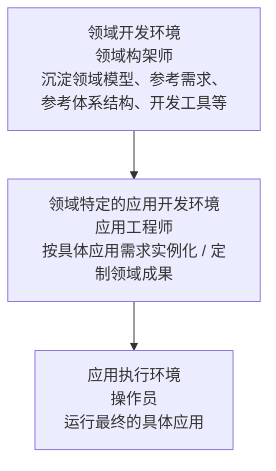

# DSSA：如何沉淀特定领域的共性架构

> [!summary]- 快速复习卡片（学完再看）
> **DSSA 一句话定义**：在一个**特定应用领域**中，为**一组应用**提供组织结构参考的**标准软件体系结构**；它是多个具体系统的共同开发基础，不是某一个项目的最终架构。
>
> **为什么需要 DSSA**：企业长期做同一领域的一系列系统时，不只复用零散资产，而是把反复出现的**共同需求、变化点、领域模型、共性架构和可重用信息**系统化沉淀下来。
>
> **三项基本活动**：领域分析 → 得到**领域模型**；领域设计 → 得到 **DSSA**；领域实现 → 开发和组织**可重用信息**。
>
> **四类参与角色**：领域专家、领域分析人员、领域设计人员、领域实现人员。
>
> **五阶段建立过程**：定义领域范围 → 定义领域特定元素 → 定义领域特定的设计和实现需求约束 → 定义领域模型和体系结构 → 产生/搜集可重用产品单元。
>
> **三层模型**：**领域开发环境（领域构架师）** → **领域特定的应用开发环境（应用工程师）** → **应用执行环境（操作员）**。
>
> **最容易混淆**：三项活动回答“**做哪三类工作**”；五阶段回答“**建立 DSSA 时怎样推进**”；三层模型回答“**领域成果在哪些环境中被开发、用于具体应用、最终运行**”。
>
> **做题第一反应**：看到“特定领域、一组系统、共同需求、领域模型、共性架构、重用基础设施”等词，先往 **DSSA / 领域工程**想；再根据题目问的是活动、角色、建立阶段还是三层环境继续判断。

## 这一篇只回答一个问题

> **一个企业长期开发同一领域的一系列相似系统时，怎样把这个领域中反复出现的需求、架构和可复用资产沉淀下来，使后续系统不用每次重新设计？**

## 从上一站继续：一般的架构复用为什么还不够

上一站 [[05_软件架构复用：为什么复用不只是复制代码]] 已经解决了一个问题：

> 软件复用不是把旧项目复制一份，而是把经过验证的需求、架构、测试和工程经验等资产系统化地获取、管理、检索、定制和再次使用。

现在把场景再推进一步。

如果企业只是偶尔做两个相似系统，“看到可复用的东西就沉淀下来”已经很有价值。

但如果企业**十年都在做同一类系统**，事情会变得更进一步：

> 与其每个新项目开始以后再去资产库里找东西，能不能先研究“这个领域本身有哪些长期稳定的共同需求、共同结构和变化点”，再把它们组织成后续同类系统都能使用的领域级开发基础？

这就是 DSSA 要继续解决的问题。

## 先看一个持续场景：一家公司长期建设医院信息系统

假设某软件公司长期给医院建设医院信息系统。

第一家医院做完后，团队发现很多能力以后还会反复出现：

- 挂号；
- 门诊；
- 住院；
- 药品；
- 收费；
- 医生工作站；
- 权限；
- 数据交换。

第二家医院、第三家医院也需要这些能力。

但是它们又不完全一样。

例如：

- 有的医院门诊流程不同；
- 有的医院科室划分不同；
- 有的医院收费规则不同；
- 有的医院需要接入更多外部设备或系统；
- 有的功能是所有医院都要，有的只是一部分医院需要。

### 出现的问题

如果每接一家医院，都重新做一遍：

> 需求调研 → 架构设计 → 模块划分 → 接口设计 → 构件开发

那团队虽然“做过很多类似项目”，却还是在重复解决同一领域的问题。

而如果只是把上一家医院的代码和架构复制过来，再不断修改，也会遇到另一个问题：

> 哪些东西真的是“医院信息系统领域的共性”，哪些只是上一家医院自己的特殊需求，并没有被系统地分清。

### 大白话直接答案

> **DSSA 的思路，就是先把“医院信息系统这个领域”本身拿出来研究：找出多个医院系统共同需要什么、哪里会变化，再形成能覆盖这个领域多个系统的共性架构，并把可重用信息组织起来。以后建设某一家具体医院时，不是从零设计，而是在这套领域基础上按差异进行实例化和定制。**

所以 DSSA 比“有东西就复用”再向前走了一步：

> **普通复用关注“已有资产怎样再次使用”；DSSA 关注“同一领域里哪些需求、架构和资产本来就应该被系统化地共同沉淀”。**

---

## DSSA 到底是什么：不是某一家医院的最终架构

主教材给出的简化定义是：

> **DSSA（Domain Specific Software Architecture，特定领域软件体系结构）是在一个特定应用领域中，为一组应用提供组织结构参考的标准软件体系结构。**

这句话先拆成三个问题看。

### 1. 为什么强调“特定领域”

DSSA 不是想设计一套“所有软件都能直接套”的万能架构。

它先限定一个领域，例如这里的：

> **医院信息系统领域。**

只有先把边界限定住，团队才有可能认真回答：

- 这个领域里哪些需求反复出现；
- 哪些结构反复出现；
- 哪些部分稳定；
- 哪些部分经常变化；
- 哪些构件和信息值得成为长期复用基础。

所以“特定领域”实际上是在控制复用范围。

### 2. 为什么强调“一组应用”

DSSA 的目标不是只服务“第一医院系统”这个单一项目。

它要支持的是：

> 第一医院系统、第二医院系统、第三医院系统……这一组相关应用。

因此，DSSA 必须包含多个系统都能使用的共性，同时还要给具体系统留下变化空间。

### 3. 为什么 DSSA 不是某个项目的最终架构

这是初学者最容易混淆的地方。

假设公司已经形成了一套医院信息系统 DSSA，它规定了挂号、门诊、住院、药品、收费等典型能力怎样组织，也沉淀了领域模型、参考需求、参考体系结构以及可重用信息。

这仍然不等于：

> “第三人民医院最终上线的系统架构已经自动生成完了。”

因为第三人民医院还有自己的：

- 业务流程；
- 规模；
- 约束；
- 可选功能；
- 外部接口；
- 部署环境。

所以更准确地理解是：

> **DSSA 是领域内多个系统都可以拿来作为基础的共性架构和开发基础；具体项目还要结合自己的差异进行选择、实例化和定制。**

主教材在“领域设计”里也明确指出：DSSA **不是单个系统的表示**，而是能够适应领域中多个系统需求的高层次设计。

---

## DSSA 必须具备什么：四项必备特征

主教材从多个 DSSA 定义中归纳出四项必备特征。

| 教材特征 | 大白话理解 | 医院信息系统场景 |
| --- | --- | --- |
| **1. 一个严格定义的问题域和问题解域** | 先说清楚“研究什么问题、解决方案范围到哪里”，不能无限扩张 | 明确研究的是医院信息系统这一范围，而不是把所有政企软件都混进来 |
| **2. 具有普遍性，使其可以用于领域中某个特定应用的开发** | 不能只适合一个项目，领域里的具体系统应该能拿它来开发 | 新医院系统能够以这套领域基础为起点 |
| **3. 对整个领域的构件组织模型的恰当抽象** | 不能陷入某一家医院的代码细节，要抽象出整个领域怎样组织 | 抽象挂号、门诊、住院、收费等典型能力及其关系 |
| **4. 具备该领域固定的、典型的在开发过程中可重用元素** | 领域里反复出现的典型东西要真正能被后续项目复用 | 领域模型、共性构件、参考架构及其他可重用信息成为后续开发基础 |

把四条压成一句话：

> **DSSA 既要“范围明确”，又要“对领域中的多个应用普遍可用”；既要抽象出领域整体组织方式，又要真正沉淀出可重用元素。**

### 垂直域 vs 水平域：是在问“领域边界怎么切”

教材还从功能覆盖范围出发，给出两种理解“领域”的方式。

#### 垂直域

**垂直域**定义的是一个特定的**系统族**，包含这个系统族内的多个系统，最终希望形成这个领域中可作为系统可行解决方案的通用软件体系结构。

放到当前场景，可以这样理解：

> 把“医院信息系统这一类系统族”整体作为研究对象，寻找这一类系统从业务到架构的共同部分。

教材同时提醒：垂直域上的 DSSA 更适合成熟、稳定的领域；如果领域范围太大，得到一致解决方案会更困难。

#### 水平域

**水平域**关注的是：

> **多个系统、多个系统族之间某个功能区域的共有部分。**

它不一定包下“整个医院信息系统”，而可能只研究一个横跨多种系统的共同功能区域。

例如为了理解，可以把“身份认证和权限控制”看成一种横向功能：它可能在多个不同系统和系统族中都出现。

### 做题时怎么分

| 题干关注点 | 第一反应 |
| --- | --- |
| “某一类完整系统族”“整个系统族中的多个系统” | **垂直域** |
| “多个系统/多个系统族都共有的某部分功能”“子系统级共同功能” | **水平域** |

> [!warning] 不要把“垂直/水平”理解成技术分层
> 这里不是表示层、业务层、数据层那种“上下层”。它是在划分**领域覆盖范围**：研究一个系统族的整体，还是跨多个系统族研究某个共同功能区域。

---

## DSSA 的三项基本活动：先弄清共性，再设计共性架构，再把它做成可重用信息

现在回到医院信息系统。

团队知道要做“领域级沉淀”，但到底做哪几类工作？

主教材把基本活动归纳为三项：

### 1. 领域分析：这个领域到底共同需要什么、哪里会变化

**领域分析的主要目标：获得领域模型。**

它不是先画架构，而是先研究这个领域。

医院信息系统团队会做的事情包括：

1. 先确定领域边界；
2. 找信息来源，例如现有医院系统、技术资料、领域专家、用户调查、市场分析和历史记录；
3. 选择有代表性的样本系统；
4. 比较多个系统的需求；
5. 找出：
   - 所有系统共同的需求；
   - 只属于某个系统的特殊需求；
   - 被一部分系统共享的需求；
6. 把这些结果组织成**领域模型**。

所以看到题干：

> “分析多个系统的共同需求、差异和变化范围，建立领域模型。”

第一反应就是：

> **领域分析。**

### 2. 领域设计：共同需求应该由什么共性架构来解决

**领域设计的主要目标：获得 DSSA。**

领域分析已经告诉团队：

> “医院信息系统领域一般需要什么，而且这些需求怎么变化。”

领域设计接下来回答：

> “那怎样设计一套高层架构，使它不是只适合一家医院，而是能够适应领域内多个系统？”

例如某些能力可能：

- 所有医院都必须具备；
- 有的方案需要二选一；
- 有的功能可以选择是否启用。

因此 DSSA 本身也要能够表达这种变化性。

主教材明确提到可以通过 **Alternative（多选一）**、**Optional（可选）** 等解决方案来适应领域需求的变化。

这个阶段得到 DSSA，也就同时形成了**重用基础设施的规约**。

所以看到题干：

> “根据领域模型形成能够覆盖多个应用的领域架构。”

第一反应：

> **领域设计。**

### 3. 领域实现：把共性架构真正落实成以后能用的东西

有了领域模型和 DSSA，如果没有可重用的实现信息，后续项目仍然很难直接受益。

**领域实现的主要目标：依据领域模型和 DSSA，开发和组织可重用信息。**

这些可重用信息可以：

- 从已有系统中提取；
- 也可以重新开发。

然后按照领域模型和 DSSA 组织起来，让团队知道：

> 什么东西在什么情况下可以复用、怎样与领域架构对应。

所以领域实现也可以理解成：

> **重用基础设施的实现阶段。**

看到题干：

> “从现有系统提取可重用构件，或者开发新的可重用构件，并按 DSSA 组织起来。”

第一反应：

> **领域实现。**

### 这三个活动不是走一遍就永远结束

教材特别强调：

> 这个过程是**反复、逐渐求精**的。

例如领域设计时发现：

> “原来的领域模型漏掉了一类重要变化。”

那就可能返回领域分析修改领域模型，再继续设计。

因此不要把三项活动理解成“一次性流水线，绝不回头”。

---

## 谁来做：四类角色不是四个同义的“架构师”

三项活动知道“做什么”以后，还要分清“谁主要负责什么”。

主教材把参与 DSSA 的人员划分为四类角色：

| 教材角色 | 主要在解决什么 | 医院信息系统里的大白话 |
| --- | --- | --- |
| **领域专家** | 提供领域系统的需求和实现知识；帮助建立一致的领域字典、选择样本系统、复审领域模型和 DSSA 等成果 | “真正懂医院业务和这一类系统的人”，告诉团队医院领域到底怎么运作、哪些系统有代表性 |
| **领域分析人员** | 控制领域分析；获取知识；把知识组织到领域模型中；验证并维护领域模型 | 把不同医院、专家和现有系统的信息整理成“共同需求 + 变化”的领域模型 |
| **领域设计人员** | 控制领域设计；根据领域模型和现有系统开发 DSSA；验证 DSSA；建立领域模型与 DSSA 的联系 | 把“领域需要什么”进一步变成“领域共性架构怎样组织” |
| **领域实现人员** | 根据领域模型和 DSSA 开发或从现有系统提取可重用构件；验证构件；建立 DSSA 与构件的联系 | 把领域架构继续落实成后续系统真正能拿来使用的可重用实现 |

### 用一条职责链记住

### 那“谁最终拿这些资产开发某一家医院的具体系统”？

这里要避免把两套角色混在一起。

上面四类是教材 `7.5.3` 中**参与 DSSA 领域工程**的四类角色。

真正进入“某一家具体医院系统开发”时，教材后面的**三层次系统模型**还会出现另一个角色：

> **应用工程师。**

应用工程师是在“领域特定的应用开发环境”中利用已经沉淀好的领域成果，去形成某个具体应用。

所以：

> **领域分析人员 / 领域设计人员 / 领域实现人员**是在造领域级复用基础；
> **应用工程师**是在这个基础上造具体应用。

不要把“应用工程师”硬塞进教材的“四类 DSSA 参与角色”里。

---

## 三项活动 ≠ 五阶段：先把两个维度彻底分开

这是本篇最值得专门防混的一点。

前面已经学了：

> **三项基本活动：领域分析、领域设计、领域实现。**

教材后面又说：

> **DSSA 的建立过程分为五个阶段。**

初学者很容易问：

> “不是刚才已经有三个阶段了吗？为什么这里又来五个？”

### 直接答案

> **三项基本活动是在给工作“分类”：DSSA 主要做哪三类事情。**
>
> **五阶段建立过程是在描述“施工过程”：真正建立一套 DSSA 时，工作要围绕哪些阶段逐步展开。**

也就是说，它们观察的是同一件事的**不同维度**，不能拿一套去替代另一套。

| 比较 | 三项基本活动 | 五阶段建立过程 |
| --- | --- | --- |
| 回答的问题 | “主要做哪三类工作？” | “建立 DSSA 时工作怎样推进？” |
| 核心记忆 | 分析 → 设计 → 实现 | 范围 → 元素 → 约束 → 模型与体系结构 → 可重用产品单元 |
| 主要产物/作用 | 领域模型 → DSSA → 可重用信息 | 从界定领域一步步推进到可用于新应用的产品单元 |
| 是否一遍走完 | 否，会反复求精 | 否，同样并发、递归、反复，可呈螺旋推进 |

---

## DSSA 的五阶段建立过程：怎样把一个领域真正“做成”可复用基础

教材给出的五阶段是：

### 第 1 阶段：定义领域范围

先回答：

> **“我们这次研究的领域到底包括什么，不包括什么？”**

教材强调，这一阶段要确定感兴趣的领域边界，以及整个过程何时结束。

放到医院信息系统场景里：

- 是否把药品管理纳入领域；
- 是否把影像系统纳入；
- 是否只研究院内核心业务；
- 哪些外部系统只作为接口对象而不纳入领域本身。

范围不明确，后面所谓“共性”就没有稳定边界。

### 第 2 阶段：定义领域特定的元素

这一步重点让领域中的概念说法逐渐一致，并进一步识别应用之间的共同点和差异。

教材提到：

- 编制领域字典；
- 处理领域术语的同义词；
- 给前面高层描述增加细节；
- 特别识别不同应用之间的**共性和差异性**。

例如不同医院可能把相近业务叫不同名称。

如果术语都没有统一，团队甚至可能把“同一个东西”误当成两个不同需求。

### 第 3 阶段：定义领域特定的设计和实现需求约束

这一步开始进入“解决方案空间”。

它关注：

> **这个领域的设计和实现受到哪些约束？这些约束会怎样影响架构和实现决定？**

不能只记“有约束”。

教材还要求记录：

- 约束本身；
- 约束对设计和实现决定造成的后果；
- 围绕这些问题形成的讨论。

所以它是在把“领域需求”进一步压到：

> **以后设计这个领域的系统时，哪些限制必须被架构认真考虑。**

### 第 4 阶段：定义领域模型和体系结构

这一步的目标是产生一般性的体系结构，并说明其中模块或构件的语法和语义。

到了这里，前面的：

> 范围、领域元素、共同点/差异、设计与实现约束

开始被组织成真正的：

> **领域模型 + 共性体系结构。**

这就是 DSSA 核心结构真正成形的阶段。

### 第 5 阶段：产生、搜集可重用的产品单元

只有“架构文档”还不够。

最后还要给 DSSA 增加真正能够被后续项目使用的产品单元，使它能够帮助产生这个问题域中的新应用。

这些产品单元可以来自：

- 新开发；
- 现有系统提取；
- 已有可复用资产整理。

因此五阶段最终不是停在“研究清楚了”，而是要落到：

> **后续具体系统真的能够基于这些成果开发。**

### 五阶段不是僵硬的直线

教材明确说这个建立过程具有：

- **并发性（Concurrent）**；
- **递归性（Recursive）**；
- **反复性（Iterative）**；
- 也可以理解成**螺旋式推进（Spiral）**。

也就是说：

> 第 4 阶段发现体系结构不合理，完全可能回到前面的范围、元素或约束继续修正；每轮再增加更多细节。

所以考试如果问“DSSA 建立过程是否只能严格按 1→2→3→4→5 一次走完”，答案显然是否定的。

---

## DSSA 的三层次系统模型：共性架构怎样一路变成具体医院系统

前面已经知道：

- 领域工程怎么分析；
- 怎么形成 DSSA；
- 怎么实现可重用信息；
- 建立 DSSA 时怎样推进。

现在还差最后一个问题：

> **这些领域级成果最终怎样被某一个具体项目使用，并变成实际运行的系统？**

教材图 7-19 给出了 DSSA 的三层次系统模型。

> [!important] 三层正式名称必须按教材记
> 1. **领域开发环境**
> 2. **领域特定的应用开发环境**
> 3. **应用执行环境**
>
> “领域模型、参考需求、参考体系结构”是上层开发基础中的内容，**不是三层的名称**。

### 第 1 层：领域开发环境——领域构架师

这一层做的是：

> **先把整个领域的共性基础造出来。**

教材图中的对应人员是：

> **领域构架师。**

这里沉淀的内容包括领域模型、参考需求、参考体系结构以及开发工具等领域级基础。

回到医院场景：

> 公司先研究大量医院系统，形成一套医院信息系统领域的共同需求、变化模型、共性架构和开发基础。

注意：

> 这一层还没有在做“第三人民医院最终系统”。

它在造的是**整个领域以后都能使用的基础**。

### 第 2 层：领域特定的应用开发环境——应用工程师

这一层开始回答：

> **“现在第三人民医院真的来了，怎样利用上层成果开发它自己的系统？”**

教材图中的对应人员是：

> **应用工程师。**

应用工程师拿到领域开发环境已经沉淀的成果后，再结合第三人民医院自己的需求：

- 选择需要的部分；
- 确定可选项；
- 按约束进行定制；
- 形成这个具体应用的**实例化体系结构**。

所以做题看到：

> “应用工程师利用 DSSA 开发某个具体领域应用。”

第一反应就是：

> **领域特定的应用开发环境。**

### 第 3 层：应用执行环境——操作员

具体应用开发完成以后，最终要真正运行。

教材图中的对应人员是：

> **操作员。**

所以这一层不是继续研究领域，也不是继续设计参考架构，而是：

> **具体应用实际执行的环境。**

例如第三人民医院最终上线后，挂号、门诊、住院、收费等具体功能在实际系统中运行，就是进入应用执行环境。

### 三层关系一句话记住

> **第一层造“领域共性基础” → 第二层用这个基础造“某个具体应用” → 第三层让“具体应用真正运行”。**

| 题干描述 | 第一判断 |
| --- | --- |
| 领域构架师、领域模型、参考需求、参考体系结构、开发工具 | **领域开发环境** |
| 应用工程师、利用领域成果开发具体应用、实例化体系结构 | **领域特定的应用开发环境** |
| 操作员、最终应用实际运行 | **应用执行环境** |

---

## 把医院信息系统场景完整走一遍

现在把全文重新串起来。

| 发生的事情 | 对应 DSSA 概念 |
| --- | --- |
| 公司发现自己长期在做大量医院信息系统，不想每家医院都从零开始 | 为什么需要 **DSSA** |
| 先限定“医院信息系统”这个领域，并研究多个医院的共同需求与变化 | **领域分析** |
| 把共同需求和变化组织成领域模型 | **领域分析的主要目标：领域模型** |
| 根据领域模型形成能适应多个医院系统的高层共性架构 | **领域设计的主要目标：DSSA** |
| 开发或从现有系统提取可重用信息、构件，并按 DSSA 组织起来 | **领域实现** |
| 领域专家提供真实业务知识，分析人员建模型，设计人员形成 DSSA，实现人员落实可重用构件 | **四类参与角色** |
| 从界定范围、统一领域元素、识别约束，一直推进到领域模型/体系结构和可重用产品单元 | **五阶段建立过程** |
| 领域构架师先造领域基础 | **领域开发环境** |
| 应用工程师面向第三人民医院进行实例化和定制 | **领域特定的应用开发环境** |
| 最终医院系统上线运行 | **应用执行环境** |

这就是本篇主问题的完整答案：

> **企业不是把某个旧医院系统当模板无限复制，而是先通过领域分析找出同一领域的共同需求和变化，形成领域模型；再通过领域设计形成可适应多个系统的 DSSA；再通过领域实现沉淀可重用信息。之后具体项目由应用工程师在领域成果基础上实例化和定制，最终形成实际运行的具体系统。**

---

## DSSA 与普通软件架构复用到底是什么关系

它们不是两个互相排斥的概念。

更准确的关系是：

> **DSSA 是把系统化复用进一步限定到“特定领域”，并把领域共性提升到领域模型、共性架构和重用基础设施层面。**

| 比较 | 一般的软件架构复用 | DSSA |
| --- | --- | --- |
| 核心问题 | 已有的架构及相关资产怎样被再次使用 | 某一特定领域的共同需求、共性架构和可重用信息怎样被系统化沉淀 |
| 关注范围 | 可以跨不同复用场景 | 明确限定在一个领域或功能域 |
| 典型动作 | 获取、管理、检索、选择、定制、组装资产 | 领域分析、领域设计、领域实现，并建立领域级开发基础 |
| 最终目的 | 减少重复劳动，让成熟资产再次发挥价值 | 让同一领域的一组应用不必每次重新分析和设计共性部分 |

所以：

> **DSSA ≠ 普通复用的另一个名字；它是“面向特定领域的系统化复用与共性架构沉淀”。**

---

## 考试动作：看到什么词，第一步判断什么

做 DSSA 题时，先不要背整段教材。

固定先判断题目正在问哪一层。

### 1. 看到这些词，先想到 DSSA / 领域工程

题干出现：

- “某一特定领域”；
- “一组系统 / 一组应用”；
- “共同需求”；
- “共性架构 / 参考体系结构”；
- “领域模型”；
- “重用（复用）基础设施”；
- “领域中的共同性与差异性”。

第一反应：

> **DSSA / 领域工程。**

### 2. 题目问“正在做哪项基本活动”

| 题干动作 | 第一反应 |
| --- | --- |
| 分析领域边界、信息源、样本系统、共同需求与变化，形成**领域模型** | **领域分析** |
| 根据领域模型形成能适应多个系统的 DSSA，形成**重用基础设施规约** | **领域设计** |
| 开发/提取并组织可重用信息或构件，实现重用基础设施 | **领域实现** |

最短记忆：

> **分析得模型 → 设计得 DSSA → 实现得可重用信息。**

### 3. 题目问“这个人是谁”

| 题干职责 | 第一反应 |
| --- | --- |
| 提供领域知识、帮助领域字典/样本系统、复审领域成果 | **领域专家** |
| 获取知识、组织和维护领域模型 | **领域分析人员** |
| 根据领域模型开发并验证 DSSA | **领域设计人员** |
| 开发/提取并验证可重用构件，建立 DSSA 与构件联系 | **领域实现人员** |

### 4. 题目问“三项活动还是五阶段”

如果选项是：

> 领域分析、领域设计、领域实现

它在问：

> **三项基本活动。**

如果选项是：

> 定义领域范围、定义领域特定元素、定义设计/实现约束、定义领域模型和体系结构、产生/搜集可重用产品单元

它在问：

> **DSSA 的五阶段建立过程。**

### 5. 题目问“三层模型”

| 题眼 | 层次 |
| --- | --- |
| 领域构架师 | **领域开发环境** |
| 应用工程师 | **领域特定的应用开发环境** |
| 操作员 | **应用执行环境** |

特别注意：

> **领域模型 / 参考需求 / 参考体系结构不是三层名称。**

---

## 一句话记住

> **DSSA = 面向一个特定领域，先分析多个系统的共同需求和变化，形成领域模型；再设计能覆盖这一组应用的共性架构；最后把可重用信息实现并组织起来，让具体项目能够在这套领域基础上实例化，而不是每次从零设计。**

## 自测

> [!question] 自测 1
> 某公司已经形成“医院信息系统 DSSA”。第三人民医院的新系统是否可以直接把 DSSA 当作自己的最终架构，不再做任何定制？
>
> > [!answer]- 答案与解析
> > **不可以。** DSSA 是面向特定领域一组应用的共性架构和开发基础，不是某一个具体系统的最终表示。具体医院仍要结合自己的需求、变化和约束进行实例化与定制。

> [!question] 自测 2
> 团队调查 20 家医院，比较现有系统和专家意见，找出所有医院都需要的需求、部分医院共享的需求以及单个医院独有的需求，并形成领域模型。这主要属于哪项基本活动？
>
> > [!answer]- 答案与解析
> > **领域分析。** 关键题眼是“共同需求/变化范围 + 形成领域模型”。领域分析的主要目标就是获得领域模型。

> [!question] 自测 3
> “领域分析 → 领域设计 → 领域实现”和“定义领域范围 → …… → 产生/搜集可重用产品单元”是不是同一套步骤的两种叫法？
>
> > [!answer]- 答案与解析
> > **不是。** 三项基本活动回答“DSSA 主要做哪三类工作”；五阶段建立过程回答“真正建立 DSSA 时工作怎样推进”。两套维度有关联，但不能互相替代。

> [!question] 自测 4
> 某工程师拿到已经沉淀好的领域模型、参考需求和共性架构，针对一家具体医院进行实例化，形成该医院的具体体系结构。按 DSSA 三层模型，他主要处在哪一层？
>
> > [!answer]- 答案与解析
> > **领域特定的应用开发环境。** 对应人员是应用工程师；上层领域开发环境负责沉淀领域基础，下层应用执行环境负责具体应用运行。

> [!question] 自测 5
> 软件架构复用和 DSSA 的关系应该理解成“二选一”吗？
>
> > [!answer]- 答案与解析
> > **不是。** 一般架构复用讲成熟资产怎样被系统化获取、管理和再次使用；DSSA 进一步把这种系统化复用限定到一个特定领域，把共同需求、领域模型、共性架构和可重用信息组织成支持一组应用的领域级开发基础。

## 上一站与下一站

- **上一站：** [[软件架构复用：为什么复用不只是复制代码]]——上一站已经学会把经过验证的架构及相关成果变成可管理、可检索、可定制的复用资产；本篇进一步把这种系统化复用提升到“同一特定领域的一组系统怎样共同沉淀”的层次。
- **下一站：** [[07_设计模式：它与架构风格、框架有什么边界]]——按当前目录顺序，下一篇进入一个扩展辨析：继续区分“可反复使用的设计经验”在不同抽象层次上分别属于什么；本篇不提前展开其正文。
- **本章入口：** [[软件架构设计索引]]

## 证据锚点

- 大纲：`官方教材/系统架构第二版 大纲.pdf`，PDF 53–54，6.5 特定领域软件架构（DSSA）。
- 主教材：`官方教材/系统架构设计师教程第二版可搜索.pdf`，PDF 283–286，7.5.1–7.5.4。
- 交叉教材：`官方教材/【带搜索】系统架构设计师第二版.pdf`，PDF 278–281；三层正式名称与主教材一致。
- SW-06A：[[软件架构复用与DSSA-SW-06A证据锁定记录]] 已锁定 ARCH-A030–A034 的教材页码、历史真题信号、Atom 边界和三层正式术语。
- 可靠历史题：活动/产物、角色职责和三层模型均有标准化历史题直接命中；五阶段完整顺序当前只按大纲与主教材掌握，不把它写成“历史高频顺序题”。
