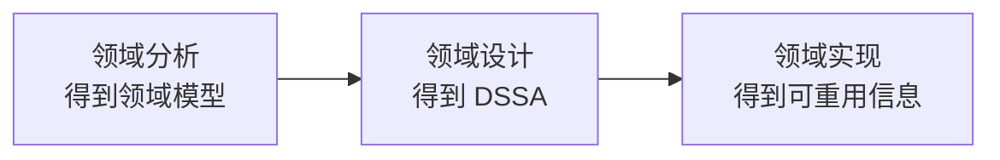

# DSSA：如何沉淀特定领域的共性架构

> [!summary]- 快速复习卡片（学完再看）
> **DSSA**：在一个特定应用领域中，为一组应用提供组织结构参考的标准软件体系结构；它是领域级共同开发基础，不是某一个项目的最终架构。  
> **三项活动**：领域分析 → 领域模型；领域设计 → DSSA；领域实现 → 可重用信息。  
> **四类角色**：领域专家、领域分析人员、领域设计人员、领域实现人员。  
> **五阶段建立过程**：范围 → 领域元素 → 设计/实现约束 → 领域模型和体系结构 → 可重用产品单元；过程可并发、递归、反复。  
> **三层模型**：领域开发环境 → 领域特定的应用开发环境 → 应用执行环境。  
> **做题第一动作**：先判断题目在问“定义/领域边界、三项活动、角色、五阶段还是三层模型”。

上一站 [[07_软件架构复用：为什么复用不只是复制代码]] 讲的是“已有成熟资产怎样再次使用”。

但如果一家公司十年都在做医院信息系统，仅仅等项目开始后再去资产库里找东西仍然不够。挂号、门诊、住院和收费会反复出现，各家医院的流程和规模又不同；团队需要先分清哪些是共同结构，哪些要留给具体项目调整。

把这个领域的共同需求和变化点先整理出来，再形成供同类系统使用的架构，正是 **DSSA（Domain Specific Software Architecture，特定领域软件体系结构）**要做的事。

## DSSA 到底是什么

一句话：

> **DSSA 是某个特定领域里，面向一组相关应用的共性架构和开发基础。**

例如医院信息系统领域可以先沉淀挂号、门诊、住院、收费等共同能力及其典型组织方式。以后建设某一家医院时，再根据自己的流程、规模和接口进行实例化和定制。

所以 DSSA **不是某一家医院最终上线的架构**。

教材归纳的四项必备特征可以压成：

- 问题域和问题解域边界明确；
- 能普遍用于该领域中的具体应用；
- 对整个领域的构件组织进行恰当抽象；
- 有该领域固定、典型、可重用的元素。

### 垂直域和水平域

- **垂直域**：研究一个特定系统族整体，例如“医院信息系统这一类系统”；
- **水平域**：研究多个系统或系统族共同的一部分功能，例如跨多类系统都需要的身份认证能力。

这里的“垂直/水平”说的是**领域覆盖范围**，不是技术分层。

## 三项基本活动：最重要的主链

**领域分析**：研究边界、信息源、样本系统以及共同需求和变化，主要产物是**领域模型**。

**领域设计**：根据领域模型形成能适应多个应用的共性架构，主要产物是 **DSSA**。

**领域实现**：开发或从现有系统提取可重用信息/构件，并按领域模型和 DSSA 组织起来。

最短记忆：

> **分析得模型 → 设计得 DSSA → 实现得复用资产。**

## 四类角色：按职责配对

| 角色 | 主要职责 |
| --- | --- |
| **领域专家** | 提供真实领域知识，帮助选择样本、统一术语并复审成果 |
| **领域分析人员** | 获取并组织知识，建立和维护领域模型 |
| **领域设计人员** | 根据领域模型形成并验证 DSSA |
| **领域实现人员** | 开发/提取可重用构件，建立 DSSA 与实现的联系 |

不要把后面的**应用工程师**塞进这四类角色。应用工程师属于三层模型中的具体应用开发环境。

## 三项活动和五阶段不是一套东西

这是最容易混的地方：

- **三项活动**回答“主要做哪三类工作”；
- **五阶段**回答“真正建立 DSSA 时怎样推进”。

五阶段按教材口径：

> **定义领域范围 → 定义领域特定元素 → 定义设计/实现需求约束 → 定义领域模型和体系结构 → 产生/搜集可重用产品单元**

它不是僵硬瀑布。教材明确说明这个过程具有**并发性、递归性和反复性**，也可理解为螺旋式逐步细化。

## 三层模型：领域成果怎样变成具体系统

| 层次 | 主要人员 | 在做什么 |
| --- | --- | --- |
| **领域开发环境** | 领域构架师 | 沉淀领域模型、参考需求、参考体系结构、开发工具等领域基础 |
| **领域特定的应用开发环境** | 应用工程师 | 用上层成果开发、实例化和定制某个具体应用 |
| **应用执行环境** | 操作员 | 运行最终的具体应用 |

一句话：

> **第一层造领域基础 → 第二层造具体应用 → 第三层让应用运行。**

“领域模型、参考需求、参考体系结构”是第一层里的成果，**不是三层名称**。

## DSSA 和一般架构复用是什么关系

它们不是二选一。

> **一般架构复用关注“已有成熟资产怎样再次使用”；DSSA 进一步限定到一个特定领域，主动沉淀这个领域的共同需求、领域模型、共性架构和可重用信息。**

所以看到“特定领域、一组应用、共同需求、领域模型、参考体系结构”，优先想到 DSSA。

## 考试快速分流

- **共同需求、变化范围、形成领域模型** → 领域分析；
- **根据领域模型形成 DSSA** → 领域设计；
- **开发/提取可重用构件** → 领域实现；
- **领域专家 / 分析 / 设计 / 实现人员** → 四类 DSSA 参与角色；
- **范围→元素→约束→模型与体系结构→产品单元** → 五阶段；
- **领域构架师 / 应用工程师 / 操作员** → 三层模型。

## 自测

1. 已经形成医院信息系统 DSSA 后，某一家医院能不能不做任何定制就把它当最终架构？

> [!answer]- 第 1 题答案与解析
> **不能。** DSSA 是面向领域中一组应用的共性开发基础，具体系统仍需实例化和定制。

2. 调查多个系统的共同需求与变化并形成领域模型，属于哪项活动？

> [!answer]- 第 2 题答案与解析
> **领域分析。** 题干的动作是从多个同类系统抽取共同需求、变化点并建立领域模型；还没有进入依据模型设计 DSSA 的“领域设计”。

3. “领域分析→领域设计→领域实现”和“五阶段建立过程”是不是同一套步骤？

> [!answer]- 第 3 题答案与解析
> **不是。** 前者给工作分类，后者描述建立 DSSA 时怎样推进。

4. 应用工程师利用领域成果形成某个具体系统，处在哪一层？

> [!answer]- 第 4 题答案与解析
> **领域特定的应用开发环境。** 这里已经使用领域成果来开发一个具体应用，不是在上层沉淀共性，也不是下层让应用运行。

## 下一站

DSSA 已经把“怎样沉淀领域共性架构”讲完。接下来核心主线不再继续扩展更多架构名词，而是问：

> **一个架构方案到底做得好不好，性能、可靠性、可修改性等目标怎样表达和评估？**

因此下一站进入 [[01_综合知识/07_系统质量属性与架构评估/系统质量属性与架构评估索引|系统质量属性与架构评估]]。

本目录的 [[01_设计模式：它与架构风格、框架有什么边界]]、[[02_SOA与REST：服务与资源约束如何形成架构风格]] 目前是扩展骨架，不属于本章 34 个 stable Atom 的核心学习主线。

## 证据锚点

- 大纲：`官方教材/系统架构第二版 大纲.pdf`，6.5 DSSA。
- 主教材：`官方教材/系统架构设计师教程第二版可搜索.pdf`，PDF 283–286。
- 交叉核验：`官方教材/【带搜索】系统架构设计师第二版.pdf`，PDF 278–281。
