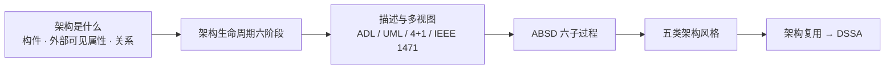

# 软件架构设计 · 考前速记

> [!summary] 5～10 分钟主线
> **先把架构识别为系统级结构 → 再看它贯穿哪些生命周期阶段 → 再学怎样描述、分视图、用 ABSD 推进 → 然后识别五类典型风格 → 最后学成熟资产复用与领域共性 DSSA。**

## 1. 一眼看全章

主事实源与学习顺序见 [[软件架构设计索引]]。五类风格是**并列分类**，上图箭头只表示阅读顺序，不表示风格之间存在演化关系。

## 2. 题干关键词 → 知识点

| 题干信号 | 第一反应 |
| --- | --- |
| 构件、构件外部可见属性、构件关系、系统结构、实现前比较方案 | **软件架构**（判断关键是问题尺度，不是“有没有图”） |
| 需求 → 设计 → 实现 → 构件组装 → 部署 → 后开发 | **软件架构生命周期六阶段** |
| 构件 + 连接子 + 配置，特别强调“怎么连” | **ADL**，尤其重视**连接子** |
| 类图、构件图、部署图等通用建模图 | **UML**（表达工具，不等于架构方法） |
| 逻辑/进程/开发/物理 + 场景贯穿 | **4+1 视图模型** |
| 软件密集型系统、体系结构描述推荐实践、多相关方关注 | **IEEE 1471-2000** |
| 功能分解 + 选择架构风格 + 软件模板；需求→设计→文档化→复审→实现→演化 | **ABSD** |
| 数据依次被加工 | **数据流风格**（批处理、管道-过滤器） |
| 控制沿明确调用关系传递 | **调用-返回风格**（主程序/子程序、面向对象、层次型、C/S） |
| 多个构件围绕共享数据工作 | **数据中心风格**（仓库、黑板） |
| 构造解释程序或规则的执行环境 | **虚拟机风格**（解释器、规则系统） |
| 相对独立构件靠消息或事件协作 | **独立构件风格**（进程通信、事件系统） |
| 成熟资产再次选择、定制、使用 | **软件架构复用** |
| 特定领域 + 一组应用 + 共性架构与开发基础 | **DSSA** |

## 3. 核心流程与公式：本章以识别和判据为主

本章**没有需要代入计算的公式**，考的是“看到结构能归类、看到顺序能排出”。需要背的只有下面六条链：

1. **生命周期六阶段**：需求（需求模型→架构模型，保持可转换、可追踪）→ 设计（架构模型、连接方式、多视图、复用经验）→ 实现（高层架构映射、细化成可运行实现，保持架构约束）→ 构件组装（通过连接子互联，发现并处理**架构失配**）→ 部署（软件构件与结点/硬件拓扑/CPU、内存等资源/质量目标的对应）→ 后开发（维护、扩展、演化、恢复与重建、复用）。（入口：[[02_软件架构生命周期：为什么架构工作从需求一直持续到上线后]]）
2. **ABSD 三个基础**：功能分解；选择架构风格实现质量与商业需求；软件模板的使用。
3. **ABSD 六个子过程**：架构需求 → 架构设计 → 架构文档化 → 架构复审 → 架构实现 → 架构演化；有主线顺序，但**允许反馈和迭代**（复审发现风险可回到设计或需求）。（入口：[[05_ABSD：如何从架构需求逐步形成可交付架构]]）
4. **DSSA**：三项活动 = 领域分析（得领域模型）→ 领域设计（得 DSSA）→ 领域实现（得可重用信息）；五阶段 = 定义领域范围 → 定义领域特定元素 → 定义设计/实现需求约束 → 定义领域模型和体系结构 → 产生/搜集可重用产品单元，过程具有**并发性、递归性、反复性**；三层模型 = 领域开发环境（领域构架师）→ 领域特定的应用开发环境（应用工程师）→ 应用执行环境（操作员）。另外，垂直域（一个系统族整体）与水平域（多类系统共有的某部分功能）说的是**领域覆盖范围**，不是技术分层。（入口：[[08_DSSA：如何沉淀特定领域的共性架构]]）
5. **复用链**：构造/获取资产 → 管理资产（关键是**分类和检索**）→ 使用资产（选择、修改、扩展、配置、组装集成，不要求原封不动照搬）。（入口：[[07_软件架构复用：为什么复用不只是复制代码]]）
6. **风格识别三步**：先找有哪些**构件** → 再找它们靠什么**连接件**互动（传数据／传控制／共享数据／解释环境／消息与事件）→ 最后看**组合约束**，并确认题干观察的是整个系统还是某段局部链路。

## 4. 易错陷阱：为什么容易错

1. **生命周期六阶段 ≠ ABSD 六子过程**：两组都是“六个”，数量相同最容易被替换；但一个回答“架构在哪些生命周期阶段持续工作”，一个回答“以架构为中心怎样推进开发”。
2. **“+1”不是第五个同类视图**：4+1 这个名字里有 5 个数，很容易顺着数成“第五个视图”；它实际是用代表性场景**贯穿和验证**另外四个视图。（入口：[[04_软件架构视图：为什么同一系统需要多个观察视角]]）
3. **UML ≠ 架构方法，UML ≠ ADL**：两者都能画图，所以容易被压成同一层；UML 是通用建模语言，ADL 才是专门强调“构件 + 连接子 + 配置”的架构描述语言。（入口：[[03_软件架构描述：ADL、UML与IEEE1471分别解决什么]]）
4. **“有图”不等于“在考架构”**：源代码目录、某张 UML 图、某个类的私有字段都容易让人误判；判断关键是**问题尺度**，不是有没有图。（入口：[[01_软件架构是什么：为什么需要架构视角]]）
5. **“约束”不宜加成经典定义第四项**：工程实践天天谈架构约束，容易顺手补成“构件、外部可见属性、关系、约束”四项；约束属于重要架构设计决策，但不是该经典定义中并列的第四项。
6. **批处理 ≠ 数据量大**：直觉会把“批”理解成“多”；真正的判据是**整批交付、后一步通常等前一步整批完成**。
7. **出现“消息”不一定选事件系统**：面向对象里的方法请求也可以叫消息；只有发布者**不必知道谁会响应**（注册/订阅、隐式调用）时，才转向事件系统。
8. **有 `if` 不等于规则系统，用了虚拟机产品也不等于虚拟机风格**：前者要看规则是否被组织成可匹配、可选择执行的集合，后者要看是否人为构造了**解释程序或规则的执行环境**。
9. **仓库 vs 黑板不能靠“主动/被动”一个词**：这个说法太粗，稳定判据是“在共享数据上一般读写”还是“多个知识源围绕问题状态和部分解逐步推进复杂求解”。
10. **复用 ≠ 复制代码，系统复用 ≠ 不允许修改**：复用对象是已验证的需求、架构、测试和工程经验等资产，使用阶段本来就包含定制、扩展和配置；资产库也不只是存文件，管理阶段还得能分类、检索、浏览和维护。
11. **DSSA 的角色与阶段最容易串位**：应用工程师职责贴近开发，很容易被写进四类角色，但它其实属于三层模型的**领域特定的应用开发环境**；“领域模型、参考需求、参考体系结构”也是领域开发环境的成果，不是三层名称。三项活动与五阶段同理，一个是工作分类，一个是建立 DSSA 的推进过程。

## 5. 高频对比

**组 1：五类架构风格是并列关系，靠连接件区分**（子卡：[[06_软件架构风格/01_数据流风格：批处理与管道过滤器为什么不同|数据流]]、[[06_软件架构风格/02_调用返回风格：控制为什么沿明确调用关系传递|调用-返回]]、[[06_软件架构风格/03_数据中心风格：仓库与黑板为什么都以共享数据为中心|数据中心]]、[[06_软件架构风格/04_虚拟机风格：解释器与规则系统如何构造执行环境|虚拟机]]、[[06_软件架构风格/05_独立构件风格：进程通信与事件系统如何实现松耦合协作|独立构件]]）

| 风格大类 | 连接件在传什么 | 典型成员 |
| --- | --- | --- |
| 数据流 | 被依次加工的数据 | 批处理、管道-过滤器 |
| 调用-返回 | 控制与服务请求/返回 | 主程序/子程序、面向对象、层次型、C/S |
| 数据中心 | 共享数据的读写与状态变化 | 仓库、黑板 |
| 虚拟机 | 待解释的程序/规则与执行状态 | 解释器、规则系统 |
| 独立构件 | 消息与事件 | 进程通信、事件系统 |

**组 2：仓库 vs 黑板**（入口：[[06_软件架构风格/03_数据中心风格：仓库与黑板为什么都以共享数据为中心]]）

| 判断维度 | 仓库 | 黑板 |
| --- | --- | --- |
| 中心内容 | 共享业务数据或数据结构 | 问题状态和部分解 |
| 构件职责 | 读取、修改、处理共享数据 | 按专长贡献局部推理结果 |
| 协作目标 | 围绕统一数据工作 | 逐步拼出复杂问题答案 |
| 题干信号 | 中央数据库、共享仓库 | 知识源、部分解、逐步求解 |

**组 3：风格内部最容易混的几组**

| 易混对 | 一句话判据 |
| --- | --- |
| 层次型 vs 管道-过滤器 | 传的是服务调用与控制，还是待加工的数据 |
| 面向对象 vs 事件系统 | 调用是否明确知道目标对象 |
| 解释器 vs 规则系统 | 下一步由程序语义决定，还是由事实匹配到哪些规则决定 |
| 进程通信 vs 事件系统 | 发送方是否面向明确通信对象（事件发布者不必知道响应者） |

**组 4：ABSD vs DSSA**

| 维度 | ABSD | DSSA |
| --- | --- | --- |
| 回答什么 | 以架构为中心怎样组织开发活动 | 特定领域里怎样为“一组应用”沉淀共性架构 |
| 主要产物 | 架构需求/设计/文档/复审/实现/演化的连续工作 | 领域模型、DSSA、可重用信息 |
| 边界 | 六子过程 ≠ 生命周期六阶段 | 不是某个具体应用的最终架构，仍需实例化和定制 |

**组 5：复用 vs 复制代码，以及两种复用时机**

| 对比 | 要点 |
| --- | --- |
| 复用 vs 复制代码 | 复用用到已验证的需求、架构、测试、工程经验等资产并保留设计依据；只复制代码则连“为什么这样拆、遇过什么缺陷”的经验一起丢掉 |
| 机会复用 vs 系统复用 | 只看**何时决定复用**：开发过程中碰到可用资产再复用 / 开发前就规划复用；不按“复用多少”区分 |

**组 6：描述手段不在同一层**

| 名称 | 处于哪一层 |
| --- | --- |
| ADL | 专门描述架构的语言类别：构件 + 连接子 + 配置 |
| UML | 通用建模语言，可用于架构也可用于详细设计 |
| 4+1 | 组织同一架构多个视图的方法 |
| IEEE 1471-2000 | 软件密集型系统架构描述的推荐实践/标准语境 |

> [!warning] SOA vs REST：本章暂不做对比
> 本章的 [[01_设计模式：它与架构风格、框架有什么边界|设计模式卡]] 与 [[02_SOA与REST：服务与资源约束如何形成架构风格|SOA 与 REST 卡]] 目前仍是**生成骨架，没有教学正文**，速记不能替它们编造结论。此处只保留边界提示：本章负责综合知识前置识别，SOA、层次式、云原生等完整机制以根级 [[架构设计理论与实践索引|06 架构设计理论与实践]] 为主事实源。

## 6. 跨知识联系

- **上承 [[软件工程基础知识索引|04 软件工程]]**：需求工程与 UML 是本章描述手段的主事实源，本章只解释它们为什么出现在架构语境；完整内容回 [[UML总览]]、[[UML用例图]]、[[UML构件图与部署图]]。
- **上承 [[数据库设计基础知识索引|05 数据库设计]]**：数据设计先把数据/类本身定义清楚，架构设计再看主要软件构件的结构、属性和交互；“数据库表怎么设计”不能自动等于系统架构设计。
- **下启 [[01_综合知识/07_系统质量属性与架构评估/系统质量属性与架构评估索引|07 系统质量属性与架构评估]]**：架构决策会牵动性能、可用性、可修改性等质量目标，所以下一步要把模糊要求场景化并做评估。
- **下启八域**：层次型、事件系统、SOA 等只在这里做一句承接，正文以 [[06_架构设计理论与实践/02_层次式架构/层次式架构：为什么要让上层只使用下层服务|层次式架构主事实源]]、[[06_架构设计理论与实践/03_云原生架构/事件驱动架构：不等下游响应时怎样让服务继续协作|事件驱动架构主事实源]] 等为准，本章不搬第二套正文。
- **本章内部**：ABSD 只负责“为什么要选风格”，风格的逐类辨析在 [[06_软件架构风格/00_软件架构风格总览：如何用构件与连接件识别典型结构|软件架构风格总览]]；复用解决“成熟资产怎样再用”，DSSA 进一步限定到特定领域。

## 7. 闭卷自测（只列问题）

1. 软件架构的经典定义优先抓哪三个核心？为什么不建议把“约束”机械背成第四项？
2. 需求已经写完整，为什么还要架构设计？架构和详细设计分别在回答什么？
3. “订单类有哪些属性”和“订单服务怎样与支付服务交互”，哪个更偏数据设计，哪个更偏架构设计？
4. 软件架构生命周期六阶段是什么？每个阶段架构分别在做什么？
5. ADL 与其他一般建模语言相比特别重视什么？它的三个核心描述对象是什么？
6. 逻辑视图、进程视图、开发视图、物理视图分别看什么？为什么“+1”不是第五个同类视图？
7. ADL、UML、4+1、IEEE 1471-2000 分别处在哪一层？为什么不能背成“四种架构语言”？
8. ABSD 的三个基础和六个子过程分别是什么？为什么它不能被理解成绝对不能回退的瀑布？
9. 五类架构风格分别是什么？识别风格时第一动作是找什么？
10. 仓库和黑板都以共享数据为中心，怎样区分？批处理和管道-过滤器又怎样区分？
11. 复用和复制旧代码的区别是什么？机会复用和系统复用按什么区分？
12. DSSA 的三项活动、五阶段建立过程、四类角色和三层模型分别是什么？为什么它们最容易互相串位？

## 下一站

本章解决的是“架构是什么、怎样描述、怎样推进、有哪些典型结构和复用基础”。架构方案到底做得好不好，性能、可靠性、可修改性等目标怎样表达和评估，进入 [[01_综合知识/07_系统质量属性与架构评估/系统质量属性与架构评估索引|07 系统质量属性与架构评估]]；上线之后的演化与维护细节，再到 [[01_综合知识/09_软件架构的演化和维护/软件架构的演化和维护索引|09 软件架构的演化和维护]] 展开。
