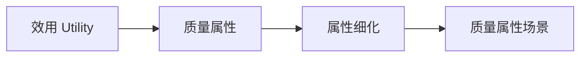

# ATAM 效用树：场景很多时，怎么决定先分析哪几个

> [!summary]- 快速复习卡片
> **作用/定位**：把抽象质量属性逐层分解成具体场景，并为关键场景排优先级。
> **核心结论**：典型层次是“效用 → 质量属性 → 属性细化 → 质量属性场景”；叶子是可分析的具体场景。
> **题干怎么认**：Utility Tree、场景排序、重要性与实现难度/风险。
> **易错点**：效用树不是功能分解树、组件树；(H,L) 的两个维度必须按题目/教材定义读取，不靠字母大小猜优先级。

促销网店有很多质量要求：下单要快、订单不能丢、后台报表可以稍慢。评估团队时间有限，不能把所有要求都同样深入地分析；需要先把大目标拆成可讨论的具体场景，并选出优先检查的部分。这就是效用树要解决的实际问题。

对场景通常要评价其业务重要性和实现难度/风险等维度，用来选出最值得深入分析的场景。

### 从“性能”落到可排序的叶子

教学例子：促销网店把“效用”细化为“性能”，再细化为“响应时间”，最后形成叶子场景：“峰值每秒 800 个下单请求时，95% 订单确认在 2 秒内返回”。团队按项目约定给该叶子标记业务重要性 H、实现难度 H；另一场景“后台报表在 30 秒内生成”标为重要性 M、难度 L。字母含义由本次评估约定，不凭 H/L 自行推导分数。比较后团队优先分析促销下单场景，因为它更重要且实现风险也高；效用树做的是把需求落到可分析场景并帮助排序，不是替团队计算唯一正确的优先级。

## 历年考法落点

题目问“效用树的叶子是什么”时，答案是**具体质量属性场景**；问“为什么要建效用树”，核心是把大量质量要求组织起来并排出分析优先级。

## 自测
1. 为什么效用树不能用组件名称当叶子来理解？
2. 效用树与 ATAM 的敏感点/权衡点分析是什么前后关系？

> [!answer]- 答案与解析
> 1. 叶子表示可分析、可排序的具体质量属性场景，不是实现组件清单。
> 2. 效用树先选出重要场景和优先级；ATAM 再据此分析架构决策的敏感点、权衡点与风险。

## 下一站
- [[CBAM成本效益分析]]
- 依据：主教材 PDF 第 298 页。
