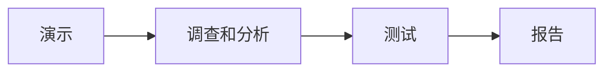

# ATAM：怎样围绕业务目标找出架构风险、敏感点和权衡

> [!summary] 快速复习卡片
> **作用/定位**：基于业务目标和质量属性场景，分析关键架构决策对多个质量属性的影响，识别风险、非风险、敏感点和权衡点。
> **核心结论**：ATAM 重点不是给架构打一个总分，也不是机械算出“最佳架构”，而是把“业务驱动 → 质量场景 → 架构方法/决策 → 风险与权衡”这条链分析清楚。
> **题干怎么认**：多质量属性、业务驱动、架构方法、效用树、场景优先级、风险/非风险、敏感点、权衡点。
> **易错点**：官方大纲的“ATAM 实践四阶段”和主教材描述的“分析活动四个领域 + 7 个步骤”是两个层次，不要混成一套编号。

ATAM（Architecture Tradeoff Analysis Method，架构权衡分析方法）在 SAAM 基础上发展而来。它关注多个相互影响的质量属性，经典重点包括性能、安全性、可修改性和可用性。

## ATAM 不是“选择最佳架构”的算法

ATAM 会给架构决策提供结构化证据：哪些场景最重要、哪些决策最敏感、哪里存在风险、哪些属性需要权衡。

它**不会**像排序算法一样输入几个架构就自动输出唯一“最佳架构”。这些结果可以支持设计改进、架构比较和决策，但最终选择仍要结合业务目标、约束、成本和项目上下文。

## 先看 ATAM 的人和输入

### 参与角色

可以把参与者先分成三组：

- **评估团队**：组织评估、引导场景和分析过程；
- **架构决策者/架构师**：说明架构、关键设计决策和约束；
- **利益相关者**：从客户、用户、开发、测试、运维、性能、安全等视角提出业务目标、质量关注和场景。

主教材强调：在场景和需求收集活动中，需要系统相关人员参与。不同角色带来的质量目标不同，ATAM 才有可能发现真正的冲突和权衡。

### 业务驱动因素

业务驱动因素回答的是：**为什么这个系统要这样做，什么目标最重要，哪些约束不能违反。**

它通常包括业务目标、关键功能、质量目标、时间/预算/技术约束等。ATAM 不是脱离业务只看技术漂亮不漂亮；后续的质量场景优先级必须能回到这些驱动因素。

### 架构方法与关键决策

这里说的“架构方法（architecture approaches）”可以理解为为了实现质量目标所采用的关键架构策略、结构和设计决策，例如冗余、缓存、分层、异步、加密等。

ATAM 要做的不是把这些方法逐个背定义，而是追问：**这个决策为什么被采用，它支撑哪个质量目标，又会给哪些其他目标带来影响。**

### 质量属性场景

业务目标还需要落成可分析场景。场景负责把“要快、要安全、要好改”变成具体条件和可验证要求，再通过 [[ATAM效用树]] 组织和排序。

## 官方大纲 7.3：ATAM 实践四阶段

大纲把 ATAM 架构评估实践概括为四个基本阶段：

做题看到“ATAM 实践四阶段”，优先按这条主线识别，不要拿下面的 7 个分析步骤去凑四阶段。

## 主教材：分析活动四个领域与 7 个步骤

主教材在 ATAM 分析模型中又给出四个活动领域：

1. 场景和需求收集；
2. 架构视图和场景实现；
3. 属性模型构造和分析；
4. 折中。

对应的 7 个分析步骤可以按这条链记：

1. 收集场景；
2. 收集需求、约束和环境；
3. 描述架构视图；
4. 将场景映射/落实到架构；
5. 针对特定质量属性进行分析；
6. 识别敏感点；
7. 识别权衡点。

这条 7 步链说明 ATAM 的核心动作：**不是只列场景，而是把场景压到具体架构决策上，再看质量属性如何受到影响。**

## ATAM 最终要带回什么结果

一次 ATAM 评估至少应能沉淀出这些可行动结果：

- 已组织并排过优先级的质量属性场景；
- 关键架构方法/架构决策与质量目标之间的关系；
- **风险点**：可能导致重要质量目标不满足的决策或假设；
- **非风险点**：在当前分析边界内有证据支持目标能够满足的决策；
- **敏感点**：某个质量属性对其变化特别敏感的关键决策；
- **权衡点**：同一决策同时影响多个质量属性、需要折中的位置；
- 需要继续验证的关键假设、问题和分析结论。

风险、非风险、敏感点和权衡点的定义统一以 [[敏感点与权衡点]] 为主事实源，这里只说明它们在 ATAM 中作为输出出现。

## SAAM vs ATAM

| | SAAM | ATAM |
| --- | --- | --- |
| 经典重点 | 可修改性 | 多质量属性权衡 |
| 核心技术 | 场景 | 场景 + 属性分析 + 权衡 |
| 题眼 | 场景交互 | 业务驱动、效用树、敏感点、权衡、风险 |

## 历年考法落点

ATAM 题第一判断入口不是“有没有场景”，因为 SAAM 也用场景。更强的识别信号是：

- 多个质量属性同时出现；
- 业务驱动和场景需要排序；
- 讨论架构方法/关键决策；
- 识别敏感点、权衡点、风险/非风险；
- 使用效用树组织质量场景。

## 自测
1. 为什么 ATAM 不是自动选择“最佳架构”的算法？
2. 业务驱动因素和质量属性场景是什么关系？
3. 官方大纲的四个实践阶段与主教材的 7 个分析步骤为什么不能混写？
4. ATAM 为什么必须让不同利益相关者参与？
5. 风险点、敏感点和权衡点分别回答什么问题？

> [!answer]- 答案与解析
> 1. ATAM 用评估过程暴露风险和权衡，帮助决策，不会自动算出唯一“最佳架构”。
> 2. 业务驱动因素提出质量目标与优先级；质量属性场景把这些目标表达为可分析的具体要求。
> 3. 大纲的四阶段是实践流程归纳，教材七步是更细的分析展开；二者层次不同，不能当作互斥或逐项一一替换。
> 4. 不同角色掌握业务目标、使用场景和技术约束的不同部分；共同参与才能避免只按单一技术视角评估。
> 5. 敏感点问“哪个决策影响质量属性”，权衡点问“该决策会同时牵动哪些属性”，风险点问“是否可能导致质量目标不达标”。

## 下一站
- [[ATAM效用树]]
- 依据：官方大纲 PDF 第 55 页；主教材 PDF 第 296–298 页。
