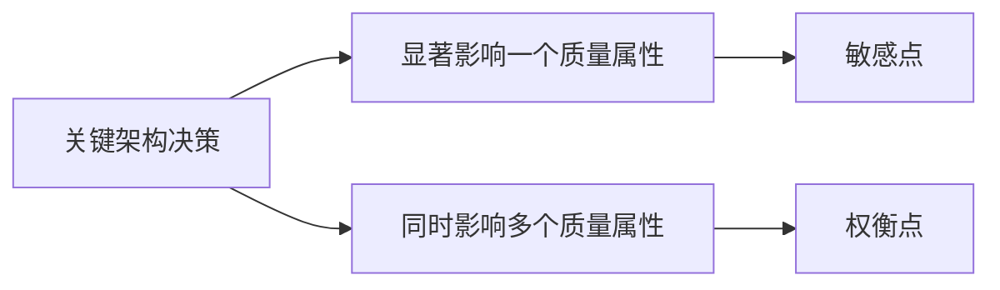

# 敏感点、权衡点与风险点：架构里的“关键旋钮”分别说明什么

> [!summary]- 快速复习卡片
> **作用/定位**：把关键架构决策分成“对某个质量目标特别敏感”“同时牵动多个质量目标”“可能让质量目标失败”三类信号。
> **当前考试区分口径**：**敏感点**看某个架构决策变化是否显著影响一个质量属性；**权衡点**看同一决策是否同时影响多个质量属性并可能此消彼长；**风险点**看该决策是否可能让重要质量目标无法满足。
> **题干怎么认**：某参数一变，性能明显变化 → 敏感点；提高安全却拖慢性能 → 权衡点；按当前决策可能达不到“2 秒内响应” → 风险点。
> **易错点**：风险点不是“发生过故障”；非风险点也不是“永远没有风险”。

网店提高加密强度后，用户资料更难被窃取，但结算处理也可能变慢。如果改动某个参数只明显影响一项质量属性，它像一个需要特别关注的“敏感旋钮”；如果同一决策同时牵动安全和性能，就必须在两项目标之间权衡。若现有设计还可能达不到必须满足的响应目标，就要记录为风险。先看这个具体冲突，再区分下面几个术语。

主教材把敏感点和权衡点都放在“关键架构决策”语境中。为了做题时不混淆，本仓库当前按下面的判断动作记忆。

## 三个概念先拆开

### 敏感点

**某个架构决策或参数发生变化，会显著影响某一个质量属性。**

例如：缓存容量稍微调整，响应时间就明显变化。题目只要求你识别“这个参数对性能很敏感”时，先判敏感点。

### 权衡点

**某个架构决策同时显著影响多个质量属性，并可能产生冲突或此消彼长。**

例如提高加密强度可以改善安全性，却可能增加处理开销、降低性能。此时“加密强度”就是典型权衡点。

### 风险点与非风险点

- **风险点**：某个架构决策、假设或实现方式，可能导致重要质量目标无法满足。
- **非风险点**：在当前场景、约束和证据下，分析认为该架构决策能够支持相应质量目标，没有暴露出当前需要处理的风险。

非风险点只是在**当前分析边界内**得到正向证据，不等于系统从此绝对安全、永不失败。

风险判断再单独问一句：**这个决策会不会让目标场景无法达标？** 如果会，就要记录为风险。

## 四个概念怎样连起来

| 判断问题 | 结论 |
| --- | --- |
| 决策变化是否显著影响某个质量属性？ | 敏感点 |
| 是否同时牵动多个质量属性？ | 权衡点 |
| 是否可能让重要质量目标无法满足？ | 风险点 |
| 当前证据是否支持目标能够满足，且未暴露对应风险？ | 非风险点 |

一个架构决策可以同时具有多种身份。例如“加密级别”既可能是安全性的敏感点，也可能因为同时影响安全与性能而成为权衡点；如果分析发现它会导致严格延迟目标无法满足，还会形成风险。

## 历年考法落点

选择题常把“敏感点”和“权衡点”互换作为干扰项。第一步先看**单个质量属性是否对该决策敏感**；第二步再看**是否跨多个质量属性**；第三步才判断**是否会造成目标不达标的风险**。

## 自测

1. 一个参数只明显影响性能，不影响其他属性，它更像什么？

> [!answer]- 第 1 题答案与解析
> 敏感点：该参数变化会显著影响性能这一项质量属性。

2. 为什么提高加密强度可能同时成为敏感点、权衡点和风险来源？

> [!answer]- 第 2 题答案与解析
> 它影响安全性，是敏感点；又可能增加延迟、影响性能，是权衡点；若目标因此不能达标，就成为风险来源。

3. “非风险点”为什么不能理解成“这里永远不会出问题”？

> [!answer]- 第 3 题答案与解析
> 非风险点只表示当前证据下没有识别出风险，不是对未来永不出问题的保证。

## 下一站
- [[SAAM架构评估]]
- 依据：主教材 PDF 第 294 页；ATAM 风险输出结合主教材 PDF 第 296–298 页与本章评估语境。
