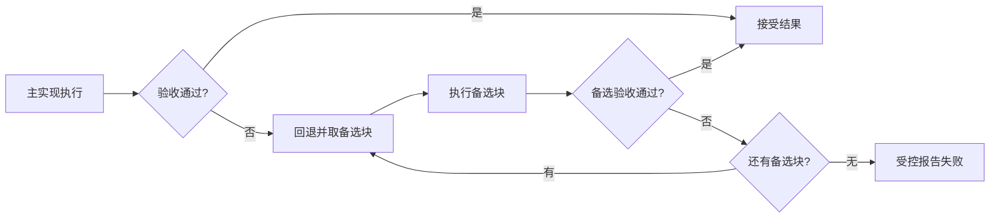

# 容错设计：恢复块、N 版本与冗余如何区分

> [!summary]- 快速复习卡片（学完再看）
> **核心结论**：容错的目标是“局部实现失效时仍尽量完成服务”；教材重点是恢复块、N 版本程序和冗余设计。
> **题干信号 → 第一反应**：顺序尝试备选实现 → 恢复块；多个独立版本同时算再多数表决 → N 版本。
> **易错边界**：把同一份有相同缺陷的软件简单复制多份，不能解决共同软件缺陷。
> **第一动作**：先看“备选实现是串行切换还是并行表决”。

## 先看一个飞控计算例子

控制指令必须算出来，不能因为一个实现出错就直接停止。于是可以准备**功能相同但实现有差异**的多个版本，让某个版本失败时还有其他结果来源。

## 1. 恢复块：一个不行，再试下一个

恢复块把一组功能相同、设计有差异的程序块作为候选：主块先执行，通过**验收测试**判断结果能否接受；失败时回退并调用后备块。

主块和每个备选块的结果都要经过验收测试。失败后先恢复到可安全尝试下一块的状态（例如撤销本块的临时写入），再取下一个备选；没有可用备选时报告受控失败，不能把未验收结果当成功输出。验收测试本身也可能漏检，因此“通过”表示满足了预先定义的验收条件，不是数学上证明程序绝无错误。

关键词是：**顺序、逐块验收、失败回退、无备选时受控失败**。

## 2. N 版本程序：多个版本同时算，再表决

N 版本程序让多个相互独立设计的版本针对相同输入执行，再用多数表决等方式决定输出。它希望某一个版本的设计错误不会同时出现在其他版本中。

因此教材特别强调**设计不相关性/差异性**：不同人员、算法、语言、工具或实现路径等，目的都是降低“大家犯同一个错误”的概率。

关键词是：**并行多版本、多数表决、设计差异**。

## 3. 冗余设计：准备不同实现作为备用能力

软件冗余不是简单复制同一二进制，而是准备不同路径、算法或实现方法的模块/系统，在故障时替换或接管。代价是开发、存储、计算和维护成本增加，所以必须做可靠性与成本的权衡。

## 三者一眼区分

| 技术 | 核心动作 | 最醒目信号 |
| --- | --- | --- |
| 恢复块 | 主实现失败后换备选实现 | 验收测试 + 回退 |
| N版本 | 多版本同时运行后表决 | 多数表决 |
| 冗余 | 准备差异化备用实现 | 备用/替换/冗余 |

## 考试动作

题目出现“多数表决”几乎先锁 N 版本；出现“验收测试失败后切换另一个程序块”先锁恢复块。再检查是否强调差异化实现，以排除“简单复制就是软件容错”的错误说法。

## 自测

1. “验收测试失败后回退并改用后备实现”对应恢复块还是 N 版本？

> [!answer]- 答案与解析
> **恢复块。**它是串行尝试备选实现；N 版本的典型题眼是多个独立版本并行计算并多数表决。

2. 主实现失败后，备选实现算出了结果，是否可以直接交付？

> [!answer]- 第 2 题答案与解析
> **不可以。**备选结果也必须通过验收测试；若失败，应回退后尝试下一备选，没有可用备选时受控报告失败。
> **解析**：恢复块的验收步骤约束每个候选结果，防止“备用程序运行结束”被误当成“结果可接受”。

## 上一站 / 下一站

**上一站**：[[07_可靠性设计：为什么要在设计阶段把可靠性做进去]] 给出了设计总目标；本篇学习“失败后仍继续服务”的路径。

**下一站**：不是每个地方都有成本做冗余。若不能自动容错，至少要尽快知道故障发生，因此进入 [[09_检错设计：发现故障为什么不等于容错]]。
