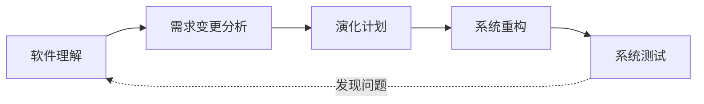

# 静态演化：停机修改怎样控制波及

> [!summary]- 快速复习卡片（学完再看）
> **核心结论**：静态演化是在系统不运行时修改/升级，主线是软件理解 → 需求变更分析 → 演化计划 → 系统重构 → 系统测试。
> **题干信号 → 第一反应**：停机升级、发布新版本、环境迁移 → 静态演化。
> **第一动作**：先做影响范围分析，再组合原子演化操作。
> **易错边界**：教材在本节把更正性、适应性、完善性维护作为静态演化对应维护方式；这不等于普通软件维护永远只有这三类。

## 静态演化不是“停机后随便改”

静态演化虽然没有运行状态一致性这个难题，但结构依赖仍在。教材给出的过程非常适合按因果理解：

1. **软件理解**：先知道原架构有哪些元素、怎样依赖；
2. **需求变更分析**：找出新旧需求差异；
3. **演化计划**：确定范围、成本和顺序；
4. **系统重构**：实施结构变化；
5. **系统测试**：验证结果，并可能进入下一轮。

## 原子演化操作有什么用

一次大改可以拆成最小的架构修改动作，例如：

- 增删模块依赖；
- 增删模块接口；
- 增删模块；
- 拆分/聚合模块；
- 在交互场景中增删消息、对象、消息片段等。

拆成原子操作的目的不是背缩写，而是能形成 `A0 → A1 → A2 → ... → An` 的中间版本链，逐步观察每一次变化对可维护性、可靠性等属性的影响。

## 与普通软件维护的边界

这里的“更正性/适应性/完善性”只是在说明**静态架构演化的需求来源和对应维护方式**。本章关注的是这些需求如何落到模块、依赖、接口和架构中间版本；软件工程章节若讨论维护分类、配置管理和项目流程，主事实源仍应留在那里。

## 考试动作

看到“系统停止运行期间的修复和升级” → 静态演化；若问过程，按“理解 → 变更分析 → 计划 → 重构 → 测试”排；若问为何做原子化，回答“为了分析每一步结构变化及其波及/质量影响”。

## 自测

1. 静态演化的五步过程应怎样排序？为什么大改要拆成原子演化操作？

> [!answer]- 第 1 题答案与解析
> **答案**：软件理解 → 需求变更分析 → 演化计划 → 系统重构 → 系统测试；原子化用于逐步观察每次结构变化的波及和质量影响。
> **解析**：静态不等于随意修改。先理解现状和影响，再计划、重构、测试，才能建立可比较的中间版本链。

## 上一站 / 下一站

**上一站**：[[07_四个演化时期：静态与动态怎样区分]] 已经定位静态演化发生在何时；本篇展开它怎样实施。

**下一站**：[[09_动态演化：运行中怎样安全改变架构]]。停机修改相对简单，真正困难的是系统不能停时怎样改变结构。

## 证据锚点

- 大纲：[[官方教材/AI教材库/原始文本/系统架构第二版 大纲/p0049-p0060|大纲 PDF 60 页，9.3.2]]
- 主教材：[[官方教材/AI教材库/原始文本/系统架构设计师教程第二版可搜索/p0349-p0360|教程 PDF 353–356 页，10.3.2]]
